# 复习思维导图

## 1.分支与循环语句
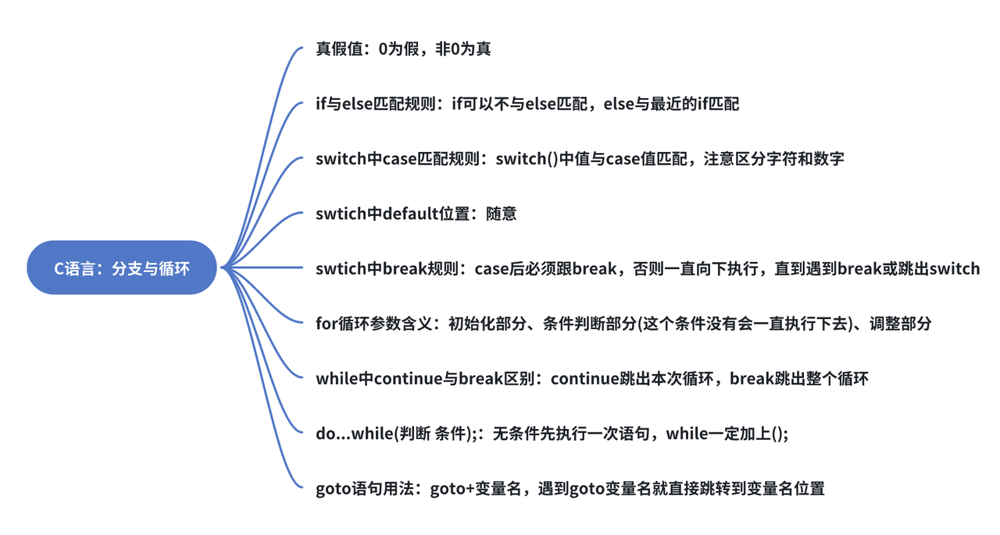

---

## 2.函数
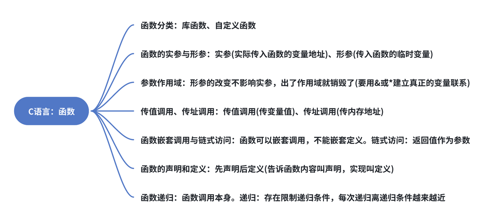

---

## 3.数组
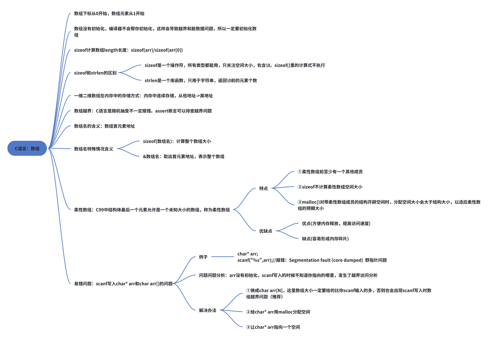

---

## 4.操作符
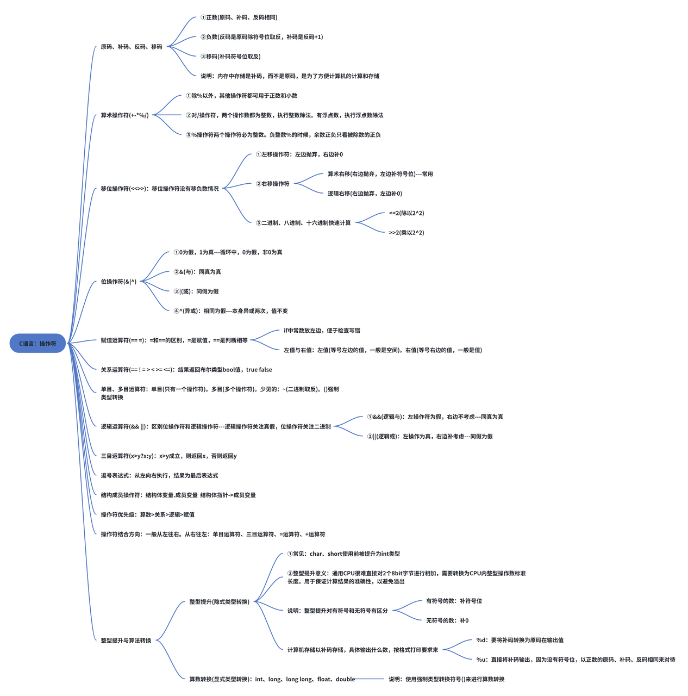

---

## 5.指针
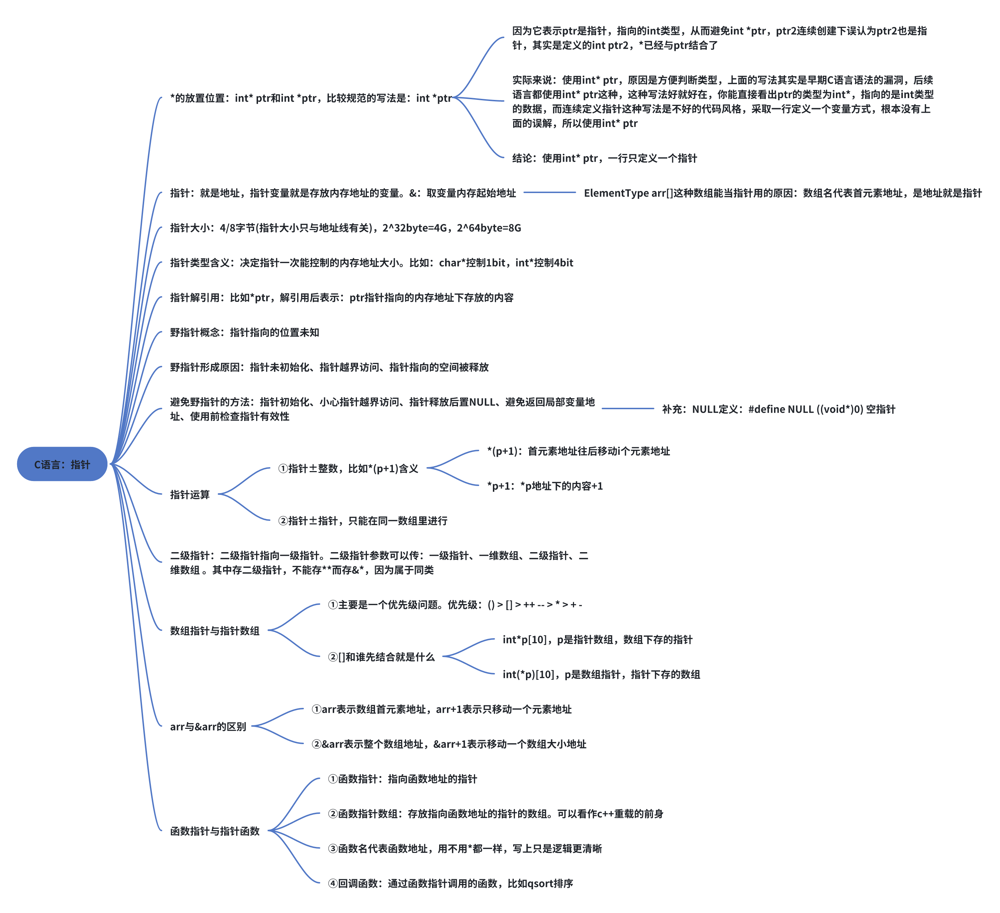

---

## 6.字符与字符串
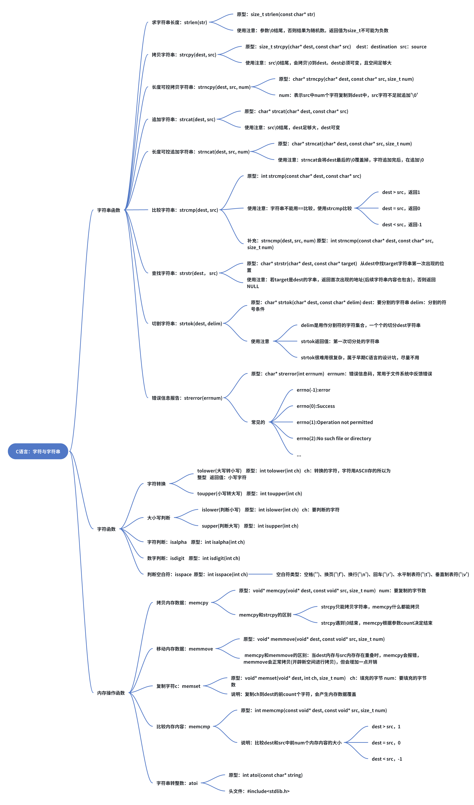

---

## 7.结构体、枚举、联合体、位段
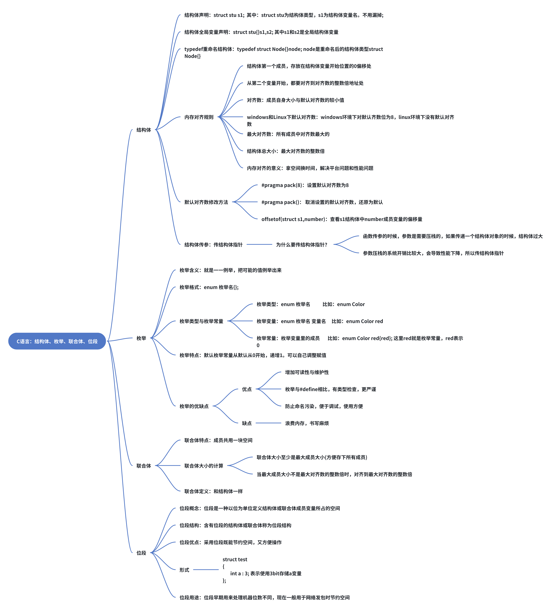

---

## 8.数据存储
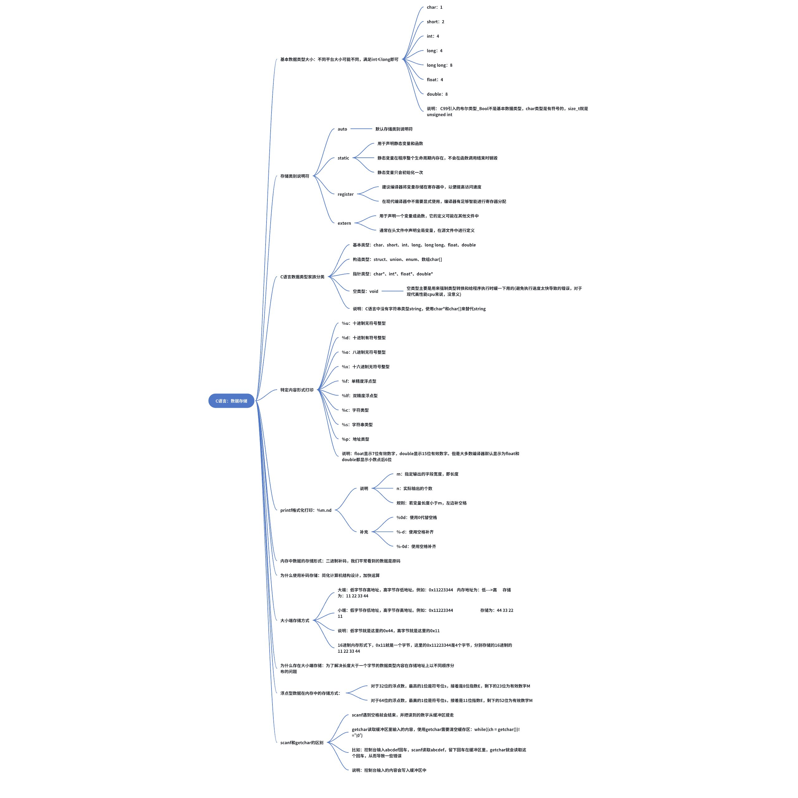

---

## 9.动态内存分配
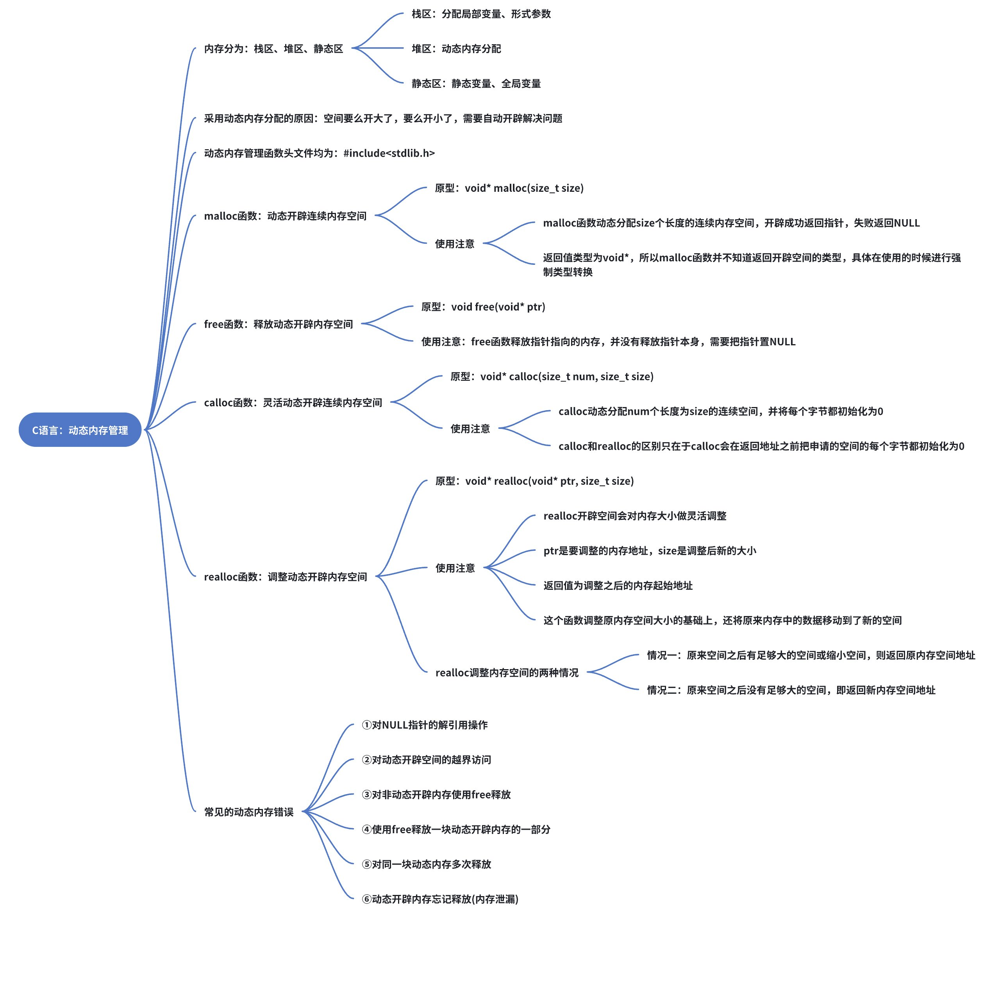

---

## 10.文件
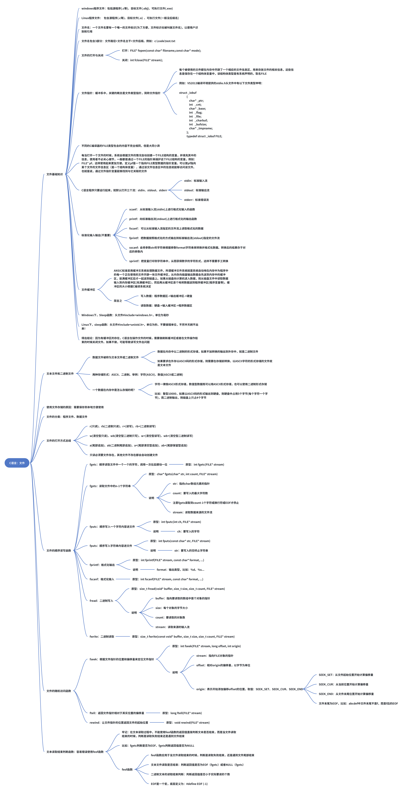

---

## 11.程序的编译、链接、预处理
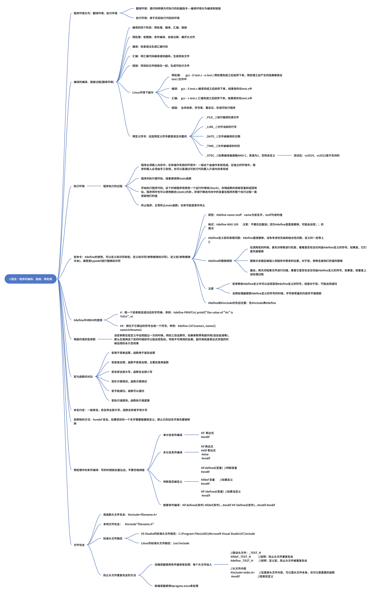