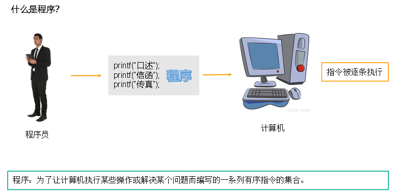

# 第一章：C语言概述

## 1.什么是程序

---

## 2.计算机语言简史

>**第一代：机器语言，使用二进制表示，例如：0000,0000,000000010000 代表 LOAD A, 16**
>**第二代：汇编语言，使用助记符表示，例如：add 2,3,result**
>**第三代：高级语言，使用指令编写程序，接近自然语言，比如：int num = 10;**

---

## 3.C语言的发行版本

- **K&R C（1978年）： 由柯尼汉和里奇合写的《C 程序设计语言》成为公认标准，简称为K&R C**
- **ANSI C（C89/C90，1989年）： 第一个ISO标准，也叫ANSI C，规范了K&R C，确保了可移植性**
- **C99（1999年）： 第一次大修订，引入许多特性如//注释、可变长度数组等，成为最流行版本**
- **C11（2011年）： 再次修订，增加_Generic、static_assert等功能，跟进新技术**
- **C17（2018年）： C11在2017年修补，2018年发布的C17只解决了C11的缺陷，未加入新功能**
- **C23（2023年）： 2023年发布的C23计划增强安全性、消除实现定义行为、引入模块化语言等，提升安全和可靠性**