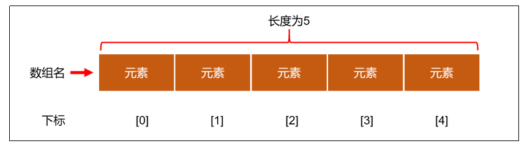
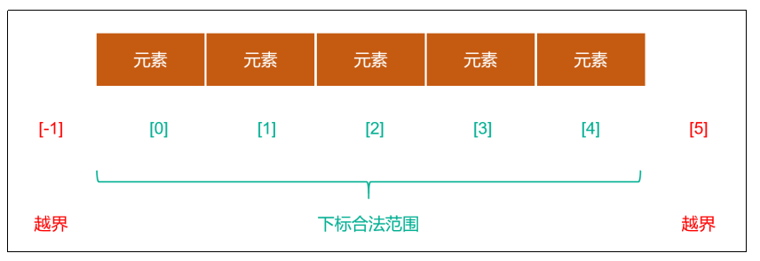
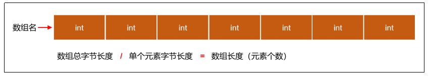
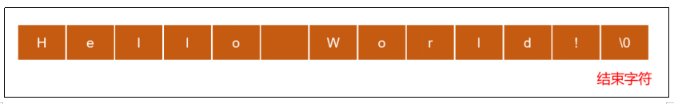
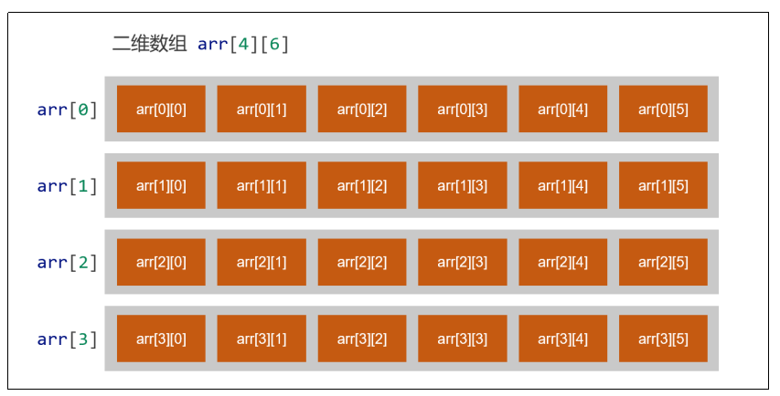
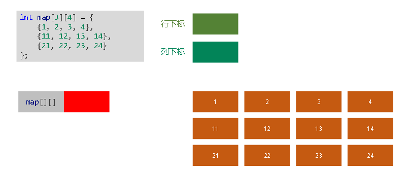
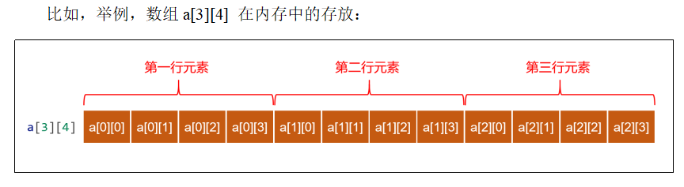

# 第七章：数组

## 1.数组的概念
**（1）什么是数组**
>**数组（Array），是多个相同类型数据按一定顺序排列的集合，并使用一个标识符命名，并通过编号（索引，也称为下标）的方式对这些数据进行统一管理**



**（2）数组相关概念**
>**数组名：本质上是一个标识符常量，命名需要符合标识符规范**<br>
>**元素：同一个数组中的元素必须是相同的数据类型**<br>
>**下标（索引、角标）：从0开始的连续数字**<br>
>**数组的长度：表示元素的个数**

**（3）数组的特点**
>**创建数组时会在内存中开辟一整块连续的空间，占据的空间的大小，取决于数组的长度和数组中元素的类型**<br>
>**数组中的元素在内存中是依次紧密排列的且有序的**<br>
>**数组一旦初始化完成，其长度就是确定的，数组的长度一旦确定，就不能修改**<br>
>**我们可以直接通过索引（下标）获取指定位置的元素，速度很快**

---

## 2.数组的操作
**（1）数组的定义**
**方法一：先指定元素的个数和类型，再进行初始化**
```c
// 定义数组，数组名字是 arr1，元素类型是 int，元素个数是 3 个  
int arr1[3];

// 定义完成后再给元素赋值
arr1[0] = 100;
arr1[1] = 200;
arr1[2] = 300;
```
**方法二：指定元素的类型和个数并同时进行初始化**
```c
// 定义完数组直接进行初始化
int arr2[3] = {4,5,6};
```
**方法三：指定元素的类型，不指定元素个数，同时进行初始化**
```c
// 没有指定元素个数，系统会自动计算
int arr3[] = {7,8,9,10};
```

**(2)访问数组元素**
>**通过“数组名[下标]”可以访问数组中的元素**

```c
#include <stdio.h>

int main()
{
    // 定义 4 个元素的数组
    int nums[4] = {10, 20, 30, 40};

    // 修改第二个元素的值
    nums[1] += 100;

    // 读取元素的值
    printf("第一个元素的值：%d\n", nums[0]); // 第一个元素的值：10
    printf("第二个元素的值：%d\n", nums[1]); // 第一个元素的值：120
    printf("第三个元素的值：%d\n", nums[2]); // 第一个元素的值：30
    printf("第四个元素的值：%d\n", nums[3]); // 第一个元素的值：40

    /*
        第一个元素的值：10
        第二个元素的值：120
        第三个元素的值：30
        第四个元素的值：40
    */
    return 0;
}
```
**（3）数组越界**
>**数组下标必须在指定范围内使用，超出范围视为越界**


```c
#include <stdio.h>

int main() {

    // 定义数组 没有指定长度
    int nums[5] = {10,20,30,40,50};

    printf("下标是0的元素：%d\n", nums[0]);  // 10
    printf("下标是4的元素：%d\n", nums[4]);  // 50
    printf("下标是-1的元素：%d\n", nums[-1]);// 得到的是不确定结果
    printf("下标是5的元素：%d\n", nums[5]);  // 得到的是不确定结果

    /*
        下标是0的元素：10
        下标是4的元素：50
        下标是-1的元素：0
        下标是5的元素：0
    */
    return 0;
}
```

**（4）计算数组长度**
**数组长度（元素个数）是在数组定义时明确指定且固定的，我们不能在运行时直接获取数组长度，但是，我们可以通过sizeof 运算符间接计算出数组长度，计算步骤如下：**
>**使用sizeof运算符计算出整个数组的字节长度，由于数组成员是同一类型，每个元素字节长度相等，用整个数组的字节长度除以单个元素的字节长度就可以得到数组的长度**



```c
#include <stdio.h>

int main()
{
    // 定义数组 没有指定长度
    int nums[] = {10, 20, 30, 40, 50, 60, 70};

    // 计算数组总的字节长度
    int arrByteLen = sizeof nums;

    // 用总字节长度除以单个元素的字节长度
    int arrLen = arrByteLen / sizeof nums[0];

    printf("数组的长度：%d", arrLen); // 数组的长度：7

    //数组的长度：7
    return 0;
}
```

**（5）遍历数组**
**遍历数组是指按顺序访问数组中的每个元素，以便读取或修改它们，编程中一般使用循环结构对数组进行遍历**
```c
#include <stdio.h>

int main()
{
    // 定义数组
    int arr[10] = {12, 2, 31, 24, 15, 36, 67, 108, 29, 51};
    
    // 计算数组长度
    int len = sizeof arr / sizeof arr[0];

    // 遍历数组中的元素
    printf("遍历数组中的元素：\n");
    for (int i = 0; i < len; i++)
    {
        printf("%d: %d \n", i, arr[i]);
    }

    /*
        遍历数组中的元素：
        0: 12
        1: 2
        2: 31
        3: 24
        4: 15
        5: 36
        6: 67
        7: 108
        8: 29
        9: 51
    */
    return 0;
}
```

---

## 3.字符数组(字符串)
**（1）字符数组的介绍**
**用来存放字符的数组称为字符数组，也可以称为字符串。字符串的输入输出格式占位符是 %s**


>**字符串结尾，会自动添加一个 \0 作为字符串结束的标志，所以字符数组最后一个元素必须是 \0**<br>
>**\0 是ASCII码表中的第0个字符，用NUL表示，称为空字符，该字符既不能显示，也不是控制字符，输出该字符不会有任何效果，它在C语言中仅作为字符串的结束标志**

**（2）字符数组的定义**
**方法一：最后一个元素设置成 \0**
>**在给某个字符数组赋值时，赋值的元素个数小于字符数组的长度，则会自动在后面加 '\0', 表示字符串结束； 赋值的元素的个数等于该数组的长度（或不指定数组长度），则不会自动添加 '\0'**

```c
#include <stdio.h>

int main()
{
    char str1[12] = {'H', 'e', 'l', 'l', 'o', ' ', 'W', 'o', 'r', 'l', 'd', '\0'}; // 显式地设值 \0
    char str2[4] = {'t', 'o', 'm'};     // 后面自动添加 \0
    char str3[] = {'j', 'a', 'c', 'k'}; // 不会自动添加 \0

    printf("str1=%s \n", str1); 
    printf("str2=%s \n", str2); 
    printf("str3=%s \n", str3); // 由于没有结束标识，会包括相邻内存的数据，直到遇到结束标记

    /*
        str1=Hello World 
        str2=tom
        str3=jacktom
    */
    return 0;
}
```
**方法二：简化写法**
```c
#include <stdio.h>

int main()
{
    char str1[] = {"I am happy"}; // 后面自动添加 \0
    char str2[] = "I am happy";   // 省略{}号,后面自动添加 \0

    printf("\n str1=%s", str1);
    printf("\n str2=%s", str2);

    /*
        str1=I am happy
        str2=I am happy
    */
    return 0;
}
```
**（3）字符数组的访问和遍历**
**字符数组（字符串）的访问和遍历，按照一般数组的方式访问和遍历即可**
```c
#include <stdio.h>

int main()
{
    // 定义字符串
    char greeting[] = "Hello";

    // 计算字符串长度
    int len = sizeof greeting / sizeof greeting[0];

    printf("%s \n", greeting);
    printf("数组长度：%d \n", len);
    printf("第3个字符: %c \n", greeting[2]);
    printf("\n");

    // 遍历字符串
    for (int i = 0; i < len; i++)
    {
        printf("%c \n", greeting[i]);
    }
    /*
        Hello 
        数组长度：6
        第3个字符: l

        H
        e
        l
        l
        o
    */
    return 0;
}
```

---

## 4.多维数组
**（1）多维数组的介绍**
>**如果数组的元素还是数组，这样的数组就称为多维数组。这种多层次的结构允许我们以表格或矩阵的方式组织数据，其中每个维度都对应于不同的行、列或更多的维度，使数据更加结构化和有组织**<br>
>**多维数组可以分为二维数组、三维数组、四维数组 …… 等，这里我们以二维数组为例进行演示**



**（2）二位数组的定义**
**方法一：先定义再初始化**
```c
// 定义一个4行6列的二维数组
int a[4][6]; 

// 进行初始化赋值
a[0][0] = 10
a[0][1] = 20;
a[0][2] = 30;
a[0][3] = 40;
a[0][4] = 50;
a[0][5] = 60;
a[1][0] = 100;
a[1][1] = 200;
……
```
**方法二：直接定义并初始化**
```c
// 定义一个4行6列的二维数组，以为矩阵的形式初始化
int a[4][6] = {
    {10, 20, 30, 30, 40, 60},
    {100, 200, 300, 400, 500, 600},
    {1000, 2000, 3000, 4000, 5000, 6000},
    {10000, 20000, 30000, 40000, 50000, 60000}
};

// 定义一个4行6列的二维数组, 会自动匹配到各行各列
int b[4][6] = { 1, 2, 3, 4, 5, 6, 7, 8, 9, 10, 11, 12, 13, 14, 15, 16, 17, 18, 19, 20, 21, 22, 23, 24};

// 如果所赋值的数量可以与元素数量对应，第一维的数组长度可以不给出
int b[][6] = { 1, 2, 3, 4, 5, 6, 7, 8, 9, 10, 11, 12, 13, 14, 15, 16, 17, 18, 19, 20, 21, 22, 23, 24};
```

**（3）二维数组的访问和遍历**
>**访问二维数组的元素，需要使用两个下标（索引），一个用于访问行（第一维），另一个用于访问列（第二维），我们通常称为行下标（行索引）或列下标（列索引）**<br>
>**遍历二维数组，需要使用双层循环结构**



```c
#include <stdio.h>

int main()
{
    // 定义一个 3 行 4 列的数组
    int map[3][4] = {
        {1, 2, 3, 4},
        {11, 12, 13, 14},
        {21, 22, 23, 24}};

    // 计算第一维度的长度
    int rows = sizeof(map) / sizeof(map[0]);
    // 计算第二维度的长度
    int cols = sizeof(map[0]) / sizeof(int);

    // 遍历输出每个元素
    for (int i = 0; i < rows; i++)
    {
        for (int j = 0; j < cols; j++)
        {
            printf("%d\t", map[i][j]);  // \t 可以输出得更加整齐
        }
        printf("\n");
    }

    // 计算所有元素的和
    int sum = 0;
    for (int i = 0; i < rows; i++)
    {
        for (int j = 0; j < cols; j++)
        {
            sum += map[i][j];
        }
    }
    printf("所有元素的和：%d", sum); // 所有元素的和：150

    /*
        1       2       3       4
        11      12      13      14
        21      22      23      24
        所有元素的和：150
    */
    return 0;
}
```

**（4）二维数组的内存分析**
>**用矩阵形式（如3行4列形式）表示二维数组，是逻辑上的概念，能形象地表示出行列关系。而在内存中，各元素是连续存放的，不是二维的，是线性的**<br>
>**C语言中，二维数组中元素排列的顺序是按行存放的。即：先顺序存放第一行的元素，再存放第二行的元素**



