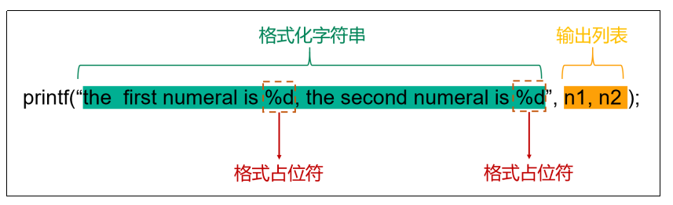
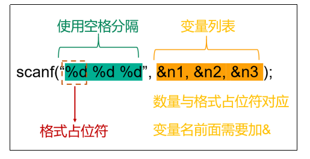

# 第三章：变量和常量

## 1.变量
### 1.1 变量的概念
**（1）变量是内存中的一个存储区域，该区域的数据可以在同一类型范围内不断变化**
**（2）通过变量名，可以引用这块内存区域，获取里面存储的值**
**（3）变量的构成包含三个要素：数据类型、变量名、存储的值**

---

### 1.2 变量的声明和使用
**（1）变量必须先声明，后使用
（2）可以先声明变量再赋值，也可以在声明变量的同时进行赋值
（3）变量的值可以在同一类型范围内不断变化**

```c
#include <stdio.h>

int main()
{
    // 声明一个整型变量，取名为 a
    int a;
    // 对变量 a 进行赋值
    a = 100;

    // 声明一个整型变量，取名为 b，并直接赋值
    int b = 200;
    // 修改变量 b 的值， 将变量 a 的值赋值给 b
    b = a;

    // 同时声明多个整型变量并赋值
    int c1 = 10, c2 = 20, c3 = 30;

    //不推荐一行声明多个变量，建议分开声明，这是一种不好的代码风格
    return 0;
}
```

---

### 1.3 输出变量
**printf 的标准含义是格式化输出文本，printf 名称来源于 "print formatted"（格式化打印）的缩写，标准语法规则如下：**

>**（1）格式化字符串是用双引号括起来的一个字符串，里面包括格式占位符和普通字符**
>**（2）格式占位符，也叫格式声明符，由“%”和格式字符组成，作用是将输出的数据转换为指定的格式后输出，这里“%d”表示整数，更多的格式占位符后续会进行讲解**
>**（3）输出列表是程序需要输出的一些数据，可以是常量、变量或表达式，与格式占位符一一对应**

```c
#include <stdio.h>

int main()
{
    // 声明一个整型变量，取名为 a
    int a;
    // 对变量 a 进行赋值
    a = 100;

    // 声明一个整型变量，取名为 b，并直接赋值
    int b = 200;
    // 输出变量的值
    printf("a=%d \n", a); // 使用输出语句，把变量a 值输出， %d 表示输出的形式为整数
    printf("b=%d \n", b); // 使用输出语句，把变量b 值输出， %d 表示输出的形式为整数

    // 修改变量 b 的值， 将变量 a 的值赋值给 b
    b = a;
    // 输出变量的值
    printf("b=%d \n", b); // 使用输出语句，把变量b 值输出， %d 表示输出的形式为整数

    // 同时声明多个整型变量并赋值
    int c1 = 10, c2 = 20, c3 = 30;
    printf("%d %d %d", c1, c2, c3); // 10 20 30

    /*
        输出结果：
            a=100
            b=200
            b=100
            10 20 30
    */
    return 0;
}
```

---

### 1.4 输入赋值变量
**scanf主要用于从标准输入（通常是键盘）读取数据并将其存储到指定的变量中（变量需要提前声明），同printf一样，位于头文件 <stdio.h> 中**

```c
#include <stdio.h>

int main()
{
    int num;
    printf("Please Input A Number: ");
    scanf("%d", &num); // 从标准输入读取整数，并将其存储到变量 num 中
    printf("Your Number Is: %d\n", num);

    int num1, num2, num3;
    printf("PLeaase Input Three Number: ");
    scanf("%d %d %d", &num1, &num2, &num3); // 从标准输入读取3个整数，使用空格分隔，并将分别将其存储到变量 num1、num2、num31 中
    printf("Numbers: %d, %d, %d", num1, num2, num3);

    return 0;
}
```
>**需要注意的是，scanf中，变量名前面需要添加 & 符号，该符号称为取地址符，没有它就没法正确读取值。与printf相同，scanf也可以通过不同格式占位符为不同类型的变量获取值**

---

## 2.常量
**程序运行时，其值不能改变的量，即为常量**


### 2.1 常量的分类
**（1）字面量常量，直接使用的常量，不需要定义或声明，包括整数常量、浮点数常量、字符常量
（2）标识符常量，使用标识符作为常量名，包括 #define 定义的标识符常量和const 关键字定义的标识符常量以及枚举常量**

---

### 2.2 常量的定义
**常量的定义方法主要有：①使用#define定义常量、②使用const关键字**

**（1）使用#define定义常量：**
>**#define 来定义常量，也叫作宏定义，就是用一个标识符来表示一个常量值，如果在后面的代码中出现了该标识符，那么<mark>编译</mark>时就全部替换成指定的常量值，即用宏体替换所有宏名，简称宏替换**<br>
>**#define定义常量的格式：<font color=red>#define 常量名 常量值</font>**
>**注意：不要用分号结尾，分号会成为常量值的一部分，会出现;;这种情况。#define必须写在main函数外面**
```c
#include <stdio.h>

#define PI 3.14 // 定义常量 PI，常量值 3.14

int main()
{
    double area;
    double r = 1.2;
    area = PI * r * r;
    printf("面积 : %.2f", area);
    //面积：4.52
    return 0;
}
```
**（2）const关键字**
>**跟使用 #define定义宏常量相比，const定义的常量有详细的数据类型，而且会在<mark>编译阶段</mark>进行安全检查，在运行时才完成替换，所以会更加安全和方便**<br>
>**const定义常量的格式：<font color=red>const 数据类型 常量名 = 常量值</font>**;

```c
#include <stdio.h>

const double PI = 3.14; // const 定义常量时，需要加分号

int main()
{
    double area;
    double r = 1.2;
    area = PI * r * r;
    printf("面积 : %.2f", area);
    //面积：4.52
    return 0;
}
```

**（3）#define和const定义常量的区别**
>**1.执行时机：#define是预处理指令，在编译之前执行；const是关键字，在编译过程中执行**
>**2.类型检查：#define定义常量不用指定类型，不进行类型检查，只是简单地文本替换；const定义常量需指定数据类型，会进行类型检查，类型安全性更强**


---

## 3.标识符
**C语言中变量、函数、数组名、结构体等要素命名时使用的字符序列，称为标识符**

### 3.1 标识符命名规范
>**强制规范
>（1）只能由大小写<font color=red>英文字母、数字、下划线</font>组成
>（2）<font color=red>不能以数字开头</font>
>（3）<font color=red>不可以是关键字</font>
>（4）<font color=red>标识符具有长度限制</font>，不同编译器和平台会有所不同，一般限制在63个字符内
>（5）<font color=red>严格区分大小写字母</font>。比如：Hello、hello是不同的标识符**

```
合法标识符举例：
    a、BOOK_sun、MAX_SIZE、Mouse、student23、Football、FOOTBALL、max、_add、num_1、sum_of_numbers

非法标识符举例：
    $zj、3sum、ab#cd、23student、Foot-baii、s.com、b＆c、j**p、book-1、tax rate、don't
```

---

### 3.2 规范命名风格
>**（1）为了提高阅读性，使用有意义的单词，见名知意，如：sum，name，max，year等
>（2）使用下划线连接多个单词组成的标识符，如：max_classes_per_student
>（3）多个单词组成的标识符，除了使用下划线连接，也可以使用小驼峰命名法，除第一个单词外，后续单词的首字母大写，如 myVariableName、maxClassesPerStudent
>（4）不要出现仅靠大小写区分不同的标识符，如：name、Name容易混淆
>（5）系统内部使用了一些下划线开头的标识符，比如，C99标准添加的类型 `_Bool`，为防止冲突，建议开发者尽量避免使用下划线开头的标识符**

---

### 3.3 关键字
**关键字是一些具有特殊含义的保留单词**
|类型|具体关键字|
|-|-|
|控制语句关键字(12)个|break, case, continue, default, do, else, for, goto, if, return, switch, while|
|数据类型关键字(12)个|char, enum, double, long, float, int, short, signed, struct, unsigned, union, void|
|存储类型关键字(4)个|auto, extern, register, static|
|其他关键字(4)个|const, sizeof, typedef, volatile|

**C99标准增加了5个关键字：inline、restrict、_Bool、_Complex和_Imaginary
C11标准增加了7个关键字：_Alignas、_Alignof、_Atomic、_Static_assert、_Noreturn、_Thread_local和_Generic。**
