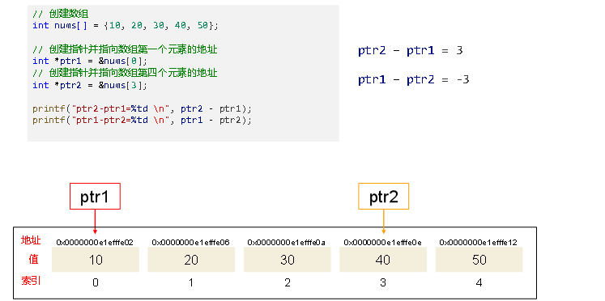
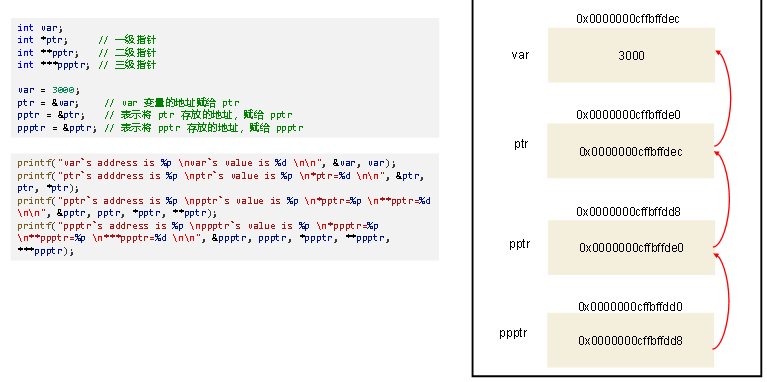

# 第九章：指针

## 1.指针的理解
**（1）变量的访问方式**
>**内存是电脑上特别重要的存储器，计算机中程序的运行都是在内存中进行的 ，为了有效的使用内存，就把内存划分成一个个小的内存单元，每个内存单元通常占用1个字节**

**变量在内存中分配空间，不同类型的变量占用不同大小的空间，那如何访问内存中的变量数据呢？有两种方式：**
>**直接访问，直接使用变量名进行的访问，以前的程序中都是采用这种方式**<br>
>**间接访问，通过指针来实现**

**（2）内存地址**
>**为了能够有效地访问到每个内存单元，就给内存单元进行了编号，这些编号被称为内存地址，因为每个内存单元都有地址，所以变量也是有地址的**


>**假设有 int 型变量 num，其在内存中会占用4个字节，也就是占用4个内存单元，第一个内存单元的地址即是变量 num 的地址。如图；**


>**在32位系统中，内存地址通常是32位二进制数字，即4个字节，这允许寻址2^32（大约 4GB）个内存位置**<br>
>**在64位系统中，内存地址通常是64位二进制数字，即8个字节，这允许寻址2^64个内存位置，这个数量相当大，远远超过了通常需要的内存大小**

**（3）什么是指针**
>**如果一个变量专门用来存放内存地址，则它称为指针变量，通常简称为指针。我们可以通过指针间接访问内存中另一个数据**


>**如图，指针里面存储的是变量 num 的地址，我们可以说该指针指向变量 num，通过该指针可以间接访问变量 num**

**（4）指针的定义**
>**一般格式：数据类型 * 指针变量名 [=初始地址值];**<br>
>***的放置位置：靠近数据类型，放左边，一行定义一个指针，防止出问题**

>**数据类型是指针所指向的地址处的数据类型，如 int、char、float 等**<br>
>**符号 * 用于通知系统，这里定义的是一个指针变量，通常跟在类型关键字的后面，表示指针指向的是什么类型的值。比如，char  * 表示一个指向字符的指针，float * 表示一个指向浮点数的指针**

**（5）取址运算符和取值运算符**
>**取址运算符，使用 & 符号表示，作用是取出变量的内存地址。如果要格式化输出地址，需使用格式占位符 %p**<br>
>**取值运算符，使用 * 符号表示，作用是取出指针指向的内存地址处的数据值，也称为解引用运算符或间接引用运算符**


**（6）指针的大小**
>**指针大小一般为：4/8字节。指针大小只与地址线有关**

---

## 2.指针的运算
**（1）指针加减整数**
>**指针与整数的加减运算，表示指针所指向的内存地址的移动（加，向后移动；减，向前移动），指针移动多少，与指针指向的数据类型有关，数据类型占据多少个字节，每单位就移动多少个字节，比如一个 int 类型指针，+1 向后移动 4 个字节，-2 向前移动 8 个字节**<br>
>**由于数组的元素在内存中连续存储的，我们通过数组元素来演示指针加减整数的情况**

```c
#include <stdio.h>

int main()
{
    // 创建数组
    int nums[] = {10, 20, 30, 40, 50};

    // 创建指针并指向数组第一个元素的地址
    int *ptr = &nums[0];

    // 打印指针的值和指向的值
    printf("ptr=%p, *ptr=%d \n", ptr, *ptr);

    // 指针加3, 指针指向int类型，每个占4个字节，此时指针会向后移动12个字节
    ptr += 3;
    printf("ptr=%p, *ptr=%d \n", ptr, *ptr);

    // 指针-2，此时指针会向前移动8个字节
    ptr -= 2;
    printf("ptr=%p, *ptr=%d \n", ptr, *ptr);

    /*
        ptr=000000000061FE00, *ptr=10 
        ptr=000000000061FE0C, *ptr=40 
        ptr=000000000061FE04, *ptr=20
    */
    return 0;
}
```


**（2）指针自增自减**
>**指针自增、自减本质上就是指针加减整数，自增地址后移，自减地址前移。下面我们利用指针的自增自减实现数组的遍历，代码如下：**

```c
#include <stdio.h>

int main()
{
    // 创建数组，元素都是short类型，占据2个字节
    short nums[] = {10, 20, 30, 40, 50};
    //  定义常量记录数组长度
    const int len = 5;

    // 利用指针自增遍历数组元素
    // 创建指针并指向数组第一个元素的地址
    short *ptr = &nums[0];
    // 循环
    for (int i = 0; i < len; i++)
    {
        printf("元素索引：%d, 元素地址：%p, 元素值：%d \n", i, ptr, *ptr);
        ptr++; // 指针自增
    }
    printf("\n");

    // 利用指针自减再次遍历数组
    // 此时指针超出数组界限，需先自减一次
    for (int i = len - 1; i >= 0; i--)
    {
        ptr--; // 指针自减
        printf("元素索引：%d, 元素地址：%p, 元素值：%d \n", i, ptr, *ptr);
    }

    /*
        元素索引：0, 元素地址：0000000e1efffe02, 元素值：10 
        元素索引：1, 元素地址：0000000e1efffe04, 元素值：20
        元素索引：2, 元素地址：0000000e1efffe06, 元素值：30 
        元素索引：3, 元素地址：0000000e1efffe08, 元素值：40
        元素索引：4, 元素地址：0000000e1efffe0a, 元素值：50

        元素索引：4, 元素地址：0000000e1efffe0a, 元素值：50 
        元素索引：3, 元素地址：0000000e1efffe08, 元素值：40
        元素索引：2, 元素地址：0000000e1efffe06, 元素值：30
        元素索引：1, 元素地址：0000000e1efffe04, 元素值：20
        元素索引：0, 元素地址：0000000e1efffe02, 元素值：10
    */
    return 0;
}
```


**（3）同类型指针相减**
>**相同类型的指针可以进行减法运算，返回它们之间的距离，即相隔多少个数据单位。高位地址减去低位地址，返回的是正值；低位地址减去高位地址，返回的是负值**<br>
>**同类型指针相减的结果是一个 ptrdiff_t 类型数据，ptrdiff_t 类型是一个带符号的整数，格式输出中对应的格式占位符是 %td，相关案例如下：**
```c
#include <stdio.h>

int main()
{
    // 创建数组
    int nums[] = {10, 20, 30, 40, 50};

    // 创建指针并指向数组第一个元素的地址
    int *ptr1 = &nums[0];
    // 创建指针并指向数组第四个元素的地址
    int *ptr2 = &nums[3];

    printf("ptr2-ptr1=%td \n", ptr2 - ptr1); // ptr2-ptr1=3
    printf("ptr1-ptr2=%td \n", ptr1 - ptr2); // ptr1-ptr2=-3

    // 再创建两个指针进行相减
    double d1 = 1.0;
    double d2 = 2.0;
    double *p1 = &d1, *p2 = &d2;
    printf("p1-p2=%td \n", p1 - p2); // p1-p2=1
    printf("p2-p1=%td \n", p2 - p1); // p2-p1=-1

    /*
        ptr2-ptr1=3 
        ptr1-ptr2=-3 
        p1-p2=1
        p2-p1=-1
        内存示意
    */
    return 0;
}
```


**（4）指针的比较运算**
>**指针之间可以进行比较运算，如 ==、<、 <= 、 >、 >=，比较的是各自指向的内存地址的大小，返回值是 int 类型整数 1 （true）或 0  （false）。案例演示如下：**

```c
#include <stdio.h>

int main()
{
    // 创建数组
    int nums[] = {10, 20, 30, 40, 50};
    double n = 1.0;

    // 创建指针并指向数组第一个元素的地址
    int *ptr1 = &nums[0];
    // 创建指针并指向数组第四个元素的地址
    int *ptr2 = &nums[3];
    // 创建指针也向数组第一个元素的地址
    int *ptr3 = &nums[0];
    // 创建指针指向变量n的地址
    double *ptr4 = &n;

    // 输出指针指向的地址
    printf("ptr1=%p\n", ptr1);
    printf("ptr2=%p\n", ptr2);
    printf("ptr3=%p\n", ptr3);
    printf("ptr4=%p\n\n", ptr4);

    // 进行比较
    printf("ptr1>ptr2: %d \n", ptr1 > ptr2);
    printf("ptr1<ptr2: %d \n", ptr1 < ptr2);
    printf("ptr1==ptr3: %d \n", ptr1 == ptr3);
    printf("ptr4>ptr1: %d \n", ptr4 > ptr1); // 由于是不同类型的指针进行比较，所以会有一个警告

    /*
        ptr1=000000d4385ffd10
        ptr2=000000d4385ffd1c
        ptr3=000000d4385ffd10
        ptr4=000000d4385ffd08

        ptr1>ptr2: 0
        ptr1<ptr2: 1
        ptr1==ptr3: 1
        ptr4>ptr1: 0
    */
    return 0;
}
```


---

## 3.指针和数组
**（1）数组名**
>**数组名在大多数情况下会被隐式地转换为指向数组第一个元素的指针，在特定情况下数组名可以被视为一个指针，具有一些指针的特性**

**但是，数组名与真正的指针是不同的，主要有以下几点区别**
>**使用 sizeof 运算符，数组名得到的是整个数组的大小；指针得到的是本身的大小**<br>
>**数组名不能进行自增、自减运算**<br>
>**数组名的指向不可更改**

```c
#include <stdio.h>

int main()
{
    // 创建数组
    int nums[5] = {10, 20, 30, 40, 50};
    // 创建指针指向数组的第一个元素
    int *ptr = &nums[0];

    // 数组名中存储了第一个元素的地址
    printf("%p, %d \n", nums, *nums); 
    printf("%p, %d \n", ptr, *ptr);   
    // nums 和 ptr 比较
    if (nums == ptr)
    {
        printf("nums 和 ptr 相等 \n\n");
    }
    else
    {
        printf("nums 和 ptr 不相等 \n\n");
    }

    // 数组名与真正的指针存在差别
    // 1. sizeof 运算符返回的是整个数组的大小，而指针返回的是本身的大小
    printf("%zu, %zu \n", sizeof nums, sizeof ptr); 

    // 2. 数组名不能进行自增、自减运算
    // nums ++;    // 报错
    ptr++; // 地址指向下一个元素
    printf("%p, %d \n", ptr, *ptr);

    // 3. 数组名的指向不可修改
    int n = 100;
    // nums = &n;  // 报错
    ptr = &n;
    printf("%p, %d \n", ptr, *ptr);

    /*
        0000000cdb5ffe60, 10 
        0000000cdb5ffe60, 10
        nums 和 ptr 相等

        20, 8
        0000000cdb5ffe64, 20
        0000000cdb5ffe5c, 100
    */
    return 0;
}
```


**（2）指针数组**
**指针数组（Pointer Array）是一个数组，其中的每个元素都是指针**
>**语法规则：数据类型 * 指针数组名[长度];**
```c
#include <stdio.h>

int main()
{
    // 创建三个变量
    int num1 = 10, num2 = 20, num3 = 30;

    // 创建一个长度为3的指针数组
    int *ptrArr[3];

    // 指针数组的每个元素指向不同的整数
    ptrArr[0] = &num1;
    ptrArr[1] = &num2;
    ptrArr[2] = &num3;

    // 遍历指针数组
    for (int i = 0; i < 3; i++)
    {
        printf("%d, %p, %d \n", i, ptrArr[i], *ptrArr[i]);
    }

    /*
        0, 0000009c22fff898, 10 
        1, 0000009c22fff894, 20
        2, 0000009c22fff890, 30
    */
    return 0;
}
```


**（3）数组指针**
**数组指针（Array Pointer）是一个指针，它指向一个数组。注意，数组指针指向的是整个数组的地址而不是第一个元素的地址，虽然二者值是相同的，但在运算中会表现出不同**
>**语法规则：数据类型 ( * 数组指针名)[长度];**

```c
#include <stdio.h>

int main()
{
    // 创建整数数组
    int arr[5] = {10, 20, 30, 40, 50};

    // 创建指针指向数组arr  &arr表示整个数组的地址
    int(*ptr)[5] = &arr;
    // int (*ptr)[5] = arr;    // 会有警告, arr 的类是 int *,  ptr 类型是 int (*)[5]

    // 二者值是相同的
    printf("arr=%p \n", arr);
    printf("ptr=%p \n\n", ptr);

    // 数组指针指向的是数组的地址，而不是第一个元素的地址
    // 数组指针+1会向后移动4*5=20个字节；数组+1会向后移动4个字节
    printf("arr+1=%p \n", arr + 1);
    printf("ptr+1=%p \n\n", ptr + 1);

    // 使用数组指针遍历数组
    for (int i = 0; i < 5; i++)
    {
        printf("%d \n", (*ptr)[i]);
    }

    /*
        arr=000000f6d35ff9c0 
        ptr=000000f6d35ff9c0

        arr+1=000000f6d35ff9c4
        ptr+1=000000f6d35ff9d4

        10
        20
        30
        40
        50
    */
    return 0;
}
```


**数组指针和数组名的区别：**
```
①指向不同：数组名指向元素首地址，数组指针指向数组的地址
②类型不同：上面案例中，arr 的类型是 int[5],；ptr 的类型是 int(*)[5]
③可变性：数组名通常是不可变的；数组指针是可变的，你可以将它指向不同的数组
④初始化：数组名不需要显式初始化，它会自动指向数组的首元素；数组指针需要显式初始化，指定它将指向的数组
⑤访问元素：数组名访问数组元素不需要解引用；数组指针通常需要解引用才能访问数组元素
```

**（4）字符指针**
**字符指针变量（简称字符指针）是C语言中的一种指针类型，它用于指向字符或字符串（字符数组），通常用于处理字符串（字符数组）**
>**用字符指针指向一个字符串：char * pStr= "hello tom";**

>**C语言对字符串" hello tom"是按字符数组处理的，在内存中开辟了一个字符数组用来存放字符串，程序在定义字符串指针pStr时只是把字符串首地址（即存放字符串的字符数组的首地址）赋给pStr**


**字符数组名和字符指针表示字符串的区别:**
>**对字符数组只能对各个元素赋值，不能对字符数组名重新赋值**

```c
char str[14];
str=" hello tom"; //错误
str[0] = 'i'; //ok
```

>**字符指针是可变的，允许使用下面方法重新赋值，指向新的字符串**

```c
char *a = "hello tom"; 
a = "tom";
```


---

## 4.指针和函数
**（1）传递指针给函数**
**当函数的形参类型是指针类型时，使用该函数时，需要传递指针、地址或者数组给该形参**

>**传地址或指针给函数**

```c
#include <stdio.h>

// 函数原型
void func(int *);

int main()
{
    int num = 100;
    int *ptr = &num;

    // 调用函数,传地址
    func(&num);
    printf("num = %d\n", num);

    // 调用函数,传指针
    func(ptr);
    printf("num = %d\n", num);

    /*
        num = 101
        num = 102
    */
    return 0;
}

// 函数声明
void func(int *p)
{
    *p += 1;
}
```


**（2）传数组给函数**
**数组名本身就代表数组首地址，因此传数组的本质就是传地址**

```c
#include <stdio.h>

/* 函数声明 */
double getAverage(int *arr, int size);

int main()
{
    /* 带有 5 个元素的整型数组  */
    int balance[5] = {1000, 2, 3, 17, 50};
    double avg;

    /* 传递一个指向数组的指针作为参数 */
    avg = getAverage(balance, 5);
    /* 输出返回值  */
    printf("Average value is: %f\n", avg);


    /*
        arr存放的地址:000000f47adff850 
        arr存放的地址:000000f47adff854
        arr存放的地址:000000f47adff858
        arr存放的地址:000000f47adff85c
        arr存放的地址:000000f47adff860
        Average value is: 214.400000
    */
    return 0;
}

// 函数定义
double getAverage(int *arr, int size)
{
    int sum = 0;
    double avg;
    for (int i = 0; i < size; ++i)
    {
        sum += *arr;
        printf("arr存放的地址:%p \n", arr);
        arr++;
    }
    avg = (double)sum / size;
    
    return avg;
}
```


---

## 5.多级指针(指向指针的指针)
**（1）多级指针基本介绍**
**指向指针的指针是一种多级间接寻址的形式，或者说是一个指针链。通常，一个指针包含一个变量的地址。当我们定义一个指向指针的指针时，第一个指针包含了第二个指针的地址，第二个指针指向包含实际值的位置**


**（2）多级指针的定义与使用**
>**声明多级指针时，需要使用多个星号来表示指针的级别**

```c
int *ptr;       // 一级指针
int **pptr;     // 二级指针
int ***ppptr;   // 三级指针
```

>**初始化多级指针时，你需要逐级给指针赋值，确保每个级别的指针指向正确的目标**

```c
int var;
int *ptr = &var;        // 一级指针指向 var
int **pptr = &ptr;      // 二级指针指向 ptr
int ***ppptr = &pptr;   // 三级指针指向 pptr
```

>**解引用多级指针时，需要根据指针的级别使用适当数量的星号解引用操作**

```c
printf("Value of var: %d\n", var);
printf("Value of ptr: %d\n", *ptr);        // 解引用一次
printf("Value of pptr: %d\n", **pptr);     // 解引用两次
printf("Value of ppptr: %d\n", ***ppptr);  // 解引用三次
```

>**使用案例：**

```c
#include <stdio.h>

int main()
{
    int var;
    int *ptr;     // 一级指针
    int **pptr;   // 二级指针
    int ***ppptr; // 三级指针

    var = 3000;
    ptr = &var;    // var 变量的地址赋给 ptr
    pptr = &ptr;   // 表示将 ptr 存放的地址，赋给 pptr
    ppptr = &pptr; // 表示将 pptr 存放的地址，赋给 ppptr

    printf("var`s address is %p \nvar`s value is %d \n\n", &var, var);
    printf("ptr`s adddress is %p \nptr`s value is %p \n*ptr=%d \n\n", &ptr, ptr, *ptr);
    printf("pptr`s address is %p \npptr`s value is %p \n*pptr=%p \n**pptr=%d \n\n", &pptr, pptr, *pptr, **pptr);
    printf("ppptr`s address is %p \nppptr`s value is %p \n*ppptr=%p \n**ppptr=%p \n***ppptr=%d \n\n", &ppptr, ppptr, *ppptr, **ppptr, ***ppptr);

    /*
        var`s address is 0000000cffbffdec 
        var`s value is 3000

        ptr`s adddress is 0000000cffbffde0
        ptr`s value is 0000000cffbffdec
        *ptr=3000

        pptr`s address is 0000000cffbffdd8
        pptr`s value is 0000000cffbffde0
        *pptr=0000000cffbffdec
        **pptr=3000

        ppptr`s address is 0000000cffbffdd0 
        ppptr`s value is 0000000cffbffdd8
        *ppptr=0000000cffbffde0
        **ppptr=0000000cffbffdec
        ***ppptr=3000
    */
    return 0;
}
```


---

## 7.空指针
**赋为NULL 值的指针被称为空指针，NULL 是一个定义在标准库 <stdio.h>中的值为零的宏常量**

**声明指针变量的时候，如果没有确切的地址赋值，为指针变量赋一个NULL 值是好的编程习惯**

```c
#include <stdio.h>

int main()
{
    int *p = NULL;
    int num = 34;
    p = &num;

    printf("p=%p\n", p);
    printf("*p=%d\n", *p);

    /*
        p=000000000061FE14
        *p=34
    */
    return 0;
}
```

---


## 8.野指针
**（1）什么是野指针**
>**野指针就是指针指向的位置是不可知（随机性，不正确，没有明确限制的）**

**（2）野指针的成因**
>**指针使用前未初始化**

```c
//指针变量在定义时如果未初始化，其值是随机的，此时操作指针就是去访问一个不确定的地址，所以结果是不可知的。此时p就为野指针
int *p;
printf("%d\n", *p);

//在没有给指针变量显式初始化的情况下，一系列的操作(包括修改指向内存的数据的值)也是错误的
int *p;
*p = 10;
```

>**指针越界访问**

```c
//当 p += 4之后，此时 *p 访问的内存空间不在数组有效范围内，此时 *p 就属于非法访问内存空间，p为野指针
int arr[4] = {10,20,30,40};
int *p = arr;
p += 4;
printf("%d", *p);   // 此时 *p 即为越界访问
```

>**指针指向已释放的空间**

```c
//调用test()函数将返回值赋给p，test函数的返回值是局部变量a的地址，函数调用结束局部变量会被销毁，其所占用的内存空间会被释放，p 指向的是已经释放的内存空间，所以 p 是野指针

#include <stdio.h>

int *test()
{
    int a = 10;
    return &a; //&a=0x0012ff40
}

int main()
{
    int *p = test();
    printf("%d", *p);
    return 0;
}
```
**（3）如何避免野指针**
>**指针初始化如果没有确切的地址赋值，为指针变量赋一个 NULL 值是好的编程习惯**<br>
>**小心指针越界**<br>
>**避免返回指向局部变量的指针**<br>
>**指针使用之前检查指针是否为 NULL**

---

## 9.指针的描述

