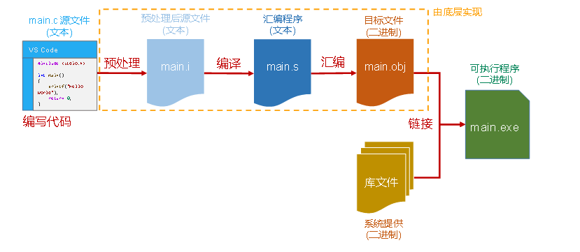

# 第二章：C语言开发环境

## 1.开发工具选择
**<mark>Visual Studio：Visual Studio（简称 VS）</mark>是由微软公司发布的集成开发环境，它包括了整个软件生命周期中所需要的大部分工具，如UML工具、代码管控工具、集成开发环境（IDE）等**

**<mark>Code::Block：Code::Block</mark>是一个免费的跨平台IDE，它支持C、C++和Fortan程序的开发，Code::Block的最大特点是它支持通过插件的方式对IDE自身功能进行扩展，这使得Code::Block具有很强的灵活性，方便用户使用**

**<mark>Clion</mark>：CLion是一款由JetBrains推出的跨平台C/C++集成开发环境（IDE），它具有智能编辑器、CMake构建支持、调试器、单元测试、代码分析等功能,可以极大提高C/C++开发效率**

**<mark>Vscode：Visual Studio Code（简称VS Code）</mark>是一款由Microsoft开发的免费、开源的代码编辑器，它是一种轻量级但功能强大的集成开发环境（IDE），VS Code旨在提供一种优秀的编码体验，适用于各种编程语言和应用程序开发任务**

**注意：Windows环境需要安装MinGW-64、Linux环境需要安装Gcc、G++等工具**

>**<font color=red>推荐开始使用VS，后续使用Clion，跨平台使用Vscode，你可以永远相信jetbrains和vscode</font>**

---

## 2.C程序执行流程

>**（1）编写：编写C语言源程序代码，并以文件的形式存储到磁盘中，源代码文件以“.c”作为扩展名，如本项目中<font color=red>main.c</font> 文件**
>**（2）<mark>预处理</mark>：在编译之前，预处理器会处理源代码文件，主要进行一些文本上的处理，包括去掉多余的空格和注释，处理预处理指令，生成经过处理的源代码文件，通常带有<font color=red>.i</font>扩展名**
>**（3）<mark>编译</mark>：编译器接受预处理后的源代码文件，并将其翻译成汇编代码，生成汇编文件，通常带有<font color=red>.s或.asm</font>扩展名**
>**（4）<mark>汇编</mark>：汇编器将汇编代码翻译成机器码并生成一个或多个目标文件，目标文件是二进制文件，通常带有<font color=red>.o（在Unix-Linux系统上）或.obj</font>（在Windows上）**
>**（5）<mark>链接</mark>：链接器将多个目标文件（如果有的话）合并在一起，包括C标准库文件和其他库文件，生成最终的可执行的二进制程序（<font color=red>.exe</font> 程序）**
>**（6）运行：执行该.exe文件得到程序的运行结果**<br>
>**说明：库文件是由系统提供，里面包括内置的标准函数和数据结构集合等，我们代码中使用的 <stdio.h> 就是标准库提供的，里面定义 printf 这个函数**
---

## 3.C语言开发注意事项
**（1）C程序源文件以"c"为扩展名
（2）C程序的执行入口是main() 函数
（3）C语言严格区分大小写
（4）C程序由一条条语句构成，每个语句以 ";" 结束**

---

## 4.C语言注释
```c
（1）//单行注释：用来注释一行内容

（2）/*
        多行注释：用来注释一块内容
    */
    
```