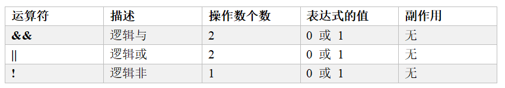

# 第五章：运算符

## 1.运算符基础

>**运算符：是一种特殊的符号，用以用于数据的运算、赋值和比较等**<br>
>**表达式：是一组运算数、运算符的组合，表达式一定具有值，一个变量或一个常量就是一个表达式，变量、常量与运算符也可以组成复杂一些的表达式**


**运算符分类：**
>**按操作数个数分类：
>    ①一元运算符（一目运算符）
>    ②二元运算符（二目运算符）
>    ③三元运算符（三目运算符）**<br>
>**按功能分类：
>    ①算术运算符
>    ②赋值运算符
>    ③关系运算符
>    ④逻辑运算符
>    ⑤位运算符**

---

## 2.算术运算符
**算术运算符是对数值类型的变量进行运算的，在C程序中使用的非常多**


>**①%操作符只能用于整数，余数正负只看被除数的正负**
>**②/操作符，两个操作数都是整数执行整数除法，有浮点数执行浮点数除法**


**（1）正号和负号**
```c
#include <stdio.h>

int main()
{
    int x = 12;
    int x1 = -x, x2 = +x;

    int y = -67;
    int y1 = -y, y2 = +y;

    printf("x1=%d, x2=%d \n", x1, x2);
    printf("y1=%d, y2=%d \n", y1, y2);

    /*
        x1=-12, x2=12 
        y1=67, y2=-67
    */
    return 0;
}
```

**（2）加、减、乘、除**
>**注意：整数之间做除法时，结果只保留整数部分而舍弃小数部分**

```c
#include <stdio.h>

int main()
{
    int a = 5 + 2.5;
    printf("%d\n", a * a);

    double b = 6 / 4;
    printf("%f\n", b); // 输出 1.000000

    double c = 6.0 / 4;
    printf("%f\n", c); // 输出 1.500000

    /*
        49
        1.000000
        1.500000
    */
    return 0;
}
```

**（3）取模**
>**注意：运算结果的符号与被模数也就是第一个操作数相同**

```c
#include <stdio.h>

int main()
{
    int res1 = 10 % 3;
    printf("%d\n", res1);

    int res2 = -10 % 3;
    printf("%d\n", res2);

    int res3 = 10 % -3;
    printf("%d\n", res3);

    int res4 = -10 % -3;
    printf("%d\n", res4);

    /*
        1
        -1
        1
        -1
    */
    return 0;
}
```

**（4）自增和自减**
>**自增、自减运算符可以写在操作数的前面也可以写在操作数后面，不论前面还是后面，对操作数的副作用是一致的**<br>
>**++i：先自增，再使用i；--i：先自减，再使用i**
>**i++：先使用，再自增；i--：先使用i，再自减**

```c
#include <stdio.h>

int main()
{
    int i1 = 10, i2 = 20;
    int i = i1++;
    printf("%d\n", i);  // 10
    printf("%d\n", i1); // 11

    i = ++i1;
    printf("%d\n", i);  // 12
    printf("%d\n", i1); // 12

    i = i2--;
    printf("%d\n", i);  // 20
    printf("%d\n", i2); // 19

    i = --i2;
    printf("%d\n", i);  // 18
    printf("%d\n", i2); // 18

    /*
        10
        11
        12
        12
        20
        19
        18
        18
    */
    return 0;
}
```

---


## 3.关系运算符


>**关系运算符返回值是布尔类型bool值，即true(1)、false(0)**

```c
#include <stdio.h>

int main() 
{
    int a = 8;
    int b = 7;

    printf("a>b的值：%d \n", a > b); 
    printf("a>=b的值：%d \n", a >= b); 
    printf("a<b的值：%d \n", a < b); 
    printf("a<=b的值：%d \n", a <= b);
    printf("a==b的值：%d \n", a == b);
    printf("a!=b的值：%d \n", a != b);

    /*
        a>b的值：1 
        a>=b的值：1 
        a<b的值：0z
        a<=b的值：0
        a==b的值：0
        a!=b的值：1
    */
    return 0;;
}
```

---

## 4.逻辑运算符

>**注意：逻辑操作符关注的是真假，位操作符关注的是二进制**<br>
>**C语言中：0为假，非0为真**<br>
>**逻辑与(&&)：两个操作数都为真，那么表达式的值为真，否则为假**<br>
>**逻辑或(||)：只要有一个操作数为真，表达式的值就为真；两个操作数都为假，表达式的值为假**<br>
>**逻辑非(！)：操作数状态取反作为表达式的值**

```c
#include <stdio.h>

int main()
{
    double score = 70; // 成绩

    if (score >= 60 && score <= 80)
    {
        printf("ok1 \n");
    }
    else
    {
        printf("ok2 \n");
    }
    //ok1
    
    
    int res = score > 99;

    if (res)
    {
        printf("hello, tom \n");
    }
    if (!res)
    { 
        printf("hello,jack \n");
    }
    //hello,jack

    int a = 10, b = 99;

    // 短路现象
    if (a < 2 && ++b > 99)
    {
        printf("ok100");
    }
    printf("b=%d\n", b);    
    //b=99

    //短路现象
    if (a > 5 || b++ > 100)
    { 
        printf("ok100 \n");
    }
    //ok100

    return 0;
}
```

---

## 5.赋值运算符

>**赋值运算符的第一个操作数（左值）必须是变量的形式，第二个操作数可以是任何形式的表达式**<br>
>**赋值运算符的副作用针对第一个操作数**

```c
#include <stdio.h>

int main()
{
    int a = 10, b = 20, c = 30;

    c += 3;   // 等价于 c = c + 3;   计算后c的值变为33
    c += b;   // 等价于 c = c + b;   计算后c的值变为53
    a += 1.7; // 等价于 a = a + 1.7  计算后a的值变为11

    printf("a=%d b=%d c=%d", a, b, c);

    //a=11 b=20 c=53
    return 0;
}
```

---

## 6.位运算符

>**操作数进行位运算的时候，以它的补码形式进行运算**

**（1）按位与、按位或、按位异或**

>**使用口诀：同真为真，同假为假，相同为假**

```c
#include <stdio.h>

int main()
{
    int a = 17;
    int b = -12;

    printf("a&b=%d\n", a & b); // a&b=16
    printf("a|b=%d\n", a | b); // a|b=-11
    printf("a^b=%d\n", a ^ b); // a^b=-27

    /*
        a&b=16
        a|b=-11
        a^b=-27
    */
    return 0;
}
```
**计算过程分析：**


**（2）按位取反**
```c
#include <stdio.h>

int main()
{
    int a = 17;
    int b = -12;

    // 按位非
    printf("~a=%d\n", ~a); 
    printf("~b=%d\n", ~b); 

    /*
        ~a=-18
        ~b=11
    */
    return 0;
}
```
**计算过程分析：**


**（3）按位左移、按位右移**

```
左移操作符(<<)：左边抛弃，右边补0
右移操作符(>>)：右边抛弃，左边补符号位
```


```c
#include <stdio.h>

int main()
{
    int a = 17;
    int b = -12;

    // 按位左移
    printf("a<<2=%d\n", a << 2); // a<<2=68
    printf("b<<2=%d\n", b << 2); // b<<2=-48

    // 按位右移
    printf("a>>3=%d\n", a >> 3); // a>>3=2
    printf("b>>3=%d\n", b >> 3); // b>>3=-2

    /*
        a<<2=68
        b<<2=-48
        a>>3=2
        b>>3=-2
    */
    return 0;
}
```
**计算过程分析：**


---

## 7.三目运算符
>**基本语法：条件表达式? 表达式1: 表达式2；**<br>
>**（1）如果条件表达式为非0（真），整个表达式的值是表达式1；
>（2）如果条件表达式为0（假），整个表达式的值是表达式2；**

```c
#include <stdio.h>

int main()
{
    int a = 10;
    int b = 99;
    int res = a > b ? a++ : b--;
    int n1 = a > b ? 1.1 : 1.2;

    printf("a=%d \n", a);
    printf("b=%d \n", b);
    printf("res=%d \n", res);

    /*
        a=10 
        b=98 
        res=99
    */
    return 0;
}
```

---


## 8.逗号表达式
>**逗号表达式形式：expr1, expr2, ..., exprN**<br>
>
>**赋值语句中的逗号表达式：int num = 1, b=2, c=3;**<br>
>**函数调用中同时传递多个参数：function(arg1, arg2, arg3);**<br>
>**<font color=red>使用注意：逗号表达式，从左往右执行，结果为最后一个表达式的值</font>**

## 9.运算符优先级
>**很复杂，详细了解建议查文档，记住最重要的就行了。一般用小括号来保证优先级**

```
运算符优先级总结：
（1）不要过多的依赖运算的优先级来控制表达式的执行顺序，这样可读性太差，尽量使用小括号来控制表达式的执行顺序
（2）不要把一个表达式写得过于复杂，如果一个表达式过于复杂，则把它分成几步来完成
（3）总体上：一元运算符 > 算术运算符 > 关系运算符 > 逻辑运算符 > 三元运算符 > 赋值运算符
（4）特殊记忆：() > [] > ++ -- > * > + -    用于判断数组指针与指针数组
```
