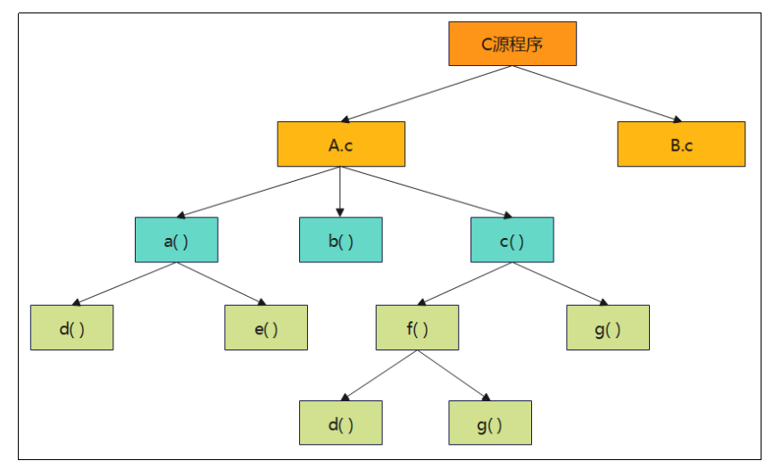
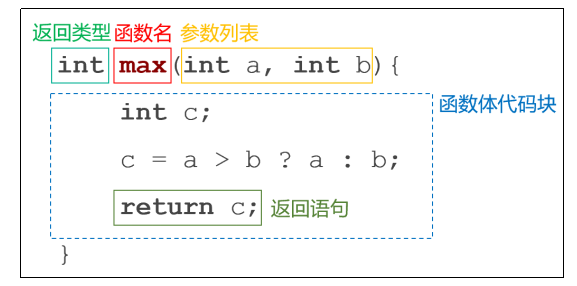
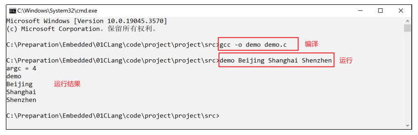
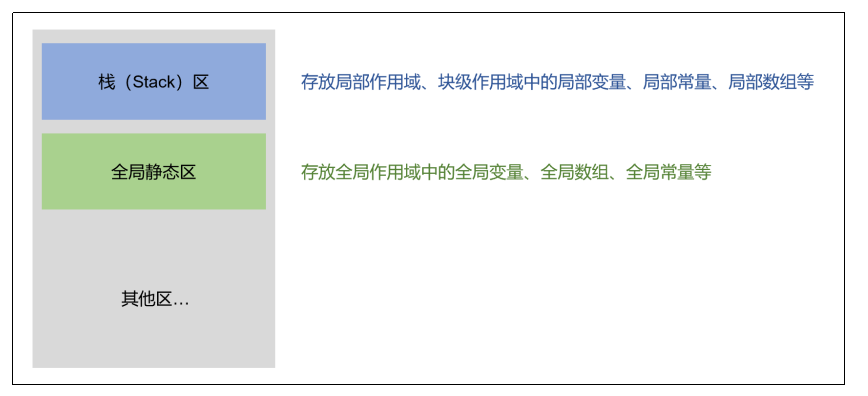
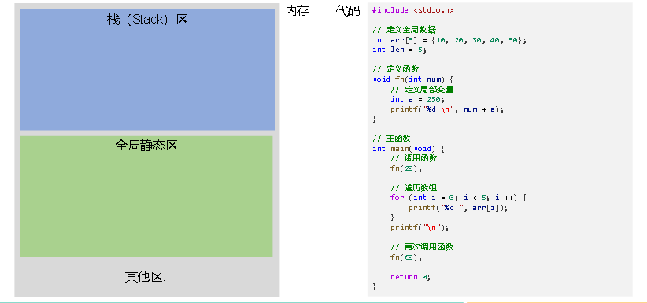
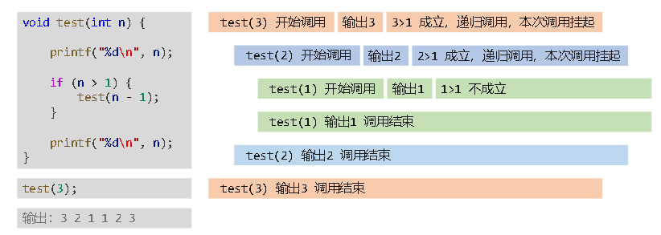
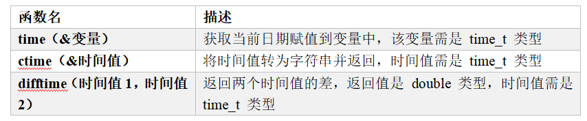
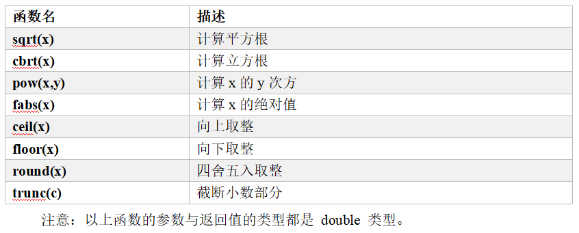

# 第八章：函数

## 1.函数基本概念
**（1）什么是函数**
>**函数是一种可重复使用的代码块，用于执行特定的任务或操作**<br>
>**函数允许我们将代码逻辑组织成独立的单元，从而提高了代码的可读性、可维护性和重用性**<br>
>**一个C程序可以由一个或多个源文件构成（C文件扩展名是“.c”），一个源文件是一个编译单位。一个源文件可以由若干个函数构成，函数之间可以相互调用。也就是说，<mark>函数是C程序基本的组成单位</mark>**<br>
>**注意：C程序中的所有函数都是互相独立的，一个函数并不从属于另一个函数，即<mark>函数不能嵌套声明</mark>**



**（2）函数的功能**
>**封装功能，将一个完整的功能封装成函数，提高代码的结构化和复用性**<br>
>**代码模块化，将程序按照功能拆分成若干模块单元,有助于降低复杂度**<br>
>**增强可维护性，如果需要修改某项功能，只需要调整对应的函数代码**<br>
>**隔离细节，通过函数调用可以隐藏实现细节，只关心输入输出**

**（3）函数的分类**
**C语言中，从使用的角度，函数可以分类两类：库函数、自定义函数**
>**库函数，也称为标准函数，是由C系统提供的，用户不必自己定义，可直接使用它们，一般用#include<...>**<br>
>**自定义函数，解决具体需求而自己定义的函数，需先定义再使用，一般用#include"..."**

---

## 2.函数基本语法
**（1）声明函数语法**


>**函数名：函数被调用时使用的名字，函数名要符合标识符规范**<br>
>**函数体：函数中所包含的代码块，用于实现函数的具体功能和操作**<br>
>**参数：用于接收调用函数时传递进来的值**<br>
>**返回值：函数执行完毕后，从函数传回到调用点的值，返回值的类型要与函数名**<br>
>**前面的返回类型对应，如果没有返回值，返回类型可以写 void**

```c
#include <stdio.h>

// 声明函数
void func()
{
    printf("hello func\n");
}

// 实现两个数字相减
int minus(int m, int n)
{
    return m - n;
}

// 取两个数字中的最大值
int max(int a, int b)
{
    int c;
    c = a > b ? a : b;
    return c;
}

// 主函数
int main()
{
    return 0;
}
```

**（2）调用函数**
>**函数名后面加上圆括号即是函数的调用，参数写在小括号中，函数每调用一次，函数体语句都会执行一遍**

```c
#include <stdio.h>

// 声明函数
void func()
{
    printf("hello func\n");
}

// 实现两个数字相减
int minus(int m, int n)
{
    return m - n;
}

// 取两个数字中的最大值
int max(int a, int b)
{
    int c;
    c = a > b ? a : b;
    return c;
}

// 主函数
int main()
{
    // 函数的调用
    func();
    func();

    printf("17-90的结果：%d\n", minus(17, 90));
    printf("21-180的结果：%d\n", minus(21, 180));
    printf("12和16之间较大的是：%d\n", max(12, 16));
    printf("45和31之间较大的是：%d\n", max(45, 31));

    /*
        hello func
        hello func
        17-90的结果：-73
        21-180的结果：-159
        12和16之间较大的是：16
        45和31之间较大的是：45
    */
    return 0;
}
```

**（3）函数的返回值**
>**函数调用后数能得到一个确定的值，这就是函数的返回值，返回值常常是一个计算的结果，或是用来作为判断函数执行状态的标记**

**函数返回值分为以下三种情况：**
>**无返回值类型：针对函数无返回值或明确不需返回值的情况，使用void（即空类型）表示**<br>
>**有返回值类型：指明具体的类型，比如，int、float、char等。需要在函数体内与return语句搭配使用**<br>
>**如果返回值类型不是void，但函数中没有return语句，则函数会返回一个不确定的值**

```c
#include <stdio.h>

// 无返回值
void fun01()
{
    printf("fun01\n");
}

// 有明确的返回值
double fun02()
{
    return 3.14;
}

// 函数返回一个不确定的值
int fun03()
{
    10 + 20;
}

// 返回类型与return的值类型不一致，可能造成精度损失
int fun04()
{
    return 20.89;
}

int main()
{
    fun01();
    printf("%f \n", fun02());
    printf("%d \n", fun03()); // 返回一个不确定的值
    printf("%d \n", fun04()); // 返回值有精度损失

    /*
        fun01
        3.140000 
        10
        20
    */
    return 0;
}
```

**（4）函数的参数**
**函数的参数分为形参与实参：**
>**形参：在定义函数时，函数名后面括号()中声明的变量称为形式参数，简称形参**<br>
>**实参： 在调用函数时，函数名后面括号()中的使用的常量、变量、表达式称为实际参数，简称实参**<br>
>**参数作用域：形参的改变不影响实参，形参出了作用域就销毁了，需要传形参的地址与实参建立真正的变量联系**<br>
>**注意：实参的数量要与形参的数量一致，否则报错**

```c
#include <stdio.h>

// x 和 y 即为形参
int func(int x, int y)
{
    return x + y;
}

int main()
{
    // 3 和 5 即为实参
    int sum = func(3, 5);
    printf("%d \n", sum); // 8;

    // 如果实参数量如形参不一致 会报错
    // func(100, 299, 300);
    // func(100);

    return 0;
}
```

---

## 3.主函数与函数原型
**（1）主函数的作用：**
>**主函数是程序的入口函数，即所有的程序一定要包含一个主函数，程序总是从这个函数开始执行，如果没有该函数，程序就无法启动**<br>
>**主函数中可以调用其它函数，但其它函数不能反过来调用主函数，主函数也不能调用自己**

**（2）主函数的返回值：**
>**C语言约定，主函数返回值0表示运行成功，如果返回其它非零整数，就表示运行失败。默认情况下，如果主函数里面省略return 0 这一行，编译器会自动加上，即 main() 的默认返回值为0。但是为了保持统一的代码风格，不建议省略**

**（3）主函数的参数：**
>**主函数的声明中可以带有两个参数，格式如下：**

```c
int main(int argc, char *argv[])
{
    // 函数体
}
```


>**其中，形参argc，全称是argument count，表示传给程序的参数个数，其值至少是1；而argv，全称是argument value，argv[]是一个指针数组，我们可以暂时将 argv 理解为是一个数组，数组的每个元素都是字符串**<br>
>**通过这种方式可以通过命令行的方式执行源代码，并接收指定的字符串传给参数argv**

>**我们创建一个名为 demo.c 的源文件，代码如下：**
```c
#include <stdio.h>

int main(int argc, char *argv[])
{
    printf("argc = %d\n", argc);
    // 函数体
    for (int i = 0; i < argc; i++)
    {
        printf("%s\n", argv[i]);
    }

    return 0;
}
```
>**在 demo.c 所在的目录下打开命令行工具，使用 gcc 命令进行编译，如下所示：**



**（4）函数原型**
>**默认情况下，函数必须先声明，后使用。由于程序总是先运行main() 函数，导致所有其它函数都必须在main() 函数之前声明**<br>
>**如果想将函数声明写在后面，可以在程序开头处给出函数原型。函数原型，就是提前告诉编译器，每个函数的返回类型和参数类型。其它信息都不需要，也不用包括函数体，具体的函数实现可以后面再补上**

```c
#include <stdio.h>

// 使用函数原型进行声明
int twice(int);

// 主函数
int main()
{
    printf("%d\n", twice(100));
    //200
    return 0;
}

// 函数定义
int twice(int num)
{
    return 2 * num;
}
```

---

## 4.函数作用域
**（1）函数作用域的概念**
>**作用域用于确定在代码中某个标识符（如变量、标识符常量、数组等）的可见性和访问范围，它决定了在程序的哪些部分可以引用或访问该标识符**<br>
>**作用域可以分为全局作用域、局部作用域、块级作用域**<br>
>**同一个作用域中不能声明同名的标识符**

**（2）全局作用域**
>**在函数和代码块（分支语句、循环语句等）以外定义的变量、标识符常量、数组等具有全局作用域，在程序的任何地方都可以被访问，通常称它们为全局变量、全局常量、全局数组等**

```c
#include <stdio.h>

// 全局变量
double money = 1.1;

// 全局常量
const double PI = 3.14;

// 全局数组
char msg[] = "Hello World";

// 全局函数
void func()
{
    printf("func 函数中使用全局数据：\n");
    printf("money=%.2f \n", money);
    printf("PI=%.2f \n", PI);
    printf("msg=%s \n", msg);
    printf("\n");
    money += 100;
}

// 主函数
int main()
{
    // 调用 func()
    func();
    
    printf("主函数中使用全局数据：\n");
    printf("money=%.2f \n", money);
    printf("PI=%.2f \n", PI);
    printf("msg=%s \n", msg);
    printf("\n");
   
    // 调用 func()
    func();

    /*
        func 函数中使用全局数据：
        money=1.10 
        PI=3.14
        msg=Hello World

        主函数中使用全局数据：
        money=101.10
        PI=3.14
        msg=Hello World

        func 函数中使用全局数据：
        money=101.10
        PI=3.14
        msg=Hello World
    */
    return 0;
}
```

>**对于全局变量，如果没有显式指定初始值，它们将自动初始化为零值**<br>
>**对于全局数组，如果没有显式初始化它们，它们的元素将自动初始化为零值，字符数组，将初始化为空字符 \0**

```c
#include <stdio.h>

// 定义全局变量不进行初始化赋值
int a;    // 自动初始化为0
double b; // 自动初始化为0.0
char c;   // 自动初始化为空字符 \0

// 定义全局数组不进行初始化
int arr[5];  // 所有元素自动初始化为0
char msg[6]; // 所有元素自动初始化为空字符 \0

// 主函数
int main()
{
    // 输出全局变量
    printf("a=%d \n", a); // a=0
    printf("b=%f \n", b); // b=0.000000
    printf("c=%c \n", c); // c=
    printf("\n");

    // 计算数组长度
    int len = sizeof arr / sizeof arr[0];
    // 遍历数组 arr
    for (int i = 0; i < len; i++)
    {
        printf("%d ", arr[i]); 
    }
    printf("\n\n");
    printf("字符数组：%s", msg); // 字符数组：

    /*
        a=0 
        b=0.000000
        c=

        0 0 0 0 0

        字符数组：
    */
    return 0;
}
```

**（3）局部作用域**
>**在函数内定义的变量、标识符常量、数组等具有局部作用域，只有在该函数内部才能被访问，通常称它们为局部变量、局部常量、局部数组等。需要注意的是，函数的形参也是局部变量**

```c
#include <stdio.h>

void add(int a)
{
    // 局部变量
    int b = 20;
    // 局部常量
    const double PI = 3.14;
    // 局部数组
    int nums[] = {10, 20, 30};

    printf("(a+b+nums[0])*PI=%f \n", (a + b + nums[0]) * PI);
}

int main()
{
    // 调用函数 add
    add(100); // (a + b + nums[0]) * PI =  408.200000

    // add 函数外部使用局部变量
    // printf("%d \n", a);  // 报错 'a' undeclared
    // printf("%d \n", b);  //报错 'b' undeclared
    // printf("%f \n", PI);  // 报错 'PI' undeclared
    // printf("%d \n", nums[0]);  // 报错 'nums' undeclared

    return 0;
}
```

>**如果局部作用域中定义了与全局作用域中同名的标识符，优先使用本作用域中定义的数据，相关代码示例如下：**

```c
#include <stdio.h>

// 全局变量
int a = 100;
int b = 200;

void add() 
{
    int a = 300;
    a += 10;
    b += 10;
    printf("函数 add 内部： a=%d, b=%d \n", a, b);
}

int main() 
{
    // 调用函数 add
    add();  // 函数 add 内部： a=310, b=210
    printf("函数 add 外部： a=%d, b=%d \n", a, b);   // 函数 add 外部： a=100, b=210

    /*
        函数 add 内部： a=310, b=210 
        函数 add 外部： a=100, b=210
    */
    return 0;
}
```

>**与全局变量和全局数组不同，局部变量和局部数组如果没有显式初始化，它们的初始值是机器垃圾值，即系统之前分配给这块空间的值。所以不对局部变量、局部数组初始化是不安全且强烈不建议的**

```c
#include <stdio.h>

int main()
{
    // 定义局部变量不进行初始化赋值
    int a;
    // 定义局部数组不进行初始化
    int arr[5];

    // 输出局部变量
    printf("a=%d \n", a);

    // 计算数组长度
    int len = sizeof arr / sizeof arr[0];
    // 遍历数组 arr
    for (int i = 0; i < len; i++)
    {
        printf("%d ", arr[i]);
    }

    /*
        a=16 
        130611760 130611760 130611760 130611760 130611760
    */
    return 0;
}
```
**（4）块级作用域**
>**块级作用域是C99标准引入的概念，在代码块（分支语句、循环语句等）中定义的变量、标识符常量、数组等具有块级作用域，只有在该代码块内部才能被访问，代码块通常具有花括号 {} 结构**<br>
>**这些被称为块级变量、块级常量、块级数组等，同时也可以被称为局部变量、局部常量、局部数组，且与函数中的局部变量、局部常量、局部数组具有相同的特性**

```c
#include <stdio.h>

int main()
{
    // 该代码块中具有块级作用域
    {
        // 块级变量
        int a = 20;
        // 块级常量
        const double PI = 3.14;

        printf("a*PI=%f \n", a * PI);
    }

    // 分支语句体具有块级作用域
    if (1)
    {
        // 局部数组
        int nums[] = {10, 20, 30};

        printf("%d %d %d \n", nums[0], nums[1], nums[2]);
    }

    // 循环语句中的标记变量i是块级变量
    for (int i = 0; i < 5; i++)
    {
        printf("%d ", i);
    }

    // printf("%d \n", a);  // 报错 'a' undeclared
    // printf("%f \n", PI);  // 报错 'PI' undeclared
    // printf("%d \n", nums[0]);  // 报错 'nums' undeclared
    // printf("%d \n", i);  // 报错 'i' undeclared

    /*
        a*PI=62.800000 
        10 20 30 
        0 1 2 3 4
    */
    return 0;
}
```
**（5）作用域和内存**

>**栈区域：局部变量、局部数组等通常存储在栈（Stack）区，这些局部数据的内存分配和释放是自动管理的，它们的生命周期受限于其定义的函数或块级作用域，当函数返回或块级作用域结束时，这些变量的内存会被自动释放**<br>
>**函数每调用一次就创建一次局部数据，调用结束就销毁；下次调用再创建新的局部数据**

>**全局静态区域：全局变量、全局数组等存储在全局静态区，这些全局的数据在程序的整个生命周期内都存在，它们在程序启动时被分配，在程序结束时才被释放**



## 5.static关键字
>**static关键字可以声明静态变量和静态函数，以控制变量和函数的作用范围和生存周期**

**（1）静态局部变量**
**使用static关键字修饰的局部变量，称为静态局部变量，静态局部变量与全局变量一样存储在内存中的全局静态区。静态局部变量具有如下特点：**
>**<mark>静态局部变量只在函数第一次调用时初始化一次</mark>并将生命周期延长到整个程序的执行期间**<br>
>**静态局部变量如果声明时没有初始赋值，系统会自动初始化为零，同全局变量的初始化规则一致**

```c
#include <stdio.h>

void fn()
{
    int n = 10;
    int a;
    printf("n=%d, a=%d \n", n, a);
    n++;
    printf("n++=%d \n", n);
    printf("    \n");
}

void fn_static() 
{
    static int n = 10;
    static int a;
    printf("static n=%d, a=%d\n", n, a);
    n++;
    printf("static n++=%d \n", n);
    printf("    \n");
}

int main() 
{
	int a = 100;
    fn();
    fn_static();

    fn();
    fn_static();

    /*
        n=10, a=16
        n++=11 

        static n=10, a=0
        static n++=11

        n=10, a=0
        n++=11

        static n=11, a=0
        static n++=12
    */
    return 0;
}
```

**（2）静态全局变量**
>**使用 static 关键字修饰的全局变量称为静态全局变量**<br>
>**普通全局变量对整个工程可见，其他文件中，使用extern外部声明后，可以直接使用。静态全局变量仅对当前文件可见，其他文件不可访问，其他文件中可以定义与其同名的变量，两者互不影响**<br>
>**静态全局变量对需要编译多个源代码文件的程序，能够有效地降低源文件之间的耦合，避免不同文件同名变量的冲突**<br>
>**此外static关键字还可以修饰函数（静态函数）、全局数组、全局常量等，功能作用与静态全局变量一致**

**下面演示一个静态全局变量的案例，创建两个源文件，分别命名为file01.c和 file02.c，源文件代码如下：**
```c
//file01.c
#include <stdio.h>

int num01 = 100;
static int num02 = 200;

const double PI01 = 3.14;
static const double PI02 = 3.15;

char msg01[] = "Hello msg01";
static char msg02[] = "Hello msg02";

void fn01()
{
    printf("function fn01 \n");
}
static void fn02()
{
    printf("function fn01 \n");
}
```

```c
//file02.c
#include <stdio.h>

// 外部声明 file02.c 中定义的全局变量
extern int num01;
extern const double PI01;
extern char msg01[];
extern void fn01();

// 外部声明 file01.c 中定义的静态全局变量会报错
extern int num02;
extern const double PI02;
extern char msg02[];
extern void fn02();

int main()
{
    // 使用 file02.c 中定义的数据
    printf("%d \n", num01);
    printf("%f \n", PI01);
    printf("%s \n", msg01);
    fn01();
    printf("\n");

    // 报错 无法获取 file01.c 中定义的全局变量
    // printf("%d \n", num02);
    // printf("%d \n", PI02);
    // printf("%s \n", msg02);
    // fn02();

    return 0;
}
```

---

## 6.递归函数
**一个函数在函数体内又调用了本身，我们称为递归调用，这样的函数就是递归函数**

**递归函数成功执行需满足以下两个条件：**
>**必须有一个明显的结束条件**
>**必须有一个趋近于结束条件的趋势**

```c
#include <stdio.h>

void test(int n)
{
    printf("%d\n", n);

    if (n > 1)
    {
        test(n - 1);
    }

    printf("%d\n", n);
}

int main()
{
    // 调用函数
    test(3);

    /*
        3
        2
        1
        1
        2
        3
    */
    return 0;
}
```



---

## 7.常用系统函数

**（1）格式化输入输出函数：**
**#include<stdio.h>中的函数：**
>**sprintf()：用于将格式化数据写入字符串。相比于 printf()，多了一个参数，第一个参数是要写入的字符串，后面参数与 printf() 一致。简单地讲，sprintf() 是将内容写入字符串而不是输出**<br>
>**sscanf()：用于从一个字符串中按照指定的格式提取数据。相比于 scanf()，多了一个参数，第一个参数是要提取数据的字符串，后面参数与 scanf() 一致。简单地讲，sscanf() 是从字符串中提取数据而不是从用户输入提取数据**

```c
#include <stdio.h>

int main()
{
    // -------------    sprintf 的使用   ---------------
    int age = 12;
    double score = 65.5;
    char name[] = "张三";

    char outputString[100]; // 字符数组，用于存储格式化后的字符串

    // 使用 sprintf 将数据格式化为字符串
    sprintf(outputString, "我叫%s,今年%d岁,成绩%.2f分", name, age, score);

    // 输出格式化后的字符串
    printf("%s\n", outputString);

    // -------------    sscanf 的使用    ---------------
    char inputString[] = "张三成绩:44,孙悟空成绩:65.5,张飞成绩:89";
    float score1, score2, score3;

    // 使用 sscanf 从字符串中提取数据
    sscanf(inputString, "张三成绩:%f,孙悟空成绩:%f,张飞成绩:%f", &score1, &score2, &score3);

    // 输出提取的数据
    printf("score1=%.2f, score2=%.2f, score3=%.2f", score1, score2, score3);

    /*
        我叫张三,今年12岁,成绩65.50分
        score1=44.00, score2=65.50, score3=89.00
    */
    return 0;
}
```
**（2）日期时间相关函数**
**#include<time.h>头文件中的函数：**

>**time_t 是C语言用于表示时间值的数据类型，它通常是一个整数类型（int 或 long 或 long long），用于存储时间戳**<br>
>**时间戳是指从1970年1月1日（通常称为UNIX纪元）零时零分零秒（UTC时间）起至某一特定时刻所经过的秒数**

```c
#include <stdio.h>
#include <time.h> //该头文件中，声明和日期和时间相关的函数

int main()
{
    // time() 获取当前的时间
    time_t curr_time;
    time(&curr_time);
    printf("当前时间戳：%lld \n", curr_time);

    // ctime() 将时间值转为字符串
    printf("当前时间字符串：%s \n", ctime(&curr_time));

    /*
        当前时间戳：1697221633 
        当前时间字符串：Sat Oct 14 02:27:13 2023
    */
    return 0;
}
```
>**接下来，我们使用 difftime() 函数来统计程序的执行时间，代码如下：**
```c
#include <stdio.h>
#include <time.h> // 该头文件中，声明和日期和时间相关的函数

int fn()
{
    int sum = 0;
    for (int i = 0; i < 10000000; i++)
    {
        sum = 0;
        for (int j = 1; j <= 100; j++)
        {
            sum += j;
        }
    }
    return sum;
}

int main()
{
    time_t start_t, end_t;
    time_t diff_t; // 存放时间差

    time(&start_t); // 得到起始时间
    fn();           //  运行 fn 函数，看看执行花费时间
    time(&end_t);   // 函数执行结束后得到时间

    // 计算两个时间值的差
    diff_t = difftime(end_t, start_t);
    printf("执行 fn() 函数耗用了 %lld 秒", diff_t);

    //执行 fn() 函数耗用了 2 秒
    return 0;
}
```
**（3）数学相关函数**
**#include<math.h>头文件中函数：**


```c
#include <stdio.h>
#include <math.h>

int main()
{
    printf("2的绝对值：%.0f, -12.34的绝对值：%.2f \n", fabs(2.0), fabs(-12.34));
    printf("10的平方根：%f \n", sqrt(10));
    printf("8的立方根：%.f \n", cbrt(8));
    printf("3的12次方：%.f \n", pow(3, 12));
    printf("12.31向上取整：%.f，-12.31向上取整：%.f \n", ceil(12.31), ceil(-12.31));
    printf("12.51向下取整：%.f，-12.51向下取整：%.f \n", floor(12.51), floor(-12.51));
    printf("12.51四舍五入：%.f，-12.51四舍五入：%.f \n", round(12.51), round(-12.51));
    printf("12.51截断小数：%.f，-12.51截断小数：%.f \n", trunc(12.51), trunc(-12.51));

    /*
        2的绝对值：2, -12.34的绝对值：12.34 
        10的平方根：3.162278
        8的立方方根：2
        3的12次方：531441
        12.31向上取整：13，-12.31向上取整：-12
        12.51向下取整：12，-12.51向下取整：-13
        12.51四舍五入：13，-12.51四舍五入：-13 
        12.51截断小数：12，-12.51截断小数：-12
    */
    return 0;
}
```

## 8.常用字符串函数

**常用字符串函数汇总：**
|函数名|函数原型|函数功能|
|-|-|-|
|strlen|size_t strlen(const char *str)|求字符串长度|
|strnlen|size_t strnlen(const char *str, size_t maxlen)|长度可控求字符串长度|
|strcpy|char *strcpy( char *str1, char *str2)|拷贝字符串|
|strncpy|char *strncpy(char *str1, char *str2, size_t n)|长度可控拷贝字符串|
|strcat|char *strcat(char *str1, char *str2)|追加字符串|
|strncat|char *strncat(char *str1, char *str2, int n)|长度可控追加字符串|
|strcmp|int strcmp(const char *str1, const char *str2)|比较字符串|
|strstr|char *strstr(char *str, char *srch_term)|查找字符串|
|strtok|char *strtok(char *dest, const char *delim)|切割字符串|
|strerror|char *strerror(int errnum)|错误信号报告|
|atoi|int atoi(const char *string)|字符串转整数|

**sizeof和strlen的区别**
>**sizeof是一个操作符，所有类型都可以使用，只关注空间大小，包含\0。sizeof()里的计算式不执行**<br>
>**strlen是一个库函数，只用于字符串，返回\0前的元素个数**


**字符串函数的例子：**
```c
#include <stdio.h>
#include <string.h>

int main() {
    char str1[20] = "Hello";
    char str2[20] = "World";
    char str3[20];

    // strlen - 计算字符串的长度
    printf("Length of str1: %d\n", (int)strlen(str1));

    // strnlen - 计算字符串的长度，但限制最大长度
    printf("Length of str2 up to 5 characters: %d\n", (int)strnlen(str2, 5));

    // strcpy - 复制字符串
    strcpy(str3, str1);
    printf("str3 after strcpy: %s\n", str3);

    // strncpy - 复制字符串，但限制最大长度
    strncpy(str3, str2, 3);
    str3[3] = '\0'; // Ensure null-terminated string
    printf("str3 after strncpy: %s\n", str3);

    // strcat - 将一个字符串附加到另一个字符串
    strcat(str1, str2);
    printf("str1 after strcat: %s\n", str1);

    // strncat - 将一个字符串附加到另一个字符串，但限制最大长度
    strncat(str1, "!!!", 2);
    printf("str1 after strncat: %s\n", str1);

    // strcmp - 比较两个字符串
    printf("Comparison of str1 and str2: %d\n", strcmp(str1, str2));

    // strstr - 在一个字符串中查找另一个字符串
    char *ptr = strstr(str1, "Wo");
    if (ptr != NULL)
        printf("Found 'Wo' in str1 at position: %ld\n", ptr - str1);
    else
        printf("'Wo' not found in str1\n");

    // strtok - 分解字符串为子字符串
    char sentence[] = "This is a sentence.";
    char *token = strtok(sentence, " ");
    while (token != NULL) {
        printf("%s\n", token);
        token = strtok(NULL, " ");
    }

    // strerror - 返回错误码对应的描述字符串
    printf("Error message for error code 2: %s\n", strerror(2));

    // atoi - 将字符串转换为整数
    char str1[] = "123";
    int num1 = atoi(str1);
    printf("num1: %d\n", num1);

    return 0;
}

```

---

## 9.常用字符函数

**常用字符函数汇总：**

|函数名|函数原型|函数功能|
|-|-|-|
|tolower|int tolower(int ch)|大写字符转小写|
|toupper|int toupper(int ch)|小写字符转大写|
|islower|int islower(int ch)|判断是否为小写|
|isupper|int isupper(int ch)|判断是否为大写|
|isalpha|int isalpha(int ch)|判断是否为字母|
|isdigit|int isdigit(int ch)|判断是否为数字|
|isspace|int isspace(int ch)|判断是否为空白符|

>**空白符指：空格('')、换页('\f')、换行('\n')、回车('\r')、水平制表符('\t')、垂直制表符('\v')**

**字符函数的例子：**

```c
#include <stdio.h>
#include <ctype.h>

int main() {
    char ch = 'A';

    // tolower - 将字符转换为小写
    printf("Lowercase of %c: %c\n", ch, tolower(ch));

    // toupper - 将字符转换为大写
    ch = 'b';
    printf("Uppercase of %c: %c\n", ch, toupper(ch));

    // islower - 检查字符是否为小写字母
    ch = 'c';
    if (islower(ch))
        printf("%c is a lowercase letter.\n", ch);
    else
        printf("%c is not a lowercase letter.\n", ch);

    // isupper - 检查字符是否为大写字母
    ch = 'D';
    if (isupper(ch))
        printf("%c is an uppercase letter.\n", ch);
    else
        printf("%c is not an uppercase letter.\n", ch);

    // isalpha - 检查字符是否为字母
    ch = '5';
    if (isalpha(ch))
        printf("%c is an alphabet character.\n", ch);
    else
        printf("%c is not an alphabet character.\n", ch);

    // isdigit - 检查字符是否为数字
    ch = '9';
    if (isdigit(ch))
        printf("%c is a digit.\n", ch);
    else
        printf("%c is not a digit.\n", ch);

    // isspace - 检查字符是否为空格字符
    ch = ' ';
    if (isspace(ch))
        printf("%c is a whitespace character.\n", ch);
    else
        printf("%c is not a whitespace character.\n", ch);

    return 0;
}

```

---

## 10.常用内存操作函数

**常用内存操作函数汇总：**
|函数名|函数原型|函数功能|
|-|-|-|
|memcpy|void *memcpy(void *dest, const void *src, size_t num)|拷贝内存数据|
|memmove|void *memmove(void *dest, const void *src, size_t num)|移动内存数据|
|memset|void *memset(void *dest, int ch, size_t num)|设置指定字符|
|memcmp|int memcmp(const void *dest, const void *src, size_t num)|比较内存内容|

**内存操作函数的例子：**

```c
#include <stdio.h>
#include <string.h>

int main() {
    char src[] = "Hello, world!";
    char dest[20];
    
    // memcpy - 将源内存中的数据复制到目标内存中
    memcpy(dest, src, strlen(src) + 1);
    printf("After memcpy: %s\n", dest);
    
    // memmove - 将内存块中的数据移动到另一个内存块中，即使它们重叠
    memmove(dest + 7, dest, strlen(dest) + 1);
    printf("After memmove: %s\n", dest);
    
    // memset - 将内存块的前几个字节设置为指定的值
    memset(dest, '-', 6);
    printf("After memset: %s\n", dest);
    
    // memcmp - 比较两个内存块的前几个字节是否相等
    char cmp1[] = "Hello!";
    char cmp2[] = "Hello!";
    if (memcmp(cmp1, cmp2, strlen(cmp1) + 1) == 0) {
        printf("memcmp: cmp1 and cmp2 are equal\n");
    } else {
        printf("memcmp: cmp1 and cmp2 are not equal\n");
    }
    
    return 0;
}

```

