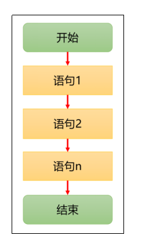
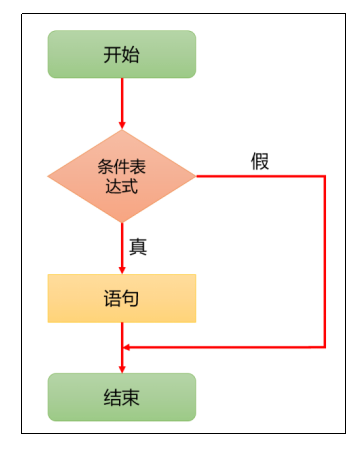
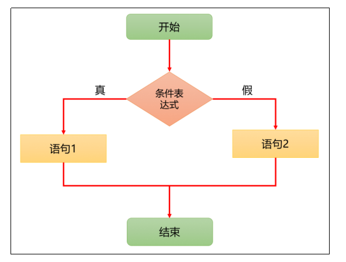
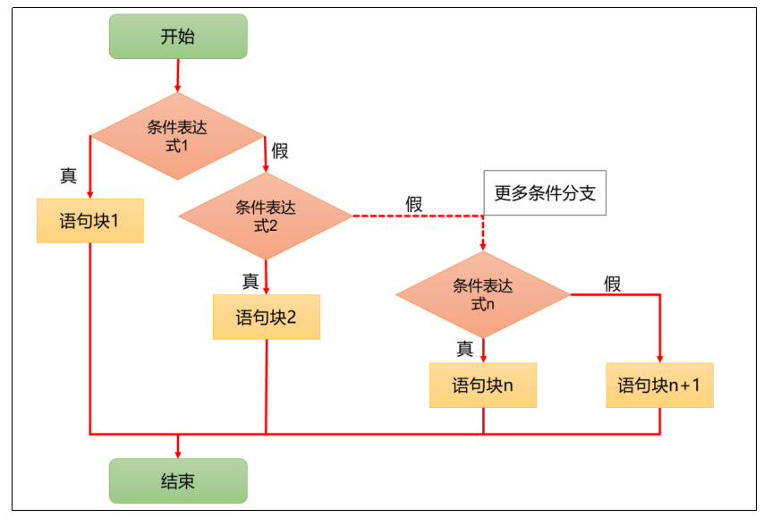
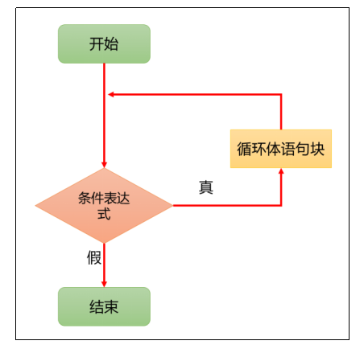
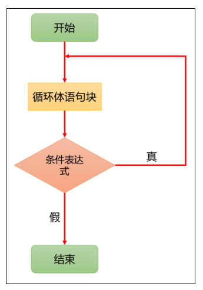
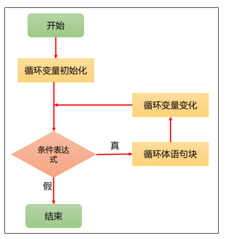
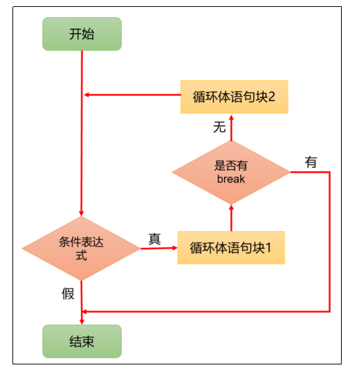
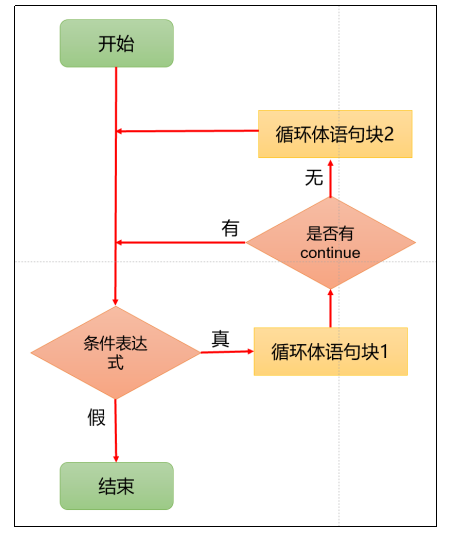
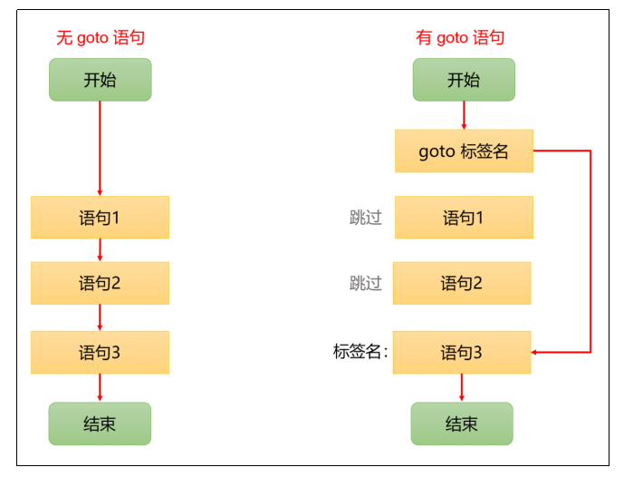

# 第六章：程序控制语句
**主要有三大流程控制语句：顺序控制、分支控制、循环控制语句**
**非主要控制语句：跳转控制语句**

## 1.顺序控制语句
**程序从上到下逐行地执行，表达式语句都是顺序执行的。并且上一行对某个变量的修改对下一行会产生影响**


---

## 2.分支控制语句
**（1）单向分支**
```c
if (条件表达式)
{
    执行代码块；
}
```
>**当条件表达式为真（非0时，就会执行代码块语句，条件表达式为假（0）时，不会执行代码块**



```c
//输入年龄，如果是未成年，则提示 “未成年人请在家长陪同下访问!
#include <stdio.h>

int main()
{
    int age = 0;

    printf("请输入年龄");
    scanf("%d", &age);

    // 根据age的值来处理
    if (age < 18)
    {
        printf("未成年人请在家长陪同下访问！");
    }

    printf("欢迎继续访问！");

    return 0;
}
```

**（2）双向分支**
```c
if (条件表达式)
{
    执行代码块1；
}
else
{
    执行代码块2;
}
```
>**当条件表达式成立（为真），执行代码块1，否则执行代码块2**



```c
//输入年龄，如果大于18岁，则输出 “你年龄大于18，要对自己的行为负责!”，否则，输出”你的年龄不大这次放过你了
#include <stdio.h>

int main()
{
    int age = 0;
    printf("请输入年龄");
    scanf("%d", &age);

    if (age > 18)
    {
        printf("\n你年龄大于18，要对自己的行为负责!");
    }
    else
    {
        printf("\n你的年龄不大，这次放过你了");
    }

    return 0;
}
```

**（3）多向分支：else if**
```c
//当条件表达式1成立时，即执行代码块1，如果表达式1不成立，才去判断表达式2是否成立，如果表达式2成立，就执行代码块2，以此类推如果所有的表达式都不成立，则执行else 的代码块
if (条件表达式1)
{
    执行代码块1;
}
else if (条件表达式2)
{
    执行代码块2;
}
... 
else
{
    执行代码块n;
}
```



```c
//张三参加考试，他和父亲达成协议，如果成绩不到 60 分没有任何奖励；如果成绩 60分（含）到80分，奖励一个肉夹馍；如果成绩80分（含）到90分，奖励一个 ipad；如果成绩90分及以上，奖励一部华为mate60 pro
#include <stdio.h>

int main()
{
    // 定义变量记录成绩
    double score;
    printf("请输入你的成绩：");
    scanf("%lf", &score);

    // 根据成绩进行判断
    if (score < 60)
    {
        printf("你的成绩不及格，没有任何奖励！");
    }
    else if (score < 80)
    {
        printf("奖励你一个肉夹馍");
    }
    else if (score < 90)
    {
        printf("奖励你一个ipad");
    }
    else if (score >= 90)
    {
        printf("奖励你一部华为 mate60 pro,遥遥领先！");
    }
    else
    {
        printf("输入无效！");
    }

    return 0;
}
```

**（4）多向分支：switch**
```c
switch (表达式)
{
    case 常量值1:
       语句块1;
        break;
    case 常量值2:
       语句块2;
        break;
   … case 常量值n:
        语句块n;
        break;
    default:
       语句块n + 1;
}
```

>**说明：**
>**switch后面表达式的值必须是一个整型（char、short, int, long等）或枚举类型**<br>
>**case后面的值必须是常量，而不能是变量**<br>
>**default是可选的，当没有匹配的case时，执行default**<br>
>**break语句可以使程序跳出switch语句块，如果没有break，会执行下一个case 语句块，直到遇到break或者执行到switch结尾，这个现象称为穿透**

```c
#include <stdio.h>

int main()
{
    char c;
    printf("请输入一个字符(a,b,c,d)：");
    scanf("%c", &c);

    switch (c)
    {
    case 'a':
        printf("今天星期一, 猴子穿新衣");
        break;
    case 'b':
        printf("今天星期二, 猴子当小二");
        break;
    case 'c':
        printf("今天星期三, 猴子爬雪山");
        break;
    case 'd':
        printf("今天星期四, 猴子有急事");
        break;
    default:
        printf("没有匹配到任何值~");
    }
    printf("switch 结束~");

    return 0;
}
```

**（5）switch和if else if的比较**
>**如果判断条件是判等，而且符合整型、枚举类型，虽然两个语句都可以使用，建议使用swtich语句**<br>
>**如果判断条件是区间判断，大小判断等，使用if else if，注意使用最短路径，也就是先判断不合适的**<br>
>**一般来说都不用switch，嵌套太深了，各功能模块都是抽离出来适用的**


**（6）嵌套分支**
>**嵌套分支是指，在一个分支结构中又嵌套了另一个分支结构，里面的分支的结构称为内层分支，外面的分支结构称为外层分支。嵌套分支层数不宜过多，建议最多不要超过3层**

```c
if ()
{
    if ()
    {
    }
    else
    {
        switch ()
        {
        case …
        }
    }
}
```

```c
#include <stdio.h>

int main()
{
    // 获取用户输入的油号和油量
    int oilN, oilL;
    printf("请输入油号：");
    scanf("%d", &oilN);
    printf("请输入油量：");
    scanf("%d", &oilL);

    // 定义变量记录价格
    double price;

    // 嵌套分支
    switch (oilN)
    {
    case 92:
        price = 4;
        if (oilL >= 40)
        {
            price = 3.5;
        }
        printf("您本次加油需支付：%.2f", price * oilL);
        break;
    case 95:
        price = 5;
        if (oilL >= 40)
        {
            price = 4.5;
        }
        printf("您本次加油需支付：%.2f", price * oilL);
        break;
    default:
        printf("本加油站没有您所需油号！");
    }

    return 0;
}
```

---

## 3.循环控制语句
**（1）while循环**
```c
while (循环条件表达式)
{
    循环体语句;
}
```
>**当循环条件表达式成立，就执行循环体语句，直到条件不成立停止循环
>为避免死循环，循环条件表达式不能永远成立，且随着循环次数增加，应该越来越趋向于不成立**



```c
//输出10次 "我第n天吃了n个韭菜馅的包子
#include <stdio.h>

int main()
{
    // 输出10次 "我第n天吃了n个韭菜馅的包子"
    // 定义循环变量
    int num = 0;
    // 开始循环
    while (num < 10)
    {
        printf("我第%d天吃了%d个韭菜馅的包子 \n", num, num);
        // 循环标记变量变化
        num++;
    }
    printf("循环结束后循环变量的值：%d", num);

    return 0;
}
```

**（2）do...while循环**
```c
do
{
    循环体语句；
} while (循环条件表达式);
```

>**do…while循环是先执行再判断，但只有第一次循环语句的执行没有经过判断，以后的每一次仍然先经过判断**<br>
>**注意：while后面的分号不能省略**


```c
#include <stdio.h>

int main()
{
    // 输出10次 "我第n天吃了n个韭菜馅的包子"
    int i = 0;

    do
    {
        printf("我第%d天吃了%d个韭菜馅的包子 \n", i, i);
        i++;
    } while (i < 10);

    printf("循环结束后循环变量的值：%i", i);

    return 0;
}
```

**（3）for循环**
```c
for (循环变量初始化; 循环条件表达式; 循环变量变化)
{
    循环语句;
}
```
>**循环变量初化只执行一次，且循环开始前就执行**<br>
>**循环条件表达式每次循环都执行，同while循环一样，每次先判断后执行循环体语句**<br>
>**循环标记变量变化每次循环都执行，在大括号中循环体语句之后执行**


```c
#include <stdio.h>

int main()
{
    // 输出10次 "我第n天吃了n个韭菜馅的包子"
    for (int i = 0; i < 10; i++)
    {
        printf("我第%d天吃了%d个韭菜馅的包子 \n", i, i);
    }

    return 0;
}
```

**（4）多重循环**
>**将一个循环放在另一个循环体内，就形成了嵌套循环， 其中，for、while、do…while均可以作为外层循环和内层循环，建议一般使用两层，最多不要超过3层，如果嵌套循环过多，会造成可读性降低**<br>
>**如果外层循环次数为m次，内层为n次，则内层循环体实际上需要执行m*n次**

```c
#include <stdio.h>

int main()
{
    // 输入列数和行数
    int rows, cols;

    printf("请输入行数：");
    scanf("%d", &rows);

    printf("请输入列数：");
    scanf("%d", &cols);

    // 循环
    for (int i = 0; i < rows; i++)
    {
        for (int j = 0; j < cols; j++)
        {
            printf("[%d,%d]  ", i, j);
        }
        printf("\n");
    }

    //假如输入：4行，7列
    /*
        [0,0]  [0,1]  [0,2]  [0,3]  [0,4]  [0,5]  [0,6]
        [1,0]  [1,1]  [1,2]  [1,3]  [1,4]  [1,5]  [1,6]
        [2,0]  [2,1]  [2,2]  [2,3]  [2,4]  [2,5]  [2,6]
        [3,0]  [3,1]  [3,2]  [3,3]  [3,4]  [3,5]  [3,6]
    */
    return 0;
}
```

---

## 4.跳转控制语句
**（1）break**
>**break语句用于终止某个语句块的执行，用在switch语句或者循环语句中**



```c
#include <stdio.h>

int main()
{

    for (int i = 0; i < 10; i++)
    {
        if (i == 3)
        {
            break;
        }
        printf("%d \n", i);
    }

    /*
        0 
        1 
        2
    */
    return 0;
}
```
**（2）continue**
>**continue语句用于结束本次循环，继续执行下一次循环**



```c
#include <stdio.h>

int main()
{
    for (int i = 0; i < 10; i++)
    {
        if (i == 3)
        {
            continue;
        }
        printf("%d \n", i);
    }
    /*
        0 
        1 
        2
        4
        5
        6
        7
        8
        9
    */
    return 0;
}
```
**（3）goto语句**
>**goto语句是一种跳转语句，它允许程序控制流程在代码中跳转到带有标签（label）的语句处，标签（label）的名称可以自行设置，需要满足标识符规范**<br>
>**我们在开发中不建议使用goto语句，但我们需要掌握 goto 语句的执行流程，以能够看懂其他开发者的代码中可能出现的 goto 语句**

```c
goto 标签名  // 跳转到指定的标签（label）处
...
标签名:      // 定义一个标签（label）
语句;
```
>**注意：goto 后面如果引用了没有定义的标签，编译器会报错！**



```c
#include <stdio.h>

int main()
{
    printf("start \n");
    goto label1; // label1是标签名

    printf("ok1 \n");
    printf("ok2 \n");
label1:
    printf("ok3 \n");
    printf("ok4 \n");

    /*
        start 
        ok3
        ok4
    */
    return 0;
}
```