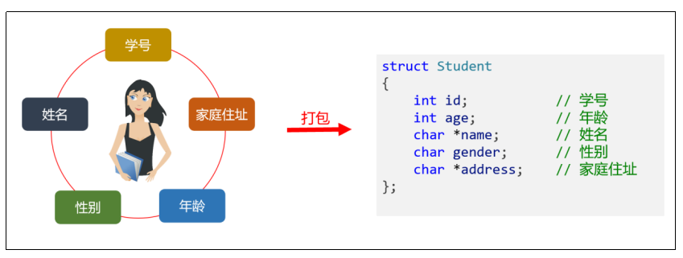
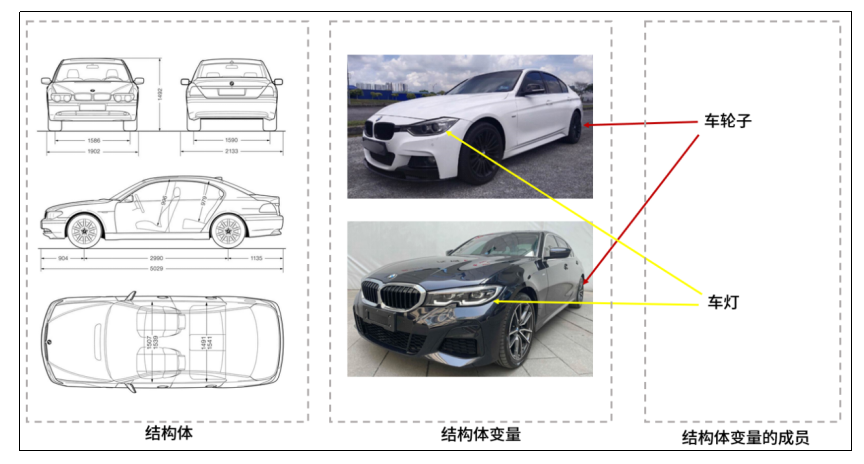
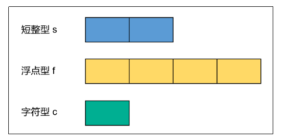

# 第十一章：自定义数据类型

## 1.枚举
**（1）什么是枚举**
>**枚举（Enumeration）是C语言中的一种用户自定义数据类型，用于定义一组相关的常量。枚举使我们可以为这些常量分配有意义的名字，从而提高代码的可读性和可维护性**<br>
>**如果我们定义一个变量，用来表示一周中的一天，该变量的值只能从七个有效值中选择，枚举可以帮助我们限制变量的有效值**

**（2）如何定义枚举**
>**枚举使用 enum 关键字来定义，枚举名称和枚举元素名称都是标识符，定义一个枚举就是定义了一种枚举数据类型，语法如下：**

```c
enum 枚举名称 
{
    枚举元素1,
    枚举元素2,
    ...
    枚举元素N
};
```

**枚举元素也称为枚举成员或枚举常量，具有如下特点：**
>**枚举元素的值必须在同一枚举中是唯一的**<br>
>**枚举元素的值必须是整数类型，通常是int**<br>
>**如果没有为枚举元素指定值，编译器会自动为它们分配值，从0开始，依次递增**<br>
>**定义枚举的时候也可以为枚举元素自定义值，需保证唯一性和整型类型**

```c
// 定义枚举类型,表示星期一到星期天，枚举元素的值自动分配，从0到6。
enum Weekday
{
    MONDAY,
    TUESDAY,
    WEDNESDAY,
    THURSDAY,
    FRIDAY,
    SATURDAY,
    SUNDAY
};

// 定义枚举类型，表示北京地区一年四季的平均温度
enum Season 
{
    SPRING = 18,
    SUMMER = 30,
    AUTUMN = 20,
    WINTER = -5
};
```

**（3）枚举变量**
**什么是枚举变量**
>**定义变量时指定类型是我们所定义的枚举类型，该变量称为枚举变量。枚举变量的值应该是枚举类型中的枚举常量中的一个，不能是其他值**

**定义枚举变量的语法：**
>**第一种：先定义枚举类型，再定义枚举变量**

```c
// 定义枚举类型
enum DAY 
{
    MON = 1, 
    TUE, 
    WED, 
    THU, 
    FRI, 
    SAT, 
    SUN
}; 
// 使用枚举类型定义枚举变量
enum DAY day;
```

>**第二种：定义枚举类型的同时声明枚举变量**

```c
enum DAY 
{
    MON = 1, 
    TUE, 
    WED, 
    THU, 
    FRI, 
    SAT, 
    SUN
} day;
```

>**第三种：定义枚举类型的同时声明枚举变量，且省略枚举名称**

```c
enum 
{
    MON = 1, 
    TUE, 
    WED, 
    THU, 
    FRI, 
    SAT, 
    SUN
} day;
```

---

## 2.结构体
**（1）什么是结构体**

>**C语言提供了struct关键字，允许自定义复合数据类型，将不同类型的值组合在一起，这种类型称为结构体（structure）类型**<br>
>**C语言没有其他语言的对象（object）和类（class）的概念，struct 结构很大程度上提供了对象和类的功能**



**（2）声明结构体**
```
struct 结构体名
{ 
    数据类型1 成员名1;   
    数据类型2 成员名2; 
    ……
    数据类型n 成员名n;
};
```

```c
// 定义结构体：学生
struct Student
{
    int id;           // 学号
    int age;          // 年龄
    char *name;       // 姓名
    char gender;      // 性别
    char *address;    // 家庭住址
};
```

**（3）声明结构体变量**
**方式一：先定义结构体，然后再创建结构体变量**

```c
// 定义结构体
struct Student
{
    int id;           // 学号
    int age;          // 年龄
    char *name;       // 姓名
    char gender;      // 性别
    char *address;    // 家庭住址
};

// 定义结构体变量
struct Student stu1,stu2;
```

**方式二：在定义结构体的同时定义结构体变量**

```c
// 定义结构体的同时定义 stu1和 stu2 两个变量
struct Student
{
    int id;           // 学号
    int age;          // 年龄
    char *name;       // 姓名
    char gender;      // 性别
    char *address;    // 家庭住址
} stu1, stu2;
```

**方式三：在定义时也可以不给出结构体名**

```c
// 不给出结构体的名字
struct
{
    int id;           // 学号
    int age;          // 年龄
    char *name;       // 姓名
    char gender;      // 性别
    char *address;    // 家庭住址
} stu1, stu2;
```

**注意：在C语言中，结构体（struct）和结构体变量是两个不同的概念**
>**结构体是一种自定义的数据类型，像一种模板，定义了数据的格式**<br>
>**结构体变量是根据结构体类型创建的变量，代表了一个具体的对象，用于存储数据**

**（4）成员的获取和赋值**
>**成员是结构体的一个组成部分，一般是基本数据类型、也可以是数组、指针、结构体等。结构体的成员也可以称为属性**<br>
>**结构体和数组类似，也是一组数据的集合，结构体使用点号 . 获取单个成员，可以进行赋值和取值**

```c
#include <stdio.h>

int main()
{
    // 声明结构体以及结构体变量,并给结构体成员赋值
    struct Student
    {
        int id;        // 学号
        int age;       // 年龄
        char *name;    // 姓名
        char gender;   // 性别
        char *address; // 家庭住址
    } stu1 = {1002, 19, "Jim Liu", 'f', "Songjiang Shanghai"}, stu2 = {1003, 16, "Tom Chen", 'm', "Baoan Shenzhen"};

    // 获取成员的值
    printf("id: %d \n", stu1.id);
    printf("name: %s \n", stu1.name);
    printf("age: %d \n", stu1.age);
    printf("gender: %c \n", stu1.gender);
    printf("address: %s \n \n", stu1.address);

    printf("id: %d \n", stu2.id);
    printf("name: %s \n", stu2.name);
    printf("age: %d \n", stu2.age);
    printf("gender: %c \n", stu2.gender);
    printf("address: %s \n", stu2.address);


    /*
        id: 1002 
        name: Jim Liu
        age: 19
        gender: f
        address: Songjiang Shanghai

        id: 1003
        name: Tom Chen
        age: 16
        gender: m
        address: Baoan Shenzhen
    */
    return 0;
}
```

**（5）结构体指针**

**①结构体指针介绍**：
>**结构体指针是指向结构体的指针变量，允许间接访问和操作结构体的成员，它提供了一种方便的方式来处理结构体数据**

>**声明结构体指针的语法格式：struct 结构体名 * 结构体指针变量名;**

**②声明结构体指针**
>**通常需要先定义一个结构体变量，再创建结构体指针，并取结构体变量的地址作为结构体指针的值**

```c
// 声明结构体
struct Student
{
    int id;        // 学号
    int age;       // 年龄
    char *name;    // 姓名
    char gender;   // 性别
    char *address; // 家庭住址
};
// 声明结构体变量
struct Student stu;
// 声明结构体指针并初始化
struct Student *ptr = &stu;
```

**③通过结构体指针访问成员**
>**结构体指针可以通过“->” 操作符访问结构体的成员**

```c
#include <stdio.h>

int main()
{   
    // 结构体
    struct Student
    {
        char *name;
        int age;
        char gender;
    };

    // 结构体变量
    struct Student s = {"张三", 20, 'M'};
    // 通过结构体变量访问成员
    printf("name=%s,age=%d,gender=%c \n", s.name, s.age, s.gender);

    // 声明结构体指针
    struct Student *ps = &s;

    // 结构体指针通过解引用访问成员
    printf("name=%s,age=%d,gender=%c\n", (*ps).name, (*ps).age, (*ps).gender);

    // 结构体指针使用->访问成员
    printf("name=%s,age=%d,gender=%c\n", ps->name, ps->age, ps->gender);


    /*
        name=张三,age=20,gender=M 
        name=张三,age=20,gender=M
        name=张三,age=20,gender=M
    */
    return 0;
}
```
**总结：如果指针变量p指向一个结构体变量stu，以下3种用法等价**
>
>**指针用->，变量用.**

```c
stu.成员名

(*p).成员名

p->成员名
```

**（6）区分结构体、结构体变量、结构体成员**

```c
int num1;        // int 是数据类型, 而num1是一个具体的int变量
struct Car car1; // Car 是结构体数据类型，而car1是一个Car变量
```



---

## 3.共用体
**（1）什么是共用体**
>**有时需要一种数据结构，不同的场合表示不同的数据类型。比如，如果只用一种数据结构表示学生的“成绩”，这种结构就需要有时是整数（80、90），有时是字符（'A'、'B'），有时是浮点数（80.5、60.5）**<br>
>**C语言提供了共用体类型（Union 结构），用来自定义可以灵活变更的数据结构。它内部可以包含各种属性，但同一时间只能有一个属性，因为所有属性都保存在同一个内存地址，后面写入的属性会覆盖前面的属性。这样做的最大好处是节省空间**

**共用体”与“结构体”的定义形式相似，但它们的含义是不同的**
>**结构体变量所占内存长度，可以认为是各成员占的内存长度的叠加；每个成员分别占有其自己的内存单元**<br>
>**共用体变量所占的内存长度等于最长的成员的长度；几个成员共用一个内存区**

**（2）声明共用体**
```
union 共用体类型名称
{
    数据类型 成员名1;
    数据类型 成员名2;
    …
    数据类型 成员名n;
};
```

```c
//union命令定义了一个包含三个属性的数据类型data。虽然包含三个属性，但是同一时间只能取到一个属性。最后赋值的属性，就是可以取到值的那个属性
union data
{
    int m;
    float x;
    char c;
};
```

**（3）声明共用体变量**
**方式一：先定义共用体类型，再定义共用体变量**

```c
// 声明共用体类型
union data 
{
    short m;
    float x;
    char c;
};

// 声明共用体变量
union data a, b;
```

**方式二：定义共用体类型的同时定义共用体变量**

```c
union data 
{
    short m;
    float x;
    char c;
} a, b;
```

**方式三：在定义时也可以不给出共用体名**

```c
union 
{
    short m;
    float x;
    char c;
} a, b;
```

**（4）共用体内存分析**
>**由上面方式二中共用体变量a为例，它由3个成员组成，分别是m、x和c，系统会按照最长的成员为它分配内存，由于成员x的长度最长，它占4个字节，所以共用体变量a的内存空间也为4个字节**



**（5）成员的获取和赋值**
>**同结构体一样，共用体也使用点号.获取单个成员，可以进行赋值和取值**

**方式一：声明共用体变量，再赋值**

```c
union data a;
a.c = 4;
```

**方式二：声明共用体变量的同时，给任一成员赋值**
```c
union data a = {.c = 4};
```

**方式三：声明共用体变量的同时，给首成员赋值**

```c
//方式三不指定成员名，所以只能为第一个成员进行赋值
union data a = {8};
```

---


## 4.typedef
**（1）typedef介绍**
>**C语言允许为一个数据类型起一个新的别名，就像给人起“绰号”一样**

**起别名的目的不是为了提高程序运行效率，而是为了编码方便。例如，有一个结构体的名字是 student，定义一个结构体变量stu1，代码如下：**

```c
struct student stu1;
```

>**struct 看起来就是多余的，但不写又会报错。如果为 struct student起了一个别名 Student，书写起来就简单了：**

```c
Student stu1;
```

>**这种写法更加简练，意义也非常明确，不管是在标准头文件中还是以后的编程实践中，都会大量使用这种别名**

**（2）typedef的应用场景**

**①为某个基本类型起别名**
>**typedef 命令用来为某个类型起别名**
```c
typedef 类型名 别名;
```

>**习惯上，常把用typedef声明的类型名的第1个字母用大写表示，以便与系统提供的标准类型标识符相区别**

```c
typedef int Integer;  //用Integer作为int类型别名，作用与int相同
Integer a, b;
a = 1;
b = 2;

typedef unsigned char Byte;  //为类型 unsign char 起别名 Byte
Byte c = 'z';
```

>**注意：使用 typedef 可以为基本类型一次起多个别名**

```c
typedef int chocolate, doughnut, mushroom; //一次性为 int 类型起了三个别名
```

**②为结构体、共用体起别名**
>**为 struct、union等命令定义的复杂数据结构创建别名，从而便于引用**

```c
//下例中，自定义数据类型时，同时使用typedef命令，为struct Treenode起了一个别名 Tree
typedef struct Treenode
{
    char *name;
    int legs;
    int speed;
} Tree;

//下例中，union命令定义了一个包含三个属性的数据类型，typedef 命令为它起别名为Quantity
typedef union
{
    short count;
    float weight;
    float volume;
} Quantity;
```

**③为指针取别名**
>**typedef可以为指针起别名**

```c
//下例中，intptr是int*的别名。不过，使用的时候要小心，这样不容易看出来，变量 x 是一个指针类型
typedef int *intptr;
int a = 10;
intptr x = &a;

//为字符指针起别名为 String，以后使用String声明变量时，就可以轻易辨别该变量是字符串
typedef char *String;
char *str1 = "hello";  // 之前的写法
String str2 = "hello"; // 现在的写法

```

**④为数组类型起别名**
>**typedef也可以用来为数组类型起别名**

```c
// 举例1 给int[5] 取别名 fiveInts
typedef int fiveInts[5];  
fiveInts x = {11, 22, 33, 44, 55}; // 相当于 int x[5] = {11, 22, 33, 44, 55};

// 举例2 给 int[100] 取别名 Num
typedef int Num[100]; // 声明Num为整型数组类型名
Num a;                // 相当于 int a[100];
```

>**使用 typedef 为数组指针取别名**

```c
// 为 int (*)[5] 取别名为 IntArrayPointer
typedef int (*IntArrayPointer)[5];  
// 定义数组
int arr[5] = {1, 2, 3, 4, 5};
// 使用别名定义数组指针
IntArrayPointer ptr = &arr;  // 使用别名指向数组
```

---

## 5.位段
>**位段概念：位段是一种以位为单位定义结构体或联合体成员变量所占的空间**<br>
>**位段结构：含有位段的结构体或联合体成为位段结构**<br>
>**位段优点：既能节约空间，又方便使用**<br>
>**位段形式：变量类型 变量名 : 位段数。比如：int a:3;表示使用3bit存储a变量**<br>
>**位段用途：用于网络发包时节约空间**

---

## 6.内存对齐规则

**<font color=red>结构体第一个成员，存放在结构体变量开始位置的0偏移处，从第二个变量开始，都要对齐到对齐数的整数倍地址处</font>**

**<font color=red>windows和Linux下默认对齐数：windows默认对齐数为8，linux没有默认对齐数</font>**


>**<font color=red>对齐数：成员自身大小与默认对齐数的较小值</font>**<br>
>**<font color=red>最大对齐数：所有成员对齐数的最大值</font>**<br>
>**<font color=red>结构体总大小：最大对齐数的整数倍</font>**


**<font color=red>内存对齐意义：拿空间换时间，解决平台问题和性能问题</font>**


