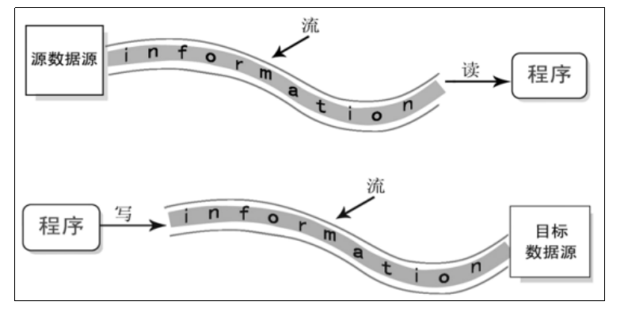
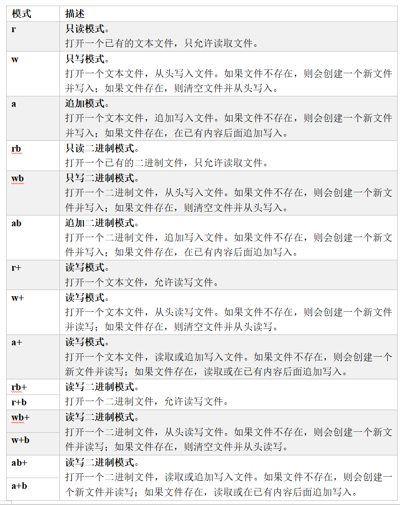

# 第十三章：文件操作

## 1.文件基本介绍
**文件，对我们并不陌生，文件是数据源（保存数据的地方）的一种，比如大家经常使用的word文档，txt文件，excel文件...都是文件。文件最主要的作用就是保存数据，它既可以保存一张图片，也可以保持视频，声音...**

**C程序中，文件中数据的输入/输出操作以“流”的方式进行，可以看做是一种数据的流动**



>**输入流（Input Stream）：数据从数据源（例如文件、键盘等）到程序（内存）的传输路径**
>
>**输出流（Output Stream）：数据从程序（内存）到数据源（例如文件、屏幕等）的传输路径**


---

## 2.C语言的输入与输出
**（1）标准文件**
>**C 语言把所有的设备都当作文件，所以设备（比如显示器）被处理的方式与文件相同。以下三个文件会在程序执行时自动打开，以便访问键盘和屏幕**


**（2）scanf和printf函数**
>**C语言中的I/O （输入/输出）通常使用printf()和scanf()两个函数，scanf()函数从标准输入流stdin读取输入，printf()函数把输出写入到标准输出流stdout。这两个函数我们在前面的案例中已经大量使用**

```c
​#include <stdio.h>

int main()
{
    // 定义变量
    char str[100];
    int i;

    // 获取输入
    printf("Please Input A String And A Number :");
    scanf("%s %d", str, &i);

    // 输出到屏幕终端
    printf("You entered: %s %d ", str, i);
    printf("\n");

    return 0;
}
```

**（3）getchar和putchar函数**
>**getchar()：用于从标准输入流（通常是键盘输入）读取一个字符。这个函数在同一个时间内只会读取一个单一的字符**<br>
>**函数原型：int getchar(void);**<br>
>**返回值说明：返回一个整数值，表示读取的字符**

>**putchar()：用于将一个字符写入到标准输出流（通常是屏幕）。这个函数在同一个时间内只会输出一个单一的字符**<br>
>**函数原型：int putchar(int character);**<br>
>**返回值说明：返回一个整数值，是写入的字符的ASCII码值**<br>
>**参数说明：character是要写入的字符的ASCII码值**

```c
#include <stdio.h> 

int main( )
{
    int c;
    printf( "Enter a value :"); 
    c = getchar();
    
    printf( "\nYou entered: ");
    putchar(c);
    printf("\n");

    return 0;
}
```

**（4）gets和puts函数**
>**gets()：用于从标准输入流（通常是键盘）读取一行文本，并将其存储在一个字符数组中（gets() 的参数），直到遇到换行符为止**<br>
>**函数原型：char * gets(char * str);**<br>
>**返回值说明：返回一个指向存储在 str 中的字符串的指针**<br>
>**参数说明：字符数组（字符串）的指针，用于存储读取的输入数据**

>**puts()：用于将字符串输出到标准输出流（通常是屏幕），并自动添加换行符。它接受一个字符串作为参数，然后将其显示在屏幕上**<br>
>**函数原型：int puts(const char * str);**<br>
>**返回值说明：返回成功写入的字符数，如果写入失败或出现错误，它会返回 特殊值EOF（（EOF 是一个定义在 stdio.h 头文件中的常量，值通常为 -1））**<br>
>**参数说明：str 是要输出的字符串**

```c
#include <stdio.h>

int main()
{
    char str[20];

    printf("Enter a line of text :");
    gets(str);

    printf("You entered: ");
    // printf("%s", str);
    puts(str);

    return 0;
}
```

---

## 3.C语言的文件读写
**文件，无论是文本文件还是二进制文件，都以一系列字节的形式存在，C语言提供了一系列函数处理存储设备上的文件**

**（1）打开文件**
>**使用fopen( ) 函数来创建一个新的文件或者打开一个已有的文件。该函数位于标准库的 stdio.h 头文件中**<br>
>**函数原型：FILE * fopen( const char * filename, const char * mode );**<br>
>**返回值说明：返回一个指向 FILE 结构的指针，该结构表示文件流，可以使用这个指针来进行文件的读取和写入操作。如果打开文件失败，返回一个空指针（NULL）**<br>
>**参数说明：filename是一个以字符串形式指定的文件名，表示要打开的文件的名称，可以包括文件路径和文件名。mode 是一个以字符串形式指定的打开模式，表示打开文件的方式，可以是以下值之一：**



**（2）关闭文件**
>**文件读写完毕后，一定要关闭文件，使用fclose( ) 函数可以关闭文件。该函数位于标准库的 stdio.h 头文件中**<br>
>**函数原型：int fclose(FILE * stream);**<br>
>**返回值说明：返回一个整数值，通常为零（0），表示关闭操作成功。如果关闭失败，它返回特殊值EOF （EOF 是一个定义在 stdio.h 头文件中的常量，值通常为 -1）**<br>
>**参数说明：stream是一个指向 FILE 结构的指针，表示要关闭的文件流**

**（3）写入文件**
>**①fputc() 函数用于逐字符写入文件。位于标准库的stdio.h 头文件中**<br>
>**函数原型：int fputc(int character, FILE * stream);**<br>
>**返回值说明：返回一个整数值，通常是写入的字符的ASCII码值。如果写入成功，返回的值与输入的 character 值相同；如果写入失败，它返回特殊值 EOF**<br>
>**参数说明：character是要写入的字符，通常以整数形式表示，即字符的ASCII码值。stream是一个指向 FILE 结构的指针，表示要写入字符的文件流**

```c
#include <stdio.h>

int main()
{
    // FILE *file = fopen("output.txt", "w"); // 从头写入
    FILE *file = fopen("output.txt", "a"); // 追加写入

    if (file != NULL)
    {
        // 使用 fputc 写入一个字符
        char ch = 'A';
        int result1 = fputc(ch, file);
        if (result1 != EOF)
        {
            printf("成功使用 fputc 写入字符 '%c'，返回值：%d。\n", ch, result1);
        }
        else
        {
            printf("使用 fputc 写入字符时出现错误。\n");
        }

        // 关闭文件
        fclose(file);
    }
    else
    {
        printf("打开文件时出现错误。\n");
    }

    return 0;
}
```

>**②fputs() 函数用于将字符串写入文件。位于标准库的stdio.h 头文件中**<br>
>**函数原型：int fputs(const char * str, FILE * stream);**<br>
>**返回值说明：返回一个整数值，如果写入成功，则返回非负整数（通常是成功写入的字符数，具体取决于编译器），否则返回特殊值 EOF**<br>
>**参数说明：str是要写入的字符串，通常以 const char * 指针的形式传递。stream是指向输出流的指针，通常是文件指针**

```c
#include <stdio.h>

int main()
{
    FILE *file = fopen("output.txt", "w"); // 从头写入
    // FILE *file = fopen("output.txt", "a"); // 追加写入

    if (file != NULL)
    {
        // 使用 fputs 写入一个字符串
        const char *text = "fputs: Hello Shangguigu\n";
        int result2 = fputs(text, file);
        if (result2 != EOF)
        {
            printf("成功使用 fputs 写入字符串，返回值：%d。\n", result2);
        }
        else
        {
            printf("使用 fputs 写入字符串时出现错误。\n");
        }

        // 关闭文件
        fclose(file);
    }
    else
    {
        printf("打开文件时出现错误。\n");
    }

    return 0;
}
```

>**③fprintf() 函数用于格式化写入文件。位于标准库的stdio.h 头文件中**<br>
>**函数原型：int fprintf(FILE * stream, const char * format, ...);**<br>
>**返回值说明：返回一个整数值，如果写入成功，则返回非负整数（通常是成功写入的字符数，具体取决于编译器），否则返回特殊值 EOF**<br>
>**参数说明：stream是一个指向 FILE 结构的指针，表示要写入的文件流。format是一个格式化字符串，类似于 printf() 函数中的格式化字符串。...表示可变数量的参数，根据格式化字符串中的格式占位符对应**

```c
#include <stdio.h>

int main()
{
    FILE *file = fopen("output.txt", "w"); // 从头写入
    // FILE *file = fopen("output.txt", "a"); // 追加写入

    if (file != NULL)
    {
        // 使用 fputs 写入一个字符串
        const char *text = "fprintf: %s is studying in Shangguigu\n";
        char *name = "Alice";
        int result3 = fprintf(file, text, name);
        if (result3 != EOF)
        {
            printf("成功使用 fprintf 写入字符串，返回值：%d。\n", result3);
        }
        else
        {
            printf("使用 fprintf 写入字符串时出现错误。\n");
        }

        // 关闭文件
        fclose(file);
    }
    else
    {
        printf("打开文件时出现错误。\n");
    }

    return 0;
}
```

**三种打开方式对比参考代码：**
```c
#include <stdio.h>

int main() 
{
    // FILE *file = fopen("output.txt", "w"); // 从头写入
    FILE *file = fopen("output.txt", "a"); // 追加写入

    if (file != NULL) {
        // 使用 fputc 写入一个字符
        char ch = 'A';
        int result1 = fputc(ch, file);

        if (result1 != EOF) {
            printf("成功使用 fputc 写入字符 '%c'，返回值：%d。\n", ch, result1);
        } else {
            printf("使用 fputc 写入字符时出现错误。\n");
        }

        // 使用 fputs 写入一个字符串
        const char *text = "fputs: Hello Shangguigu\n";
        int result2 = fputs(text, file);

        if (result2 != EOF) 
        {
            printf("成功使用 fputs 写入字符串，返回值：%d。\n", result2);
        } else {
            printf("使用 fputs 写入字符串时出现错误。\n");
        }

        // 使用 fprintf 写入格式化数据
        int num = 42;
        float pi = 3.14159;
        const char *formattedText = "fprintf: %d %.2f\n";
        int result3 = fprintf(file, formattedText, num, pi);

        if (result3 >= 0) {
            printf("成功使用 fprintf 写入格式化数据，返回值：%d。\n", result3);
        } else {
            printf("使用 fprintf 写入格式化数据时出现错误。\n");
        }

        fclose(file); // 关闭文件
    } else {
        printf("打开文件时出现错误。\n");
    }

    return 0;
}
```

**（4）读取文件**
>**①fgetc() 函数用于从文件中逐字符读取。位于标准库的stdio.h 头文件中**<br>
>**函数原型：int fgetc(FILE * stream);**<br>
>**返回值说明：如果读取成功，它返回所读取字符的ASCII码值（0-255之间的整数），如果到达文件结束或发生错误，它返回特殊值 EOF**<br>
>**参数说明：stream是一个指向 FILE 结构的指针，表示要写入字符的文件流**

```c
#include <stdio.h>

int main()
{
    FILE *file = fopen("output.txt", "r"); // 打开文件以供读取

    if (file != NULL)
    {
        int ch; // 用于存储读取的字符

        // 使用 fgetc 逐字符读取文件
        while ((ch = fgetc(file)) != EOF)
        {
            printf("%c", ch); // 将字符显示在屏幕上
        }

        fclose(file); // 关闭文件
    }
    else
    {
        printf("Error opening the file.\n");
    }

    return 0;
}
```

>**②fgets() 函数从文件中逐行读取，遇到换行符即读取结束，读取的内容中包含换行符。该函数位于标准库的stdio.h 头文件中**<br>
>**函数原型：char * fgets(char * str, int num, FILE * stream);**<br>
>**返回值说明：如果读取成功，它返回指向 str 的指针；如果到达文件结束或发生错误，它返回一个空指针（NULL）**<br>
>**参数说明：str是一个指向字符数组的指针，用于存储读取的字符串。num是要读取的最大字符数（包括字符串终止符 \0），通常是str的长度。stream是一个文件流，通常是标准输入流（stdin）或其他文件流，用于指定从哪里读取数据**

```c
#include <stdio.h>

int main()
{
    FILE *file = fopen("output.txt", "r"); // 打开文件以供读取

    if (file != NULL)
    {
        char buffer[256]; // 用于存储读取的字符串

        // 使用 fgets 逐行读取文件
        while (fgets(buffer, sizeof(buffer), file) != NULL)
        {
            printf("%s", buffer); // 将读取的字符串显示在屏幕上
        }

        fclose(file); // 关闭文件
    }
    else
    {
        printf("Error opening the file.\n");
    }

    return 0;
}
```

>**③fscanf() 函数用于从文件中解析数据并存储到变量中，使用空白字符（空格、制表符、换行符等）分隔内容赋值给不同的变量。该函数位于标准库的stdio.h 头文件中**<br>
>**函数原型：int fscanf(FILE * stream, const char * format, ...);**<br>
>**返回值说明：返回成功读取和分配的参数数目，如果没有成功读取任何参数，它返回 0；如果读取过程中发生错误，它返回特殊值 EOF**<br>
>**参数说明：stream是一个指向 FILE 结构的指针，表示要从中读取数据的文件流。format是一个格式化字符串，类似于 printf() 函数中的格式化字符串。... 表示可变数量的参数，根据格式化字符串中的格式指定要存储数据的变量**

```c
#include <stdio.h>

int main()
{
    FILE *file = fopen("example.txt", "r"); // 打开文件以供读取

    if (file != NULL)
    {
        // 变量
        char msg1[100], msg2[100], msg3[100];
        int num;

        // 读取
        fscanf(file, "%s %s %s %d", msg1, msg2, msg3, &num);

        // 输出
        printf("%s\n%s\n%s\n%d", msg1, msg2, msg3, num);

        // 关闭文件
        fclose(file);
    }
    else
    {
        printf("打开文件时出现错误。\n");
    }

    return 0;
}
```

**（5）二进制读写文件**

>**fread：用于二进制读，函数原型：size_t fread(void * buffer, size_t size_t, size_t count, FILE * stream)**<br>
>**说明：buffer是指向要读取的数组中首个对象的指针，size是每个对象的字节大小，count是要读取的对象数，stream是读取来源的输入流**

>**fwrite：用于二进制写，函数原型：size_t fwrite(const void * buffer, size_t size_t, size_t count, FILE * stream)**

**函数的例子：**

```c
#include <stdio.h>
#include <stdlib.h>

#define BUFFER_SIZE 1024

int main() {
    FILE *input_file, *output_file;
    char buffer[BUFFER_SIZE];
    size_t bytes_read;

    // 打开输入文件（读取模式）
    input_file = fopen("input.txt", "rb");
    if (input_file == NULL) {
        perror("Error opening input file");
        return EXIT_FAILURE;
    }

    // 打开输出文件（写入模式）
    output_file = fopen("output.txt", "wb");
    if (output_file == NULL) {
        perror("Error opening output file");
        fclose(input_file);
        return EXIT_FAILURE;
    }

    // 从输入文件中读取数据，并写入到输出文件中
    while ((bytes_read = fread(buffer, 1, BUFFER_SIZE, input_file)) > 0) {
        fwrite(buffer, 1, bytes_read, output_file);
    }

    // 关闭文件
    fclose(input_file);
    fclose(output_file);

    printf("File copied successfully.\n");

    return 0;
}

```
**（6）文件的随机访问函数**
>**fseek：根据文件指针的位置和偏移量来定位文件指针。函数原型：int fseek(FILE * stream, long offset, int origin)**<br>
>**说明：stream是指向FILE对象的指针；offset是相对origin的偏移量，以字节为单位；origin表示开始添加偏移offset的位置，取值为：SEEK_SET、SEEK_CUR、SEEK_END**<br>
>**SEEK_SET：从文件起始位置开始计算偏移量；SEEK_CUR：从文件当前位置开始计算偏移量；SEEK_END：从文件末尾位置开始计算偏移量**

>**ftell：返回文件指针相对于起始位置的偏移量。函数原型：long ftell(FILE * stream)**

>**rewind：让文件指针的位置返回文件的起始位置。函数原型：void rewind(FILE * stream)**

**函数的例子：**

```c
#include <stdio.h>

int main() {
    FILE *file;
    long size;
    int ch;

    // 打开文件
    file = fopen("example.txt", "r");
    if (file == NULL) {
        perror("Error opening file");
        return -1;
    }

    // 获取文件大小
    fseek(file, 0, SEEK_END);  // 定位到文件末尾
    size = ftell(file);         // 获取当前文件指针位置，即文件大小
    printf("File size: %ld bytes\n", size);

    // 将文件指针重新定位到文件开头
    rewind(file);

    // 逐字符读取并输出文件内容
    printf("File content:\n");
    while ((ch = fgetc(file)) != EOF) {
        putchar(ch);
    }

    // 关闭文件
    fclose(file);

    return 0;
}

```

**（7）文件读取结束判断函数**
>**feof：用于判断文件读取是否结束，这个函数容易被错误使用**<br>
>**文本文件读取判断结束：判断返回值是否为EOF（getc）、或者NULL（gets）**<br>
>**二进制文本的读取判断结束：判断返回值是否小于实际要读的个数**<br>
>**EOF是一个宏，底层定义为：#define EOF (-1)**

>**牢记：在文本读取过程中，不能使用feof函数的返回值直接判断文本是否结束，而是当文件读取结束时，判断是读取失败结束还是遇到文件结束**

>**比如：fgetc判断是否为EOF、fgets判断返回值是否为NULL**
