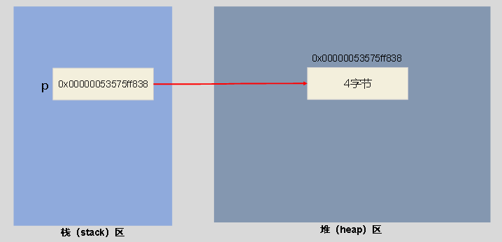
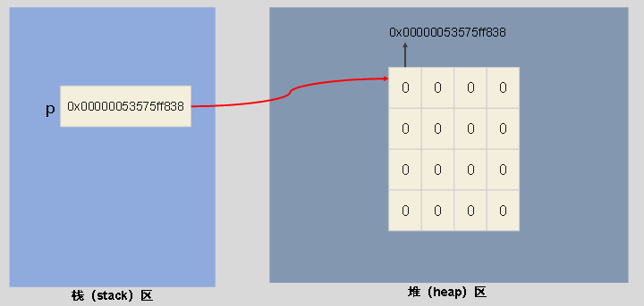
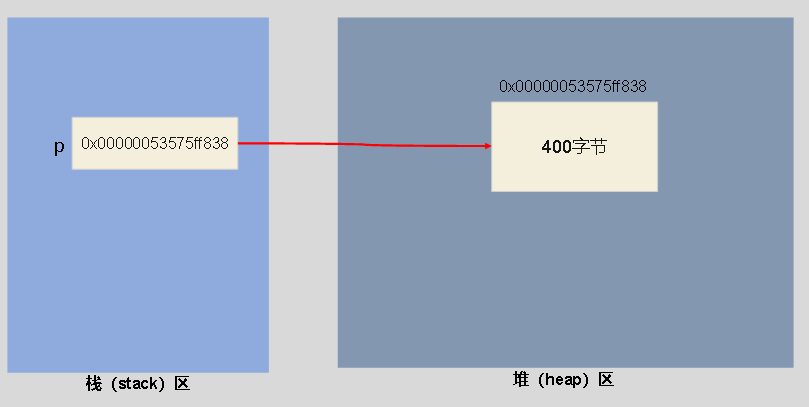
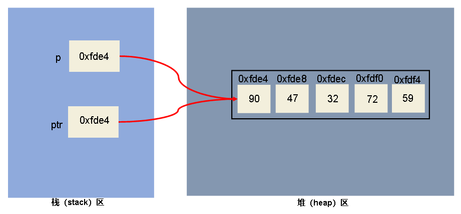

# 第十二章：动态内存分配

## 1.C程序动态内存分配
**动态内存分配：是指根据需要向系统申请所需大小的空间，由于未在声明部分定义其为变量或者数组，不能通过变量名或者数组名来引用这些数据，只能通过指针来引用**


---

## 2.void指针(无类型指针)
**（1）void指针介绍**
>**C99允许定义一个类型为void的指针变量，它可以指向任何类型的数据**

**（2）void指针作用**
>**指针变量必须有类型，否则编译器无法知道如何解读内存块保存的二进制数据。但是，有时候向系统请求内存的时候，还不确定会有什么类型的数据写入内存，需要要先获得内存块，稍后再确定写入的数据类型**<br>
>**这种情况下就可以使用 void 指针，它只有内存块的地址信息，没有类型信息，等到使用该块内存的时候，再向编译器补充说明，里面的数据类型是什么**

**（3）void指针特点**
>**void 指针与其他所有类型指针之间是互相转换关系，任一类型的指针都可以转为 void 指针，而 void 指针也可以转为任一类型的指针**<br>
>**由于不知道 void 指针指向什么类型的值，所以不能用 * 运算符取出它指向的值（解引用）**


```c
#include <stdio.h>

int main()
{
    int num = 42;
    double pi = 3.14159;

    // int 指针转为 void 指针
    void *viPtr = &num;  // 隐式类型转换

    // double 指针转为 void 指针
    void *vdPtr = &pi;   // 隐式类型转换

    // void 指针转换为 int 指针并解引用
    // int *intPtr = viPtr;    // 隐式类型转换
    int *intPtr = (int *)viPtr;    // 显示类型转换
    printf("整数值：%d \n", *intPtr);

    // void 指针转换为 double 指针并解引用
    // double *doublePtr = vdPtr;  // 隐式类型转换
    double *doublePtr = (double *)vdPtr; // 显式类型转换
    printf("浮点数：%f \n", *doublePtr);

    // void 指针不能解引用 会报错
    // printf("%d", *viPtr);
    // printf("%d", *vdPtr);

    /*
        整数值：42 
        浮点数：3.141590
    */
    return 0;
}
```
**（4）特别注意**
>**其他类型指针赋给 void指针，使用隐式转换即可，因为 void 指针不包含指向的数据类型的信息，通常是安全的**<br>
>**void 指针赋给其他类型指针，建议使用显式类型转换，这样更加安全，如果使用隐式类型转换，有些编译器会触发警告**

---

## 3.内存分配相关函数
>**头文件 <stdlib.h> 声明了四个关于内存动态分配的函数：malloc、calloc、realloc、free**

**（1）malloc函数**
**malloc() 函数用于分配一块连续的内存空间**
>**函数原型：void * malloc(size_t size);**<br>
>**返回值说明：如果内存分配成功，返回一个void指针，指向新分配内存块的地址；如果分配失败（例如内存不足），返回一个空指针（NULL）**<br>
>**参数说明：size是要分配的内存块的大小，以字节为单位**

```c
#include <stdio.h>
#include <stdlib.h>

int main()
{
    int *p;
    p = (int *)malloc(sizeof(int));

    // 判断是否分配成功
    if (p == NULL)
    {
        printf("内存分配失败\n");
        return 1; // 退出程序
    }

    // 使用解引用赋值并输出
    *p = 120;
    printf("p指向的地址：%p \n", p);
    printf("p指向的值：%d", *p);

    /*
        p指向的地址：00000053575ff838
        p指向的值：120
    */

    // 释放分配的内存
    free(p);

    return 0;
}
```



**（2）calloc函数**
**calloc() 函数用于分配内存并将其初始化为零，它在分配内存块时会自动将内存中的每个字节都设置为零**

>**函数原型：void * calloc(size_t numElements, size_t sizeOfElement);**<br>
>**返回值说明：如果内存分配成功，返回一个 void 指针，指向新分配内存块的地址；如果分配失败（例如内存不足），返回一个空指针（NULL）**<br>
>**参数说明：numElements是要分配的元素的数量，sizeOfElement是每个元素的大小（以字节为单位）**

```c
#include <stdio.h>
#include <stdlib.h>

int main()
{
    int *p;    // 定义整型指针
    int n = 5; // 定义数组长度

    // 动态分配内存，将地址赋给指针p
    p = (int *)calloc(n, sizeof(int));

    // 判断是否分配成功
    if (p == NULL)
    {
        printf("内存分配失败\n");
        return 1; // 退出程序
    }

    // 输出数组的元素的值
    for (int i = 0; i < n; i++)
    {
        printf("p[%d]=%d \n", i, p[i]);
    }

    /*
        p[0]=0 
        p[1]=0
        p[2]=0
        p[3]=0
        p[4]=0
    */

    // 释放分配的内存
    free(p);
    return 0;
}
```


**（3）reallco函数**
**realloc() 函数用于重新分配malloc() 或calloc() 函数所获得的内存块的大小**
>**函数原型：void * realloc(void * ptr, size_t size);**<br>
>**返回值说明：返回一个指向重新分配内存块的指针。如果内存重新分配成功，返回的指针可能与原始指针相同，也可能不同；如果内存分配失败，返回返回一个空指针（NULL）。如果在原内存块上进行缩减，通常返回的原先的地址**<br>
>**参数说明：ptr是要重新分配的内存块的指针，size是新的内存块的大小（以字节为单位）**

```c
//说明：_msize()函数，该函数可以获取指定内存块的大小，头文件为#include<malloc.h>
#include <stdio.h>
#include <stdlib.h>
#include <malloc.h>

int main()
{
    // 声明指针
    int *b;

    // 分配内存
    b = malloc(sizeof(int) * 100);
    printf("b=%p, size:%zu \n", b, _msize(b));

    // 调整内存大小
    b = realloc(b, sizeof(int) * 2000);
    printf("b=%p, size:%zu \n", b, _msize(b));

    // 再次调整内存大小
    b = realloc(b, sizeof(int) * 200);
    printf("b=%p, size:%zu \n", b, _msize(b));

    /*
        b=000001f5fc3f4770, size:400 
        b=000001f5fc3f47d0, size:8000
        b=000001f5fc3f47d0, size:800
    */

    // 释放内存
    free(b);

    return 0;
}
```


**（4）free函数**
>**如果动态分配的内存空间没有被正确释放，这种情况称为内存泄漏，内存泄漏会导致系统中的可用内存逐渐减少，直到耗尽系统可用的内存资源**<br>
>**free() 函数用于释放动态分配的内存，以便将内存返回给操作系统，防止内存泄漏**

>**函数原型：void free(void * ptr);**<br>
>**返回值说明：没有有返回值**<br>
>**参数说明：ptr是指向要释放的内存块的指针，ptr必须是malloc() 或calloc() 动态分配的内存块地址**

>**注意:**
>**分配的内存块一旦释放，就不应该再次操作已经释放的地址，也不应该再次使用 free() 对该地址释放第二次**<br>
>**如果忘记调用free()函数，会导致无法访问未回收的内存块，构成内存泄漏**


**（5）内存分配案例**
>**动态创建数组，输入5个学生的成绩，再定义一个函数检测成绩低于60分的，输出不合格的成绩**
```c
#include <stdlib.h>
#include <stdio.h>

// 函数原型声明
void check(int *);

int main()
{   
    int *p;
    // 在堆区开辟一个 5 * 4 的空间
    p = (int *)malloc(5 * sizeof(int));

    printf("请输入5个成绩：");

    for (int i = 0; i < 5; i++)
    {
        scanf("%d", p + i);
    }

    check(p);
    free(p); // 销毁 堆区 p 指向的空间

    return 0;
}

// 函数定义
void check(int *p)
{
    printf("\n不及格的成绩有: ");
    for (int i = 0; i < 5; i++)
    {
        if (p[i] < 60)
        {
            printf(" %d ", p[i]);
        }
    }
}
```


---

## 4.内存分配基本原则
**（1）避免分配大量的小内存块：分配堆上的内存有一些系统开销，所以分配许多小的内存块比分配几个大内存块的系统开销大**

**（2）仅在需要时分配内存：只要使用完堆上的内存块，就需要及时释放它，否则可能出现内存泄漏**

**（3）总是确保释放已分配的内存：在编写分配内存的代码时，就要确定好在代码的什么地方释放内存**
