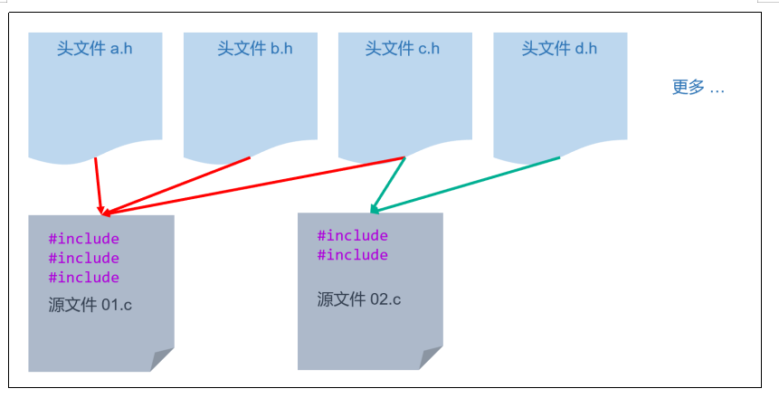
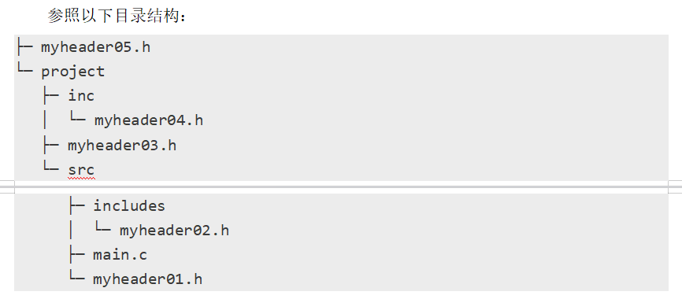
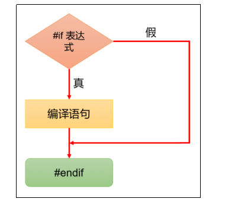
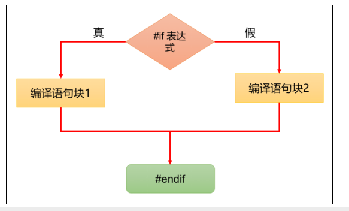
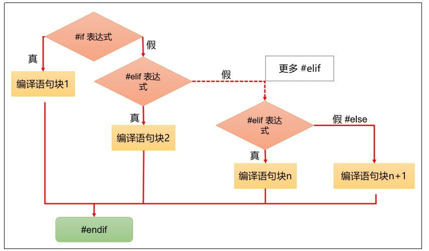
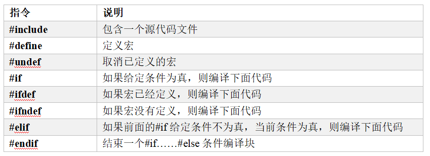

# 第十章：预处理器

## 1.预处理器基本介绍
**（1）预处理器**
>**C语言编译器在编译程序之前，会先使用预处理器（preprocessor）处理代码，代码经过预处理之后再送入编译器进行编译**<br>
>**预处理器的主要任务包括宏替换、文件包含、条件编译等**

**（2）预处理指令**
>**预处理过程中会执行预处理指令，预处理指令以 # 号开头，用于指导预处理器执行不同的任务**

**预处理指令具有如下特点：**
>**1.预处理指令应该放在代码的开头部分**<br>
>**2.预处理指令都以 # 开头，指令前面可以有空白字符（比如空格或制表符），# 和指令的其余部分之间也可以有空格，但是为了兼容老的编译器，一般不留空格**

```c
// 推荐写法
#include <stdio.h>

// 不推荐写法
    #include <stdio.h>
# include <stdio.h>
```

>**3.预处理指令都是一行的，除非在行尾使用反斜杠，将其折行**

```c
#include <std\
io.h>
```

>**4.预处理指令不需要分号作为结束符，指令结束是通过换行符来识别的**

```c
#include <stdio.h>; 	// 这里有分号会报错
#define PI 3.14;    	// 分号会成为 PI 的值的一部分
```

>**5.预处理指令通常不能写在函数内部，有些编译器的扩展允许将预处理指令写在函数里，但强烈不建议这么干**

```c
int main () 
{
    // 一般不允许写在这里
    #include <stdio.h>
    return 0;
}
```

---

## 2.宏定义
**（1）宏定义基本介绍**
>**宏定义，就是用一个标识符（宏名称）来表示一个替换文本，如果在后面的代码中出现了宏名称，预处理器会将它替换为对应的文本，称为宏替换或宏展开**

>**宏定义基本语法：#define 宏名称 替换文本**<br>
>**宏名称：宏的名称，是一个标识符，通常使用大写字母表示，以便与变量名区分开来**<br>
>**替换文本：宏名称在代码中的每次出现都会被替换为这段文本**<br>
>**前面的案例中，我们曾经使用宏定义来定义常量和布尔类型**

**（2）使用宏定义常量**

```c
//下面代码中，使用宏定义声明了N，后面代码中出现了 N，会替换成 100
#include <stdio.h>

// 定义常量
#define PI 3.14

int main()
{
    // 定义变量保存半径，值通过用户输入获取
    double radius;
    printf("请输入半径：");
    scanf("%lf", &radius);

    // 计算面积并输出
    printf("圆的面积：%.2f", radius * PI * PI);

    return 0;
}
```

**（3）使用宏定义数据类型**
```c

//下面代码中使用宏定义声明了BOOL、TURE、FALSE，后面代码中出现BOOL会替换成int，出现TRUE会替换成1，出现FALSE替换成0
#include <stdio.h>

// 宏定义
#define BOOL int
#define TRUE 1
#define FALSE 0

int main()
{
    // 使用整型表示真假两种状态
    // int isPass = 0;
    // int isOk = 1;

    // 借助于宏定义
    BOOL isPass = FALSE;
    BOOL isOk = TRUE;

    if (isPass)
    {
        printf("Pass");
    }

    if (isOk)
    {
        printf("Ok");
    }

    return 0;
}
```

**（4）宏定义的替换文本**
>**替换文本可以含任何字符，它可以是字面量、表达式、if 语句、函数等，预处理程序对它不作任何检查，直接进行文本替换，如有错误，只能在编译已被宏展开后的源程序时发现**

```c
#include <stdio.h>
#define M (n * n + 3 * n)
#define PRINT_SUM printf("sum=%d", sum)

int main()
{
    int n = 3;
    int sum = 3 * M + 4 * M + 5 * M; // 宏展开 3*(n*n+3*n)+4*(n*n+3*n)+5*(n*n+3*n);
    PRINT_SUM;                       // 宏展开 printf("sum=%d", sum)

    //sum=216
    return 0;
}
```

**（5）宏定义嵌套**
>**宏定义允许嵌套，在宏定义的替换文本中可以使用已经定义的宏名，在宏展开时由预处理程序层层替换**

```c
#include <stdio.h>
#define PI 3.1415926
#define S PI *y *y

int main()
{
    int y = 2;
    printf("%f", S); // 宏替换变为 printf("%f", 3.1415926*y*y);

    //12.566370
    return 0;
}
```

**（6）取消宏定义**
>**如要取消宏定义使用#undef命令**

```c
#include <stdio.h>
#define PI 3.14159

int main()
{
    printf("PI=%f", PI);

    //PI=3.141590
    return 0;
}

#undef PI // 取消宏定义
void func()
{
    // printf("PI=%f", PI); //错误,这里不能使用到PI了
}
```

---

## 3.带参数的宏定义
**（1）带参数的宏定义基本介绍**
>**C语言允许宏带有参数。在宏定义中的参数称为“形式参数”，在宏调用中的参数称为“实际参数”，这和函数有些类似**<br>
>**对带参数的宏，在展开过程中不仅要进行文本替换，还要用实参去替换形参**<br>
>**带参宏定义的一般形式为#define宏名（形参列表）替换文本，在替换文本中可以含有各个形参**<br>
>**带参宏调用的一般形式为：宏名（实参列表）**

```c
#include <stdio.h>

// 说明
//  1. MAX 就是带参数的宏
//  2. (a,b) 就是形参
//  3. (a>b) ? a : b是带参数的宏对应字符串，该字符串中可以使用形参
#define MAX(a, b) (a > b) ? a : b

int main()
{
    int x, y, max;
    printf("input two numbers: ");
    scanf("%d %d", &x, &y);

    // 说明
    //  1.  MAX(x, y); 调用带参数宏定义
    //  2.  在宏替换时(预处理，由预处理器)， 会进行字符串的替换，同时会使用实参， 去替换形参
    //  3. 即MAX(x, y) 宏替换后  (x>y) ? x : y
    max = MAX(x, y);
    printf("max=%d\n", max);

    return 0;
}
```

**（2）注意事项和细节**
>**带参宏定义中，形参之间可以出现空格，但是宏名和形参列表之间不能有空格出现**<br>
>**在带参宏定义中，不会为形式参数分配内存，因此不必指明数据类型，而在宏调用中，实参包含了具体的数据，要用它们去替换形参，因此实参必须要指明数据类型**<br>
>**在宏定义中，替换文本内的形参通常要用括号括起来以避免出错**

```c
#include <stdio.h>

// 带参宏定义,字符串内的形参通常要用括号括起来以避免出错
#define SQ(y) (y) * (y)

int main()
{
    int a, sq;
    printf("input a number: ");
    scanf("%d", &a);

    // 宏替换为 (a+1) * (a+1)
    sq = SQ(a + 1); 
    printf("sq=%d\n", sq);

    return 0;
}
```

**（3）带参宏定义和函数的区别**
>**宏展开仅仅是文本的替换，不会对表达式进行计算；宏在编译之前就被处理掉了，它没有机会参与编译，也不会占用内存**<br>
>**函数是一段可以重复使用的代码，会被编译，会给它分配内存，每次调用函数， 就是执行这块内存中的代码**

```c
//函数实现
#include <stdio.h>

int SQ(int y)
{
    return y * y;
}

int main()
{
    int i = 1;
    while (i <= 5)
    {
        printf("%d\n", SQ(i++));
    }

    return 0;
}
```

```c
//带参数的宏实现
#include <stdio.h>
#define SQ(y) (y) * (y)

int main()
{
    int i = 1;

    while (i <= 5)
    {
        // SQ(i++) 会被宏替换为 (i++) * (i++), i++ 会执行两次，最终无法得到我们想要的结果
        // printf("%d\n", SQ(i++));
        
        printf("%d\n", SQ(i));
        i ++;
    }

    return 0;
}
```

---

## 4.文件包含
**#include 指令用于引入标准库头文件、自定义头文件或其他外部源代码文件，以便在当前源文件中使用其中定义的函数、变量、宏等内容**



>**一个源文件可以导入多个头文件，一个头文件也可以被多个源文件导入**
>**标准库头文件、自定义头文件的扩展名都是 .h**

**（1）包含标准库头文件**
>**标准库头文件是系统提供的头文件，直接引入即可，像我们前面用过的 stdio.h、stdbool.h、string.h、time.h 等。引入标准库头文件需要使用尖括号将文件名包裹起来，格式如下:**

```c
#include <头文件名.h>
```

**（2）包含自定义头文件**
>**自定义头文件的文件名写在双引号里面，格式如下：**

```c
#include "文件名.h"
```

>**建议把所有的常量、宏、系统全局变量和函数原型写在自定义的头文件中，在需要的时候随时引用这些头文件**

**（3）使用相对路径**
>**如果自定义的头文件在源文件的同级目录或源文件所在目录的下级目录，使用 ./ 开头的路径，./ 可以省略**<br>
>**如果自定义的头文件在源文件所在目录的上级或者更上级，使用 ../ 开头的路径**



**如果要在源文件 main.c 中引入以上自定义的头文件，需按照如下写法：**

```c
//需要注意的是，建议将头文件放置在源文件所在目录或子目录中，以保持项目的组织结构清晰
#include "myheader01.h" // 等价于 #include "./myheader01.h" 
#include "includes/myheader02.h" // 等价于 #include "./myheader01.h" 
#include "../myheader03.h"
#include "../inc/myheader04.h"
#include "../../myheader05.h"
```

**（4）使用绝对路径**
>**绝对路径是文件在文件系统中的完整路径，它从文件系统的盘符（Windows系统）或根目录（Linux系统、MacOS系统）开始，沿着文件系统的目录结构一直到达目标文件**

**Windows 系统中使用绝对路径引入自定义头文件，示例如下：**

```c
#include "C:\Preparation\Embedded\01CLang\code\project\foo.h"
```

**Linux系统或MacOS系统中使用绝对路径引入自定义头文件，示例如下：**

```c
#include "/usr/local/lib/foo.h"
```

---

## 5.条件编译
**（1）#if**
**①#if...#endif**
>**#if...#endif指令用于预处理器的条件判断，满足条件时，内部的行会被编译，否则就被编译器忽略**



```c
#if 0
  const double pi = 3.1415; // 不会执行
#endif
```

>**上面示例中，#if后面的0，表示判断条件不成立。所以，内部的变量定义语句会被编译器忽略。#if 0这种写法常用来当作注释使用，不需要的代码就放在#if 0里面**<br>
>**#if后面的判断条件，通常是一个表达式。如果表达式的值不等于0，就表示判断条件为真，编译内部的语句；如果表达式的值等于0，表示判断条件为伪，则忽略内部的语句**


**②#if...#else...#endif**
>**#if...#endif之间还可以加入#else指令，用于指定判断条件不成立时，需要编译的语句**



```c
#define FOO 1

#if FOO
  printf("defined\n");
#else
  printf("not defined\n");
#endif
```
>**上面示例中，宏FOO如果定义过，会被替换成1，从而输出defined，否则输出not defined**

**③#if...#elif...#else...#endif**
>**如果有多个判断条件，还可以加入#elif命令**



```c
#if HAPPY_FACTOR == 0
  printf("I'm not happy!\n");
#elif HAPPY_FACTOR == 1
  printf("I'm just regular\n");
#else
  printf("I'm extra happy!\n");
#endif
```
>**上面示例中，通过#elif指定了第二重判断。注意，#elif的位置必须在#else之前。如果多个判断条件皆不满足，则执行#else的部分**<br>
>**没有定义过的宏，等同于0。因此如果UNDEFINED是一个没有定义过的宏，那么#if UNDEFINED为伪，而#if !UNDEFINED为真**

**（2）#ifdef**
>**①#ifdef...#endif指令用于判断某个宏是否定义过**

>**有时源码文件可能会重复加载某个库，为了避免这种情况，可以在库文件里使用#define定义一个空的宏。通过这个宏，判断库文件是否被加载了**

```c
//下面示例中，EXTRA_HAPPY就是一个空的宏
#define EXTRA_HAPPY
```

>**然后，源码文件使用#ifdef...#endif检查这个宏是否定义过**

```c
//下面示例中，#ifdef检查宏EXTRA_HAPPY是否定义过。如果已经存在，表示加载过库文件，就会打印一行提示
#ifdef EXTRA_HAPPY
  printf("I'm extra happy!\n");
#endif
```

>**②#ifdef可以与#else指令配合使用**

```c
//下面示例中，如果宏EXTRA_HAPPY没有定义过，就会执行#else的部分
#ifdef EXTRA_HAPPY
  printf("I'm extra happy!\n");
#else
  printf("I'm just regular\n");
#endif
```

>**③#ifdef...#else...#endif可以用来实现条件加载**

```c
//下面示例中，通过判断宏MAVIS是否定义过，实现加载不同的头文件
#ifdef MAVIS
  #include "foo.h"
  #define STABLES 1
#else
  #include "bar.h"
  #define STABLES 2
#endif
```

**（3）#if defined**
>**#ifdef指令，等同于#if defined**

```c
//下面示例中，defined是一个预处理运算符，如果它的参数是一个定义过的宏，就会返回1，否则返回0
#ifdef FOO
// 等同于
#if defined FOO
```

```c
//使用这种语法，可以完成多重判断
#if defined FOO
  x = 2;
#elif defined BAR
  x = 3;
#else
  x = 4;
#endif
```

**（4）#ifndef**
>**#ifndef...#endif指令跟#ifdef...#endif正好相反。它用来判断，如果某个宏没有被定义过，则执行指定的操作**

```c
//下面示例中，针对宏EXTRA_HAPPY是否被定义过，#ifdef和#ifndef分别指定了两种情况各自需要编译的代码
#ifdef EXTRA_HAPPY
  printf("I'm extra happy!\n");
#endif

#ifndef EXTRA_HAPPY
  printf("I'm just regular\n");
#endif
```

>**#ifndef常用于防止重复加载。举例来说，为了防止头文件myheader.h被重复加载，可以把它放在#ifndef...#endif里面加载**

```c
//下面示例中，宏MYHEADER_H对应文件名myheader.h的大写。只要#ifndef发现这个宏没有被定义过，就说明该头文件没有加载过，从而加载内部的代码，并会定义宏MYHEADER_H，防止被再次加载
#ifndef MYHEADER_H
  #define MYHEADER_H
  #include "myheader.h"
#endif
```

---

## 6.预处理命令总结
