# 第四章：二进制与数据类型

## 1.二进制

### 1.1 进制
**计算机世界中只有二进制，所以计算机中存储和运算的所有数据都要转为二进制。包括数字、字符、图片、声音、视频等**

**（1）常见进制介绍**
>**（1）二进制：0、1，满2进1
>（2）十进制：0 - 9，满10进1
>（3）十六进制：0 - 9及A-F，满16进1。十六进制中，除了 0 到 9 十个数字外，还引入了字母，以便表示超过9的值。字母A对应十进制的10，字母B对应十进制的11，字母 C、D、E、F 分别对应十进制的 12、13、14、15**

**（2）C语言中使用不同进制表示整数**
>**（1）二进制：以0b或0B开头表示
>（2）十进制：正常数字表示
>（3）十六进制：以0x或0X开头表示，此处的A-F不区分大小写**

```c
#include <stdio.h>

int main()
{
    int num1 = 0b10; // 二进制
    int num2 = 210;  // 十进制
    int num3 = 0x1f; // 十六进制

    //都打印为10进制整数
    printf("num1=%d \n", num1);
    printf("num1=%d \n", num2);
    printf("num1=%d \n", num3);

    //num1=2
    //num1=210
    //num1=31
    return 0;
}
```

**（3）C语言的输出格式**
>**%d ：十进制整数
>%x ：十六进制整数
>%#x ：显示前缀 0x(小写) 的十六进制整数
>%#X ：显示前缀 0X(大写) 的十六进制整数**

```c
#include <stdio.h>

int main()
{
    int x = 100;

    printf("十进制：%d \n", x);
    printf("十六进制：%x \n", x);
    printf("十六进制（0x开头）：%#x \n", x);
    printf("十六进制（0X开头）：%#X \n", x);

    /*
        十进制：100 
        十六进制：64 
        十六进制（0x开头）：0x64 
        十六进制（0X开头）：0X64
    */
    return 0;
}

```

---

### 1.2 进制的转换
**（1）二进制与十进制的转换**

>**二进制转换成十进制：从最低位开始，将每个位上的数提取出来，乘以2的（位数-1）次方，然后求和**

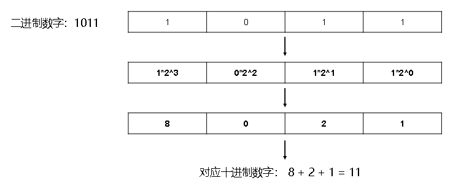

>**十进制转换成二进制：将该数不断除以2，直到商为0为止，然后将每步得到的余数倒过来，就是对应的二进制**

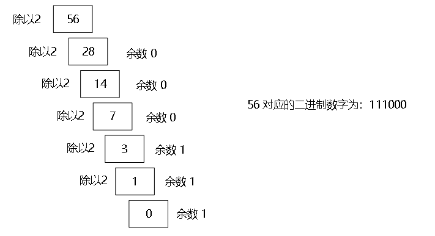

**（2）十六进制与十进制的转换**

>**十六进制转成十进制：从最低位开始，将每个位上的数提取出来，乘以16的（位数-1）次方，然后求和**

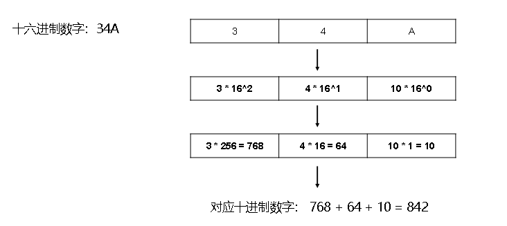

>**十进制转成十六进制：将该数不断除以16，直到商为0为止，然后将每步得到的余数倒过来，就是对应的十六进制**

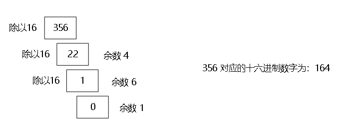

**（3）二进制与十六进制的转换**
>**二进制转成十六进制：低位开始，将二进制数每四位一组，转成对应的十六进制数即可**

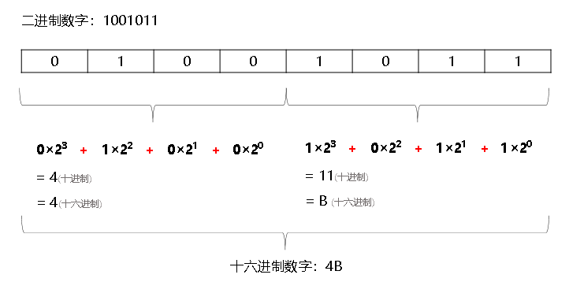

>**十六进制转成二进制：将十六进制数每1位，转成对应的4位的一个二进制数即可**

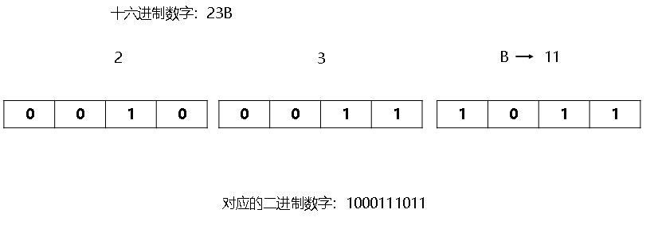

---

### 1.3 原码、补码、反码
**计算机底层存储数据时使用的是二进制数字，但是计算机在存储一个数字时并不是直接存储该数字对应的二进制数字，而是存储该数字对应二进制数字的<mark>补码</mark>**

**（1）机器数和真值**
>**机器数：一个数在计算机的存储形式是二进制数，我们称这些二进制数为机器数。机器数可以是有符号的，用机器数的最高位存放符号位，0表示正数，1表示负数**<br>
>**真值：因为机器数带有符号位，所以机器数的形式值不等于其真实表示的值（真值），以机器数10000001为例，其真正表示的值（首位为符号位）为-1，而形式值（首位就是代表1）为129；因此将带符号的机器数的真正表示的值称为机器数的真值**

**（2）原码、补码、反码的概念**
**总结：**
- **正数的原码、反码、补码都一样，三码合一**
- **负数的反码：它的原码符号位不变，其它位取反；**
- **负数的补码：它的反码+1**
- **0的反码，补码都是0**

>**原码：原码的表示与机器数真值表示的一样，即用第一位表示符号，其余位表示数值**
>- **正数的原码：就是它对应的二进制数**
>- **负数的原码：它的绝对值对应的二进制数，且最左边位变为1**
>- **0的原码：仍然是0**<br>
>**十进制的正负1，用8位二进制的原码表示如下：**
>**+1 原码：[ 0000 0001 ]**
>**-1 原码：[ <font color=red>1</font>000 0001 ]**<br>
>---
>
>**反码：**
>- **正数的反码：和原码相同**
>- **负数的反码：在其原码的基础上，符号位不变，其余各位取反**
>- **0的反码：仍然是0**
>
>**十进制的正负1，用8位二进制的反码表示如下：**
>**+1 原码：[ 0000 0001 ]  反码：[ 0000 0001 ]**
>**-1 原码：[ 1000 0001 ]  反码：[ 1<font color=red>111 1110</font> ]**<br>
>**注意：反码通常是用来由原码求补码或者由补码求原码的过渡码**
>
>---
>
>**补码：**
>- **正数的补码：和原码、反码相同**
>- **负数的补码：反码的基础上加1**
>- **0的补码：仍然是0**
>
>**十进制的正负1，用8位二进制的补码表示如下：**
>**+1 原码：[ 0000 0001 ]  反码：[ 0000 0001 ]  补码：[ 0000 0001 ]**
>**-1 原码：[ 1000 0001 ]  反码：[ 1111 1110 ]  补码：[ 1111 1111 ]**

---

### 1.4 计算机为什么要用补码
**简言之：简化硬件设计和提高计算效率**
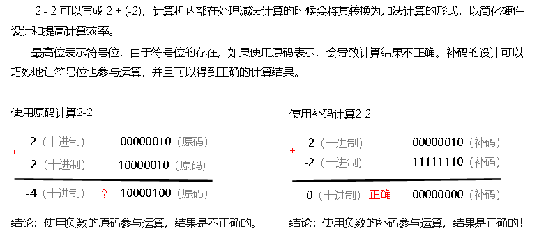

---


## 2.数据类型
**C语言根据数据的特性和用途进行了类型划分，不同类型的数据在内存中占据不同大小的空间**
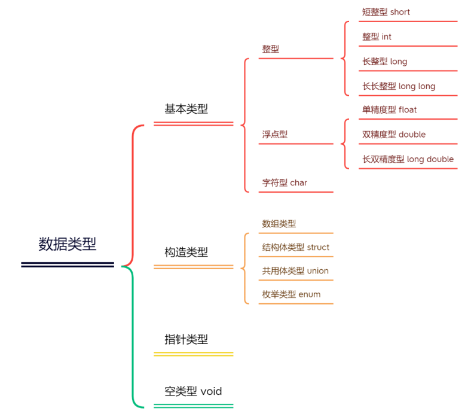

### 2.1 整形类型
**（1）关于存储大小单位：**
>**bit（位）：计算机中的最小存储单位，表示一个二进制位
>byte（字节）：计算机中基本存储单元，1byte = 8bit**<br>
>- **各类型存储大小受到操作系统、编译器、硬件平台的影响**
>- **整型分为有符号signed和无符号unsigned两种，默认是signed**
>- **开发中使用整型一般用int型，如果不足以表示大数，可以使用long long**

|类型|存储大小|值范围|
|-|-|-|
|short、signed short|2字节|-32,768 (- 2^15)到 32,767 (2^15 -1)|
|unsigned short|2字节|0 到 65,535 (2^16 - 1)|
int、signed int|16位：2 字节、32位：4 字节|16位：-32,768 (- 2^15 ) 到 32,767 (2^15-1)、32位：-2,147,483,648 (- 2^31) 到 2,147,483,647 (2^31 -1)|
|unsigned int|16位：2 字节、32位：4 字节|16位：0 到 65,535 (2^16-1) 、32位：0 到 4,294,967,295 (2^32 -1)|
|long 、signed long|32位：4 字节、64位：8 字节|32位：-2,147,483,648 (- 2^31) 到 2,147,483,647 (2^31 - 1)、64位：9223372036854775808(-2^63) 到9223372036854775807 (2^63-1)|
|unsigned long|4 或 8 字节|32位：0 到 4,294,967,295 (2^32 - 1)、64位：0 ~ 18446744073709551615 (2^64 - 1)|
|long long、signed long long|8字节|9223372036854775808(-2^63) 到9223372036854775807 (2^63-1)|
|unsigned long long|8 字节|0 ~ 18446744073709551615 (2^64 - 1)|

**（2）字面常量后缀**
**字面量是源代码中一个固定值的表示法，用于直接表示数据，如图所示：**
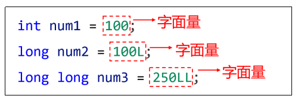
>**（1）一个整数字面量默认是int类型
>（2）如果需要表示 long 类型字面量，需要添加后缀 l 或 L
>（3）如果需要表示 long long 类型字面量，需要添加后缀 ll 或 LL
>（4）如果需要表示无符号整数字面量，需要添加后缀 u 或 U， 注意， u 和 l 可以结合使用，不分先后，如 ul（无符号long类型）、ULL（无符号 long long类型），lu（无符号 long 类型）等**

```c
#include <stdio.h>

int main()
{
    // short 类型
    short a1 = 10;  // 等同于 signed short a1 = 10;
    short a2 = -10; // 等同于 signed short a1 = -10;
    // unsigned short a3 = -20;
    unsigned short a3 = 20;
    printf("a1=%d; a2=%d; a3=%d \n", a1, a2, a3); // a1=10; a2=-10; a3=20

    // int 类型
    int b1 = 100;  // 等同于 signed int a1 = 100;
    int b2 = -100; // 等同于 signed int a1 = -100;
    unsigned int b3 = 200u;
    unsigned b4 = 300U;                                      // 等同于  unsigned int b4 = 300U;
    printf("b1=%d; b2=%d; b3=%d; b4=%d \n", b1, b2, b3, b4); // b1=100; b2=-100; b3=200; b4=300

    // long 类型
    long c1 = 1000l;   // 等同于 signed long c1 = 1000l;
    long c2 = -1000L; // 等同于 signed long c2 = -1000L;
    unsigned long c3 = 2000ul;
    printf("c1=%ld; c2=%ld; c3=%ld \n", c1, c2, c3); // c1=100; c2=-1000; c3=2000

    // long long 类型
    long long d1 = 10000ll;  // 等同于 signed long long d1 = 10000ll;
    long long d2 = -10000LL; // 等同于 signed long long d2 = -10000LL;
    unsigned long long d3 = 20000ULL;
    printf("d1=%lld; d2=%lld; d3=%lld \n", d1, d2, d3); // d1=10000; d2=-10000; d3=20000

    /*
        a1=10; a2=-10; a3=20
        b1=100; b2=-100; b3=200; b4=300
        c1=100; c2=-1000; c3=2000
        d1=10000; d2=-10000; d3=20000
    */
    return 0;
}
```

**（4）精确宽度类型**
**C 语言的整数类型（short、int、long）在不同计算机上，占用的字节宽度可能是不一样的。程序员有时需要精准的字节宽度，以提高代码的可移植性，尤其是嵌入式开发中，使用精确宽度类型可以确保代码在各种平台上的一致性**

**标准库的头文件 <stdint.h> 中定义了一些新的类型别名，如下：**
|类型名称|含义|
|-|-|
|int8_t|8 位有符号整数|
|int16_t|16 位有符号整数|
|int32_t|32 位有符号整数|
|int64_t|64 位有符号整数|
|uint8_t|8 位无符号整数|
|uint16_t|16 位无符号整数|
|uint32_t|32 位无符号整数|
|uint64_t|64 位无符号整数|

```c
#include <stdio.h>
#include <stdint.h>

int main()
{
    // 变量 x32 声明为 int32_t 类型，可以保证是32位(4个字节)的宽度。
    int32_t x32 = 45933945; 
    printf("x32=%d\n", x32);

    //x32=45933945
    return 0;
}
```

---

### 2.2 浮点类型
**浮点类型可以表示一个小数，比如：123.4，7.8，0.12等**

**（1）浮点型的类型**
|类型|存储大小|值范围|有效小数位数|
|-|-|-|-|
|float 单精度|4 字节|1.2E-38 到 3.4E+38|6 ~ 9|
|double 双精度|8 字节|2.3E-308 到 1.7E+308|15 ~18|
|long double 长双精度|32位：10字节、64位：16字节|32位：与 double 相同或更大、64位：3.4E-4932到1.2E+4932|18或更多|

**（2）浮点型数据表示形式**
>**十进制数形式：如：5.12、512.0f、.512（0.512 可以省略 0）
>科学计数法形式：如：5.12e2、5.12E-2
>开发中用到浮点型数字，建议使用double型，如精度要求更高可以使用long double 型**

**（3）字面量后缀**
>**浮点数字面量默认是double型
>如果需要表示float类型字面量，须加后缀 f 或 F
>如果需要表示long double类型字面量，需加后缀 l 或 L**

**（4）格式占位符**
>**%f：是浮点类型的格式占位符，在printf中对应float类型（float类型会转换成double来处理）；默认会保留6位小数，可以指定小数位数，如：%.2f 表示保留2位小数**<br>
>**%lf：在printf中和 %f意思相同（C99标准加入），对应double类型，默认保留6位小数，可以指定小数位数，如：%.2lf 表示保留2位小数。但需要注意的是，在scanf中 %lf和 %f含义不同：输入一个float类型数据时使用 %f；而输入double类型时必须使用 %lf**<br>
>**%Lf：对应的是long double 类型，默认保留6位小数，可以指定小数位数，如： %.2Lf 表示保留2位小数。需要注意的是，输入输出 long double 类型都必须使用 %Lf 占位符**<br>
>**%e：对应科学计数法表示的浮点数，可以指定尾数部分所保留的小数位数，如 %.2e 表示尾数部分保留两位小数**

```c
#include <stdio.h>

int main()
{
    // double 类型
    double a1 = 3.1415;
    double a2 = .12345678;
    double a3 = -2e12;
    double a4 = 1.9823e2;
    printf("a1=%f, a2=%.10f, a3=%.2lf, a4=%lf \n", a1, a2, a3, a4);
    printf("a1=%e, a2=%.2e, a3=%e, a4=%e \n", a1, a2, a3, a4);

    // float 类型
    float b1 = 3.1415f;
    float b2 = .123456f;
    float b3 = -2e12f;
    float b4 = 1.9823e2f;
    printf("b1=%f, b2=%f, b3=%.0f, b4=%f \n", b1, b2, b3, b4);
    printf("b1=%e, b2=%.2e, b3=%e, b4=%e \n\n", b1, b2, b3, b4);

    /*
        a1=3.141500, a2=0.1234567800, a3=-2000000000000.00, a4=198.230000 
        a1=3.141500e+00, a2=1.23e-01, a3=-2.000000e+12, a4=1.982300e+02 

        b1=3.141500, b2=0.123456, b3=-1999999991808, b4=198.229996
        b1=3.141500e+00, b2=1.23e-01, b3=-2.000000e+12, b4=1.982300e+02
    */
    return 0;
}
```

---


### 2.3 字符类型
**字符类型 char 可以表示单个字符，如一个数字、一个字母、一个符号**
>**char类型的字面量是用单引号括起来的单个字符**
>**可以使用转义字符 \ 表示特殊含义的字符**
>**多个字符称为字符串，在C语言中使用char数组表示，数组不是基本数据类型，而是构造类型**
>**使用%c表示char类型**

|转义字符|说明|
|-|-|
|\b|退格|
|\n|换行符|
|\r|回车符|
|\t|制表符|
|\”|双引号|
|\\'|单引号|
| \\\ |反斜杠|

**（1）字符类型本质**
>**C语言中，char类型本质是一个整数，是ASCII码中对应的数字，存储长度是 1 个字节，char类型可以进行数学运算**<br>
>**字符型同样分为signed char（无符号）和unsigned char（有符号），其中signed char取值范围-128 ~ 127，unsigned char取值范围0 ~ 255。默认是否带符号取决于当前运行环境**

**（2）字符型数据在计算中存储和读取的过程**
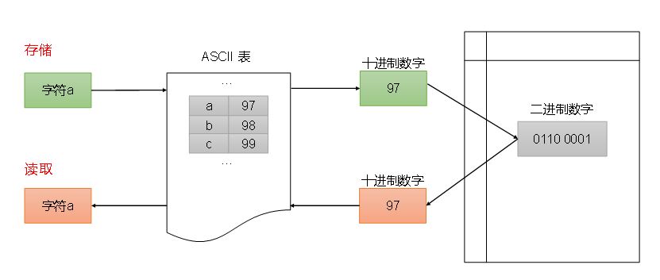

**（3）ASCII码介绍**
>**ASCII码是一种用于表示文本字符的字符编码标准，一共规定了128个字符的编码，比如空格“SPACE” 是32（二进制00100000），大写的字母A是65（二进制01000001）**<br>
>**主要记住：A是65，a是97，相差32**

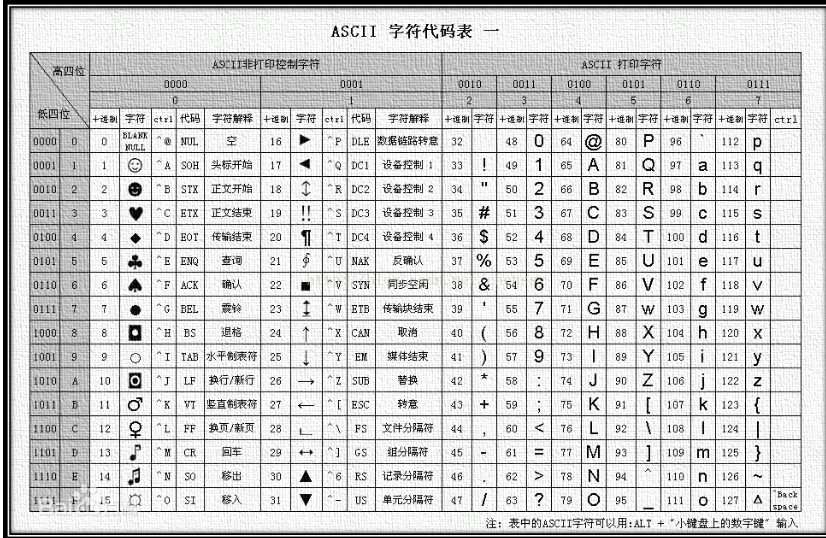

```c
#include <stdio.h>

int main()
{
    // char 类型字面量需要使用单引号包裹
    char a1 = 'A';
    char a2 = '9';
    char a3 = '\t';
    printf("c1=%c, c3=%c, c2=%c \n", a1, a3, a2);

    // char 类型本质上整数可以进行运算
    char b1 = 'b';
    char b2 = 101;
    printf("%c->%d \n", b1, b1);
    printf("%c->%d \n", b2, b2);
    printf("%c+%c=%d \n", b1, b2, b1 + b2);

    // char 类型取值范围
    unsigned char c1 = 200; // 无符号char取值范围 0 ~255
    signed char c2 = 200;   // 有符号char取值范围 -128~127，c2会超出范围
    char c3 = 200;          // 当前系统，char 默认是 signed char
    printf("c1=%d, c2=%d, c3=%d", c1, c2, c3);

    /*
        c1=A, c3=       , c2=9
        b -> 98
        e -> 101
        b + e = 199
        c1=200, c2=-56, c3=-56
    */
    return 0;
}
```

---

### 2.4 布尔类型
**布尔值用于表示真、假两种状态，通常用于逻辑运算和条件判断**

**（1）声明布尔类型的三种方法：主要用第三种**

>**①宏定义：**
```c
#define BOOL int
#define TURE 1
#define FALSE 0
```

>**②C99标准提供了_Bool 型，_Bool仍是整数类型，但与一般整型不同的是，_Bool变量只能赋值为0或1，非0的值都会被存储为1**

>**③C99标准还提供了一个头文件 <stdbool.h> 定义了bool代表_Bool，true代表1，false代表0**

---

### 2.5 存储类别说明符
**存储类别说明符分为：auto、static、register、extern**

>**auto：默认存储类型说明符**

>**static：用于声明静态变量和函数，静态变量在程序的整个生命周期内存在，不会在函数调用结束就销毁，static声明的变量只会初始化一次**

>**register：用于建议编译器将变量存储在寄存器中，以便提高访问速度，在现代编译器中不需要使用，编译器足够智能**

>**extern：用于声明一个变量或函数，告知它的定义可能在其他文件中，通常在头文件中声明全局变量，在源文件中定义**

---

## 3.获取数据的存储大小
**使用sizeof 可以获取数据类型或变量、字面量的存储大小，单位是字节。sizeof返回一个size_t类型的无符号整数值，格式占位符是 %zu，通常用%d打印**

>**size_t 通常是 unsigned int 或 unsigned long 的别名，具体是哪个类型的别名，由系统和编译器决定**

```c
#include <stdio.h>

int main()
{
    // 计算数据类型的大小, 必须使用括号将数据类型关键字包裹起来
    printf("char：%zu \n", sizeof(char));               // char：1
    printf("short：%zu \n", sizeof(short));             // short：2
    printf("int：%zu \n", sizeof(int)); 
    printf("long：%zu \n", sizeof(long));               // long：4
    printf("long long：%zu \n", sizeof(long long));     // long long：8
    printf("float：%zu \n", sizeof(float));             // float：4
    printf("double：%zu \n", sizeof(double));           // double：8
    printf("long double：%zu \n", sizeof(long double)); // long double：16
    printf("\n");

    // 计算字面量数据的大小，字面量可以省略括号
    printf("%zu \n", sizeof('a')); // 4
    printf("%zu \n", sizeof(431)); // 4
    printf("%zu \n", sizeof 4.31); // 8
    printf("\n");

    // 计算变量的大小，变量可以省略括号
    char a = 'A';
    int b = 90;
    long long c = 100;
    double d = 10.8;
    printf("a: %zu \n", sizeof(a)); // a: 1
    printf("b: %zu \n", sizeof b);  // b: 4
    printf("c: %zu \n", sizeof(c)); // c: 8
    printf("d: %zu \n", sizeof(d)); // d: 8

    /*
        char：1 
        short：2 
        int：4
        long：4
        long long：8
        float：4
        double：8
        long double：16

        4
        4
        8

        a: 1
        b: 4
        c: 8
    */
    return 0;
}
```

---


## 4.数据类型转换
**数据类型转换分为：自动类型转换(隐式类型转换)、强制类型转换(显式类型转换)**

### 4.1 隐式类型转换
**不同类型的数据进行混合运算，会发生数据类型转换，窄类型会自动转为宽类型，这样不会造成精度损失**

**（1）运算过程中的隐式转换**
>**不同类型整数进行运算，窄类型整数自动转换为宽类型整数
>不同类型浮点数进行运算，精度小的类型自动转换为精度大的类型
>整数与浮点数进行运算，整数自动转换为浮点数**

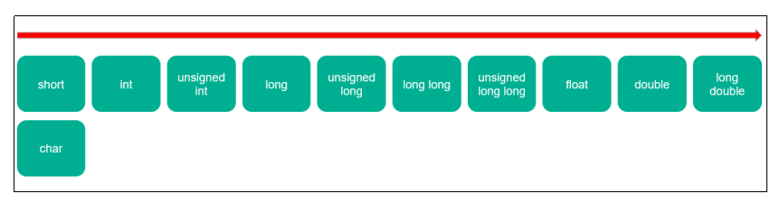

```c
#include <stdio.h>

int main()
{
    // 整型提升
    short s1 = 10;
    int n1 = 40000;
    // 运算过程中，变量 s1 是 short 类型，会自动转为 int 类型
    printf("%d \n", s1 + n1);

    // 有符号整数自动转为无符号整数
    // int n2 = 100;
    int n2 = -100;
    unsigned int n3 = 20;
    // 负数转为无符号整数，两者绝对值的和是无符号整数的最大值再加 1
    printf("%u \n", n2 + n3);

    // 不同类型的浮点数运算，精度低的转诶精度高的
    float f1 = 1.25f;
    double d2 = 4.58667435;
    // printf("%f \t", f1);
    printf("%.10f\n", f1 + d2);

    // 整型与浮点型运算，整型转为浮点型
    int n4 = 10;
    double d3 = 1.67;
    printf("%f", n4 + d3);

    /*
        40010
        4294967216
        5.8366743500
        11.670000
    */
    return 0;
}
```

**（2）赋值时的隐式转换**
>**在赋值运算中，赋值号 两边量的数据类型不同时，等号右边的类型将转换为左边的类型。 如果窄类型赋值给宽类型，不会造成精度损失；如果宽类型赋值给窄类型，会造成精度损失**

```c
#include <stdio.h>
int main()
{
    // 赋值 窄类型赋值给宽类型
    int a1 = 10;
    double a2 = a1;
    printf("%f \n", a2);

    // 赋值 宽类型赋值给窄类型
    double b1 = 1.2;
    int b2 = b1;
    printf("%d", b2);

    /*
        10.000000
        1
    */
    return 0;
}
```

---

### 4.2 显示类型转换
**隐式类型转换中的宽类型赋值给窄类型，编译器是会产生警告的，提示程序存在潜在的隐患，如果非常明确地希望转换数据类型，就需要用到强制（或显式）类型转换**
>**转换格式：（类型名）变量、常量、表达式**

```c
#include <stdio.h>

int main()
{
    double d1 = 1.934;
    double d2 = 4.2;
    int num1 = (int)d1 + (int)d2;         // d1转为1，d2转为4，结果是5
    int num2 = (int)(d1 + d2);            // d1+d2=6.134，6.134转为6
    int num3 = (int)(3.5 * 10 + 6 * 1.5); // 35.0 + 9.0 = 44.0 -> int = 44

    printf("num1=%d \n", num1);
    printf("num2=%d \n", num2);
    printf("num3=%d \n", num3);

    /*
        num1=5 
        num2=6 
        num3=44
    */
    return 0;
}
```

---


## 5.大小端存储

**<font color=red>大端：低字节存在高地址，高字节存在低地址。例如：0x11223344，假设内存地址为：低->高，则存储为：11 22 33 44</font>**

**<font color=red>小端：低字节存储在低地址，高字节存储在高地址。例如：0x11223344，假设内存地址为：低->高，则存储为：44 33 22 11</font>**

**<font color=red>说明：低字节就是这里的0x44，高字节就是这里的0x11</font>**

**<font color=red>16进制内存下，0x11就是一个字节，这里的0x11223344就是4字节，分别存储16进制的11 22 33 44</font>**

**<font color=red>为什么存在大小端存储：为了解决长度大于一个字节的数据类型内容在存储地址上以不同顺序分布的问题</font>**
