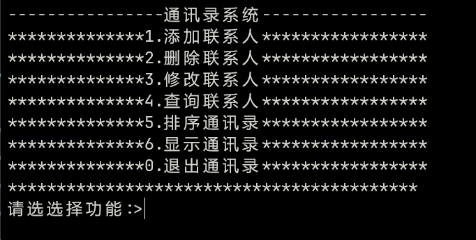

# 练手项目：通讯录管理系统

## 1.项目效果


---

## 2.项目要求

**技术要求：包含C语言所有常用基础知识和文件系统**

**通讯录系统功能：
1.添加联系人：向通讯录中添加联系人，信息包括（姓名、性别、年龄、联系方式、住址）最多记录1000人
2.删除联系人：按照用户需求进行删除指定联系人
3.修改联系人：按照用户需求重新修改指定联系人
4.查询联系人：按照用户需求查看指定联系人信息
5.显示通讯录：显示通讯录中所有联系人信息
6.排序通讯录：按照用户需求排序联系人
0.退出系统：  退出当前使用的通讯录**

---

## 3.项目代码
### 3.1 contact.h头文件
```c
//  Author：JimBo (1353429820@qq.com)
//  Filename：Contact.h
//  Date：2024/1/14
//  Description：implement basic functions of the address book
//  Copyrights（c）JimBo. All rights reserved

//头文件
#pragma once
#include<stdio.h>
#include<string.h>
#include<assert.h>
#include<stdlib.h>
#include<errno.h>
#include<unistd.h>

//通讯录结构体成员最大值宏
#define MAX_NAME 16  //名字     特殊情况：这人名字有8位(1个汉字=2字节)
#define MAX_SEX 5    //性别     特殊情况：填的未知
#define MAX_TEL 16   //电话号码 特殊情况：加地域号4位
#define MAX_ADD 50   //地址     特殊情况：地址有25位
#define MAX_ARR 16   //联系人地址

//通讯录功能界面选择
enum Option
{
	EXIT,       //退出通讯录 0
	ADD,        //添加联系人 1
	DEL,        //删除联系人 2
	MODIFY,     //修改联系人 3
	SEARCH,     //查找联系人 4
	SORT,       //排序通讯录 5
	PRINT       //显示通讯录 6
};

//通讯录联系人基本信息结构体
typedef struct ContactInfo
{
	char name[MAX_NAME];    //联系人姓名
	int age;                //联系人年龄
	char sex[MAX_SEX];      //联系人性别
	char telephone[MAX_TEL];//联系人电话
	char address[MAX_ADD];  //联系人地址
}ContactInfo;

//通讯录结构体
typedef struct Contact
{
	ContactInfo* data;  //联系人信息结构体
	int size;           //通讯录大小
	int capacity;       //通讯录容量
}Contact;


//通讯录功能函数

/*
 *  函数名：ContactSave
 *  函数功能：保存通讯录文件
 *  参数说明：psl指向Contact结构体的指针
 *  返回值：无
*/
void ContactSave(Contact* psl);


/*
 *  函数名：ContactLoad
 *  函数功能：加载通讯录文件
 *  参数说明：psl指向Contact结构体的指针
 *  返回值：无
*/
void ContactLoad(Contact* psl);


/*
 *  函数名：ContactInit
 *  函数功能：初始化通讯录文件
 *  参数说明：psl指向Contact结构体的指针
 *  返回值：无
*/
void ContactInit(Contact* psl);


/*
 *  函数名：ContactDestroy
 *  函数功能：销毁通讯录文件
 *  参数说明：psl指向Contact结构体的指针
 *  返回值：无
*/
void ContactDestroy(Contact* psl);


/*
 *  函数名：ContactCheck
 *  函数功能：检查通讯录容量
 *  参数说明：psl指向Contact结构体的指针
 *  返回值：无
*/
void ContactCheck(Contact* psl);


/*
 *  函数名：ContactAdd
 *  函数功能：添加联系人
 *  参数说明：psl指向Contact结构体的指针
 *  返回值：无
*/
void ContactAdd(Contact* psl);


/*
 *  函数名：ContactDelete
 *  函数功能：删除联系人
 *  参数说明：psl指向Contact结构体的指针
 *  返回值：无
*/
void ContactDelete(Contact* psl);


/*
 *  函数名：ContactModify
 *  函数功能：修改联系人
 *  参数说明：psl指向Contact结构体的指针
 *  返回值：无
*/
void ContactModify(Contact* psl);


/*
 *  函数名：ContactFind
 *  函数功能：查询联系人的下标
 *  参数说明：psl指向Contact结构体的指针、name存储要查找的联系人名
 *  返回值：int
*/
int ContactFind(Contact* psl,char name[]);

/*
 *  函数名：ContactSearch
 *  函数功能：查询联系人
 *  参数说明：psl指向Contact结构体的指针
 *  返回值：无
*/
void ContactSearch(Contact* psl);


/*
 *  函数名：ContactSort
 *  函数功能：升序排序联系人
 *  参数说明：psl指向Contact结构体的指针
 *  返回值：无
*/
void ContactSort(Contact* psl);


/*
 *  函数名：ContactPrint
 *  函数功能：显示全部通讯录联系人
 *  参数说明：psl指向Contact结构体的指针
 *  返回值：无
*/
void ContactPrint(const Contact* psl);


/*
 *  函数名：ContactMenu
 *  函数功能：显示通讯录功能界面
 *  参数说明：无
 *  返回值：无
*/
void ContactMenu();


/*
 *  函数名：ContactMenu
 *  函数功能：实现姓氏升序排序
 *  参数说明：psl指向Contact结构体的指针
 *  返回值：无
*/
void ContactSortUp(Contact* psl);


//函数功能实现
void ContactSave(Contact* psl)
{
	//打开文件
	FILE* pf=fopen("contact.txt","wb");//wb：二进制可写
	if(pf==NULL)
	{
		printf("保存文件失败：%s\n",strerror(errno));
		return;
	}
	//写文件
	for(int i=0;i<psl->size;++i)
	{
		fwrite(psl->data+i,sizeof(ContactInfo),1,pf);
	}
	//关闭文件
	fclose(pf);
	pf=NULL;
}


void ContactLoad(Contact* psl)
{
	//打开文件
	FILE* pf= fopen("contact.txt","rb");//二进制可读
	if(pf==NULL)
	{
		printf("加载文件失败：%s\n",strerror(errno));
		return;
	}
	//读取文件
	ContactInfo buf={0};//这里{0}有也可以，没有也可以。起一个初始化作用
	while(fread(&buf,sizeof(ContactInfo),1,pf))
	{
		ContactCheck(psl);
		psl->data[psl->size]=buf;
		psl->size++;
	}
	fclose(pf);
}


void ContactInit(Contact* psl)
{
	assert(psl);
	//这里不用检查扩容函数，因为初始化的时候我们就设定了capacity的大小
	ContactInfo* tmp=(ContactInfo*)malloc(sizeof(ContactInfo));
	if(tmp!=NULL)
	{
		psl->data=tmp;
	}
	else
	{
		printf("开辟空间失败：%s\n", strerror(errno));
		return;
	}
	psl->size=0;
	psl->capacity=0;
	//加载文件信息
	ContactLoad(psl);
}


void ContactDestroy(Contact* psl)
{
	assert(psl);
	free(psl->data);
	psl->data=NULL;
	psl->size=0;
	psl->capacity=0;
}


void ContactCheck(Contact* psl)
{
	assert(psl);
	if(psl->size==psl->capacity)
	{
		//增加容量
		ContactInfo* tmp=(Contact*)realloc(psl->data,(psl->capacity+2)*sizeof(ContactInfo));
		if(tmp!=NULL)
		{
			psl->data=tmp;
			psl->capacity+=2;
		}
	}
}


void ContactAdd(Contact* psl)
{
	assert(psl);
	ContactCheck(psl);
	printf("请输入名字:>");
	scanf("%s",psl->data[psl->size].name);//size代表最后一位元素，由于下标从0开始，所有size位置没存元素
	printf("请输入年龄:>");
	scanf("%d",&psl->data[psl->size].age);//数组名表示首元素地址，可以不加&
	printf("请输入性别:>");
	scanf("%s",psl->data[psl->size].sex);
	printf("请输入电话:>");
	scanf("%s",psl->data[psl->size].telephone);
	printf("请输入地址:>");
	scanf("%s",psl->data[psl->size].address);
	psl->size++;
	printf("添加联系人成功!\n");
}


void ContactDelete(Contact* psl)
{
	assert(psl);
	if(psl->size==0)
	{
		printf("通讯录为空，无法删除!\n");
		return;
	}
	printf("请输入要删除的联系人名字:>");
	char tmp[MAX_ARR]={0};//这里一定要用字符数组并且给大小，否则会出现数组越界问题！这个BUG我改了几个小时！！！
	scanf("%s",tmp);
	//查找指定联系人
	int pos= ContactFind(psl,tmp);//pos是元素的下标
	if(pos==-1)
	{
		printf("联系人不存在!\n");
		return;
	}
	else
	{
		//删除
		for (int i = pos; i < psl->size-1; ++i)
		{
			psl->data[i]=psl->data[i+1];//联系人信息结构体整体赋值
		}
		psl->size--;
		printf("删除联系人成功!\n");
	}
}


void ContactModify(Contact* psl)
{
	assert(psl);
	printf("请输入要修改的联系人名字:>");
	char tmp[MAX_ARR]={0};
	scanf("%s",tmp);//这里接收失败，tmp=NULL
	int pos= ContactFind(psl,tmp);
	if(pos==-1)
	{
		printf("联系人不存在!\n");
		return;
	}
	else
	{
		//修改联系人
		printf("请输入修改后的年龄:>");
		scanf("%d", &psl->data[pos].age);//数组名表示首元素地址，可以不加&
		printf("请输入修改后的性别:>");
		scanf("%s", psl->data[pos].sex);
		printf("请输入修改后的电话:>");
		scanf("%s", psl->data[pos].telephone);
		printf("请输入修改后的地址:>");
		scanf("%s", psl->data[pos].address);
		printf("修改联系人成功!\n");
	}
}


int ContactFind(Contact* psl,char* arr)
{
	assert(psl && arr);
	for(int i=0;i<psl->size;++i)
	{
		if(strcmp(psl->data[i].name,arr)==0)
		{
			return i;
		}
	}
	return -1;//没找到返回-1
}


void ContactSearch(Contact* psl)
{
	assert(psl);
	printf("请输入要查找的联系人名字:>");
	char tmp[MAX_ARR]={0};
	scanf("%s",tmp);
	int pos= ContactFind(psl,tmp);
	if(pos==-1)
	{
		printf("不存在联系人!\n");
		return;
	}
	else
	{
		printf("找到了联系人，它的信息如下：\n");
		printf("%-10s\t%-5d\t%-5s\t%-14s\t%-20s\n",
			psl->data[pos].name, psl->data[pos].age, psl->data[pos].sex, psl->data[pos].telephone, psl->data[pos].address);
	}
}


void ContactSort(Contact* psl)
{
	assert(psl);
	if(psl->size==0)
	{
		printf("通讯录为空，无需排序!\n");
		return;
	}
	else
	{
		printf("通讯录即将按照联系人姓氏升序进行排序！\n");
		printf("排序中...\n");
		sleep(2);//睡2s假装处理排序
		//姓氏升序排序
		ContactSortUp(psl);
		printf("排序完成!\n");
	}
}


void ContactPrint(const Contact* psl)
{
	assert(psl);
	int i = 0;
	printf("%-10s\t%-5s\t%-5s\t%-14s\t%-20s\n", "名字", "年龄", "性别", "电话", "地址");
	for (i = 0; i < psl->size; i++)
	{
		printf("%-10s\t%-5d\t%-5s\t%-14s\t%-20s\n",
			psl->data[i].name, psl->data[i].age, psl->data[i].sex, psl->data[i].telephone, psl->data[i].address);
	}
}


void ContactSortUp(Contact* psl)
{
	for(int i=0;i<psl->size-1;++i)
	{
		for(int j=0;j<psl->size-1;++j)
		{
			if(strcmp(psl->data[i].name,psl->data[i+1].name)>0)//前面的比后面的字母大，则交换
			{
				ContactInfo  tmp;
				tmp=psl->data[i];
				psl->data[i]=psl->data[i+1];
				psl->data[i+1]=tmp;
			}
		}

	}
}


void ContactMenu()
{
	printf("----------------通讯录系统-----------------\n");
	printf("**************1.添加联系人*****************\n");
	printf("**************2.删除联系人*****************\n");
	printf("**************3.修改联系人*****************\n");
	printf("**************4.查询联系人*****************\n");
	printf("**************5.排序通讯录*****************\n");
	printf("**************6.显示通讯录*****************\n");
	printf("**************0.退出通讯录*****************\n");
	printf("******************************************\n");
}
```

---

### 3.2 main.c源文件
```c
//  Author：JimBo (1353429820@qq.com)
//  Filename：main.c
//  Date：2024/1/14
//  Description：implement the main function of the address book
//  Copyrights（c）JimBo. All rights reserved

#include"Contact.h"

int main()
{
	int input=0;
	Contact con={0};//初始化通讯录，不初始化也行，反正后也要初始化

	//初始化通讯录
	ContactInit(&con);

	//界面循环：do...while实现
	do
	{
		ContactMenu();
		printf("请选选择功能:>");
		scanf("%d", &input);
		switch (input)
		{
		case ADD:
			ContactAdd(&con);
			break;
		case DEL:
			ContactDelete(&con);
			break;
		case MODIFY:
			ContactModify(&con);
			break;
		case SEARCH:
			ContactSearch(&con);
			break;
		case SORT:
			ContactSort(&con);
			break;
		case PRINT:
			ContactPrint(&con);
			break;
		case EXIT:
			//保存信息到文件
			ContactSave(&con);
			ContactDestroy(&con);
			printf("已退出，感谢使用通讯录系统!\n");
			break;
		default:
			printf("选择错误，请重新选择功能!\n");
			break;
		}
	}while(input);
	return 0;
}
```